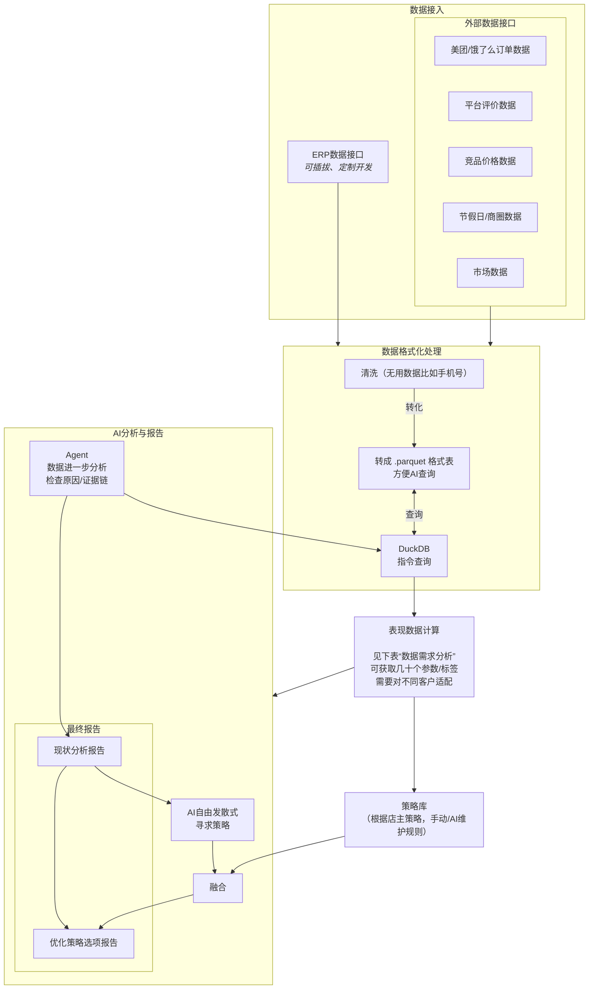

> [!CAUTION]
> **本文档已过时 (DEPRECATED)**
> 本文档编写于项目重构前，内容可能与当前 Monorepo 架构不符。请参考最新的架构设计和代码实现。

# 药店分析系统 - AI 决策辅助

## 想要什么样的“结果报告”

### 现状分析维度报告（判断现状）

现状分析维度报告只回答：**现在发生了什么、问题在哪里、可能原因是什么、数据是否可靠**。

#### 输出内容示例

> 本店本月属于“高客流低利润 / 促销依赖型增长”。` `>
> 销售额上涨 12%，订单数上涨 18%，但毛利额仅上涨 2%。新增订单主要集中在低毛利 SKU A/B，其中 A/B 贡献了 46% 的新增订单，但只贡献 8% 的新增毛利。
> 目前可以判断：
>
> - 流量增长主要来自低价爆品；
> - 高毛利品类销售占比下降；
> - 促销对订单数有效，但对利润贡献有限；
> - 库存中有 18 个 SKU 超过 60 天未动销。

#### 数据需求分析

<table>
  <thead>
    <tr>
      <th>店的类型</th>
      <th>需要拿到的结果 / 分析出来什么</th>
      <th>对应需要的数据或者接口</th>
    </tr>
  </thead>
  <tbody>
    <tr>
      <td rowspan="34"><strong>通用数据</strong></td>
      <td><strong>门店当前状态标签</strong>：稳步增长 / 波动式增长 / 假增长 / 瓶颈 / 衰退 / 促销依赖 / 库存拖累 / 流量下滑但客单补偿</td>
      <td>ERP/POS销售流水：日期、门店、渠道、订单数、销售额、退款、客单价；历史同期数据；O2O订单；促销标记；库存缺货记录</td>
    </tr>
    <tr><td><strong>增长来源拆解</strong>：增长到底来自订单数、客单价、复购、涨价、促销、还是某几个爆品</td><td>订单明细、商品明细、会员ID、售价、折扣、促销活动ID、SKU销量、历史价格</td></tr>
    <tr><td><strong>销售质量判断</strong>：销售额涨了，但毛利是不是也涨？有没有“卖得多但不赚钱”</td><td>销售额、进货成本、毛利率、毛利额、折扣金额、平台佣金、配送费、退款金额</td></tr>
    <tr><td><strong>利润结构</strong>：哪些品类 / SKU贡献了真正利润，哪些只是冲销售额</td><td>SKU销售额、SKU毛利、品类、品牌、成本价、售价、促销让利</td></tr>
    <tr><td><strong>爆品依赖度</strong>：门店是不是靠少数几个SKU撑起来，风险大不大</td><td>SKU销售排行、销售额占比、毛利占比、TOP 5 / TOP 10 SKU贡献率</td></tr>
    <tr><td><strong>长尾库存占用</strong>：哪些商品长期不动销，占用了现金流</td><td>库存快照、入库日期、最近销售日期、库存金额、近30/60/90天销量</td></tr>
    <tr><td><strong>动销健康度</strong>：畅销、正常、滞销、死库存、季节性待观察</td><td>SKU库存、日均销量、库存天数、周转率、品类季节标签</td></tr>
    <tr><td><strong>缺货损失估算</strong>：哪些商品缺货导致少卖了多少钱</td><td>库存为0时间段、历史日均销量、O2O搜索/点击/加购数据、热销榜TOP50</td></tr>
    <tr><td><strong>效期风险</strong>：哪些药临期，预计能不能卖完，应该清仓还是调拨</td><td>批次号、生产日期、有效期、库存量、近30天销量、毛利、可退货政策</td></tr>
    <tr><td><strong>补货优先级</strong>：今天/本周最该补哪些货，补多少</td><td>当前库存、销量预测、供应商交期、最小订货量、采购价、历史缺货记录</td></tr>
    <tr><td><strong>采购错误识别</strong>：买太多、买太晚、买错品类、买了不适合本店人群的货</td><td>采购单、入库单、库存周转、SKU销量、供应商、采购员、品类需求趋势</td></tr>
    <tr><td><strong>价格竞争力</strong>：本店价格是偏贵、偏便宜，还是该维持</td><td>自家售价、历史售价、竞品价格接口/爬虫、O2O平台同品价格、区域均价</td></tr>
    <tr><td><strong>促销真实效果</strong>：促销到底带来了新增销售，还是只是让利给原本会买的人</td><td>活动前后销售、活动SKU、折扣金额、订单数、会员新老客、对照SKU/对照门店</td></tr>
    <tr><td><strong>促销副作用</strong>：促销有没有压低毛利、透支后续销量、抢了其他SKU销量</td><td>活动期间毛利、活动后销量回落、相关品类销售变化、折扣成本</td></tr>
    <tr><td><strong>品类结构健康度</strong>：药品、保健品、器械、日化、慢病、季节品比例是否合理</td><td>商品品类树、SKU销售额、毛利、库存、门店类型标签</td></tr>
    <tr><td><strong>热销品匹配度</strong>：外部热销TOP50里，本店有多少没卖/缺货/价格不合适</td><td>外部热销榜接口、平台榜单、区域热销数据、自家SKU库、库存、售价</td></tr>
    <tr><td><strong>选品缺口</strong>：顾客可能想买但本店没有的品</td><td>外部热销榜、平台搜索词、竞品商品页、顾客评价/咨询文本、LLM结构化需求词</td></tr>
    <tr><td><strong>替代品机会</strong>：缺货时可以推荐哪些替代SKU</td><td>商品成分/功效/品类标签、库存、价格、毛利、药师规则库、合规规则</td></tr>
    <tr><td><strong>会员健康度</strong>：新客、活跃客、沉睡客、流失客分别多少</td><td>会员ID、首次购买时间、最近购买时间、购买频次、购买金额、联系方式授权状态</td></tr>
    <tr><td><strong>复购周期预测</strong>：哪些会员快到复购时间，可以提醒</td><td>会员购买历史、慢病药/常用品SKU、购买数量、理论使用周期、上次购买日期</td></tr>
    <tr><td><strong>客单价拆解</strong>：客单价高/低是因为买得多，还是买得贵</td><td>小票明细、订单SKU数、单品均价、组合购买、折扣</td></tr>
    <tr><td><strong>连带销售机会</strong>：买A的人通常还买B，但本店没做好推荐</td><td>小票篮子数据、SKU共购矩阵、品类关联规则、库存、毛利</td></tr>
    <tr><td><strong>O2O漏斗诊断</strong>：曝光少、点击低、转化低、履约差，问题在哪一层</td><td>O2O平台接口：曝光、点击、访问、加购、下单、取消、退款、评价、配送时长</td></tr>
    <tr><td><strong>平台排名风险</strong>：为什么外卖平台流量下降</td><td>O2O平台店铺分、评分、履约率、取消率、缺货率、配送时长、活动参与情况</td></tr>
    <tr><td><strong>评价/差评主题</strong>：顾客真正抱怨什么</td><td>美团/饿了么/京东到家/大众点评评价文本；LLM分类：价格贵、缺货、配送慢、服务差、药师不专业</td></tr>
    <tr><td><strong>服务履约问题</strong>：慢在拣货、打包、骑手、还是缺货改单</td><td>订单状态流转时间、接单时间、出库时间、配送时间、取消原因、缺货替换记录</td></tr>
    <tr><td><strong>人效分析</strong>：人多不多、忙不忙、是不是排班错位</td><td>员工排班、收银员/导购员销售、小时销售额、小时订单数、客流计数器</td></tr>
    <tr><td><strong>时段机会</strong>：早中晚、夜间、周末分别卖什么</td><td>按小时销售、按小时O2O订单、品类销售、天气、节假日</td></tr>
    <tr><td><strong>天气/季节影响</strong>：销量变化是不是受感冒季、过敏季、降温影响</td><td>天气API、空气质量API、节假日API、流感/过敏指数接口、历史品类销量</td></tr>
    <tr><td><strong>商圈变化影响</strong>：周边人流、竞品、医院/学校/办公区变化</td><td>地图POI接口、商圈人口热力、竞品门店数量、周边医院/社区/写字楼数据</td></tr>
    <tr><td><strong>竞品动作识别</strong>：竞品是否在降价、上新、做活动</td><td>竞品O2O店铺页、商品页、活动页、价格爬虫；LLM抽取：活动类型、主推SKU、价格变化</td></tr>
    <tr><td><strong>经营异常预警</strong>：异常涨跌、刷单、退货异常、员工操作异常</td><td>销售流水、退款记录、作废单、手工改价、会员异常购买、员工操作日志</td></tr>
    <tr><td><strong>现金流压力</strong>：库存钱压得多不多，近期采购会不会吃紧</td><td>库存金额、应付账款、采购计划、销售回款、平台结算周期、租金/工资/固定成本</td></tr>
    <tr><td><strong>报告可信度</strong>：本次报告哪些结论可靠，哪些因为数据缺失只能推测</td><td>ETL日志、接口同步状态、缺失字段比例、异常值检测、数据更新时间</td></tr>
    <tr>
      <td rowspan="7"><strong>夫妻店 / 独立小药店特别关注数据</strong></td>
      <td><strong>老板最该看的一句话结论</strong>：今天/本周到底是赚钱、亏钱、还是库存拖累</td>
      <td>销售额、毛利、库存金额、采购支出、固定成本估算</td>
    </tr>
    <tr><td><strong>明天该补什么，不该补什么</strong></td><td>SKU库存、近7/30天销量、热销榜、供应商交期、最低采购量</td></tr>
    <tr><td><strong>现金流安全线</strong>：现在库存还能撑几天，钱压在哪些货上</td><td>库存金额、动销天数、采购账期、日均毛利、临期库存</td></tr>
    <tr><td><strong>最少动作清单</strong>：只给3-5个马上能做的动作</td><td>通用指标异常结果 + 规则库 + LLM生成行动建议</td></tr>
    <tr><td><strong>社区老客维护名单</strong>：哪些老客快流失，哪些该提醒复购</td><td>会员购买记录、最后购买时间、常购品、联系方式授权</td></tr>
    <tr><td><strong>不能断货清单</strong>：断货会直接伤生意的基础SKU</td><td>历史高频SKU、库存、缺货记录、外部热销榜、季节需求</td></tr>
    <tr><td><strong>价格别乱降提醒</strong>：哪些品不用降价，哪些必须跟价</td><td>竞品价格、自家销量弹性、毛利率、平台同品价格</td></tr>
    <tr>
      <td rowspan="5"><strong>社区药店特别关注数据</strong></td>
      <td><strong>社区需求画像</strong>：附近主要是老人、家庭、学生、上班族，对应需求不同</td>
      <td>会员年龄段/购买品类、地图商圈POI、社区人口数据、LLM归纳</td>
    </tr>
    <tr><td><strong>慢病复购池</strong>：高血压、糖尿病等长期用户的复购机会</td><td>慢病SKU标签、会员购买周期、购买数量、复购间隔</td></tr>
    <tr><td><strong>家庭常备药覆盖度</strong>：感冒、肠胃、外伤、儿童、老人用品是否齐</td><td>商品品类标签、库存、区域热销榜、季节数据</td></tr>
    <tr><td><strong>邻里口碑风险</strong>：服务差评是否集中在药师建议、态度、价格</td><td>评价文本、客服记录、顾客咨询记录、LLM情绪/主题分类</td></tr>
    <tr><td><strong>社区活动机会</strong>：适合做测血压、慢病会员日、家庭药箱活动</td><td>会员结构、慢病SKU销售、社区人群、节假日、历史活动效果</td></tr>
    <tr>
      <td rowspan="7"><strong>O2O外卖型药店特别关注数据</strong></td>
      <td><strong>平台漏斗瓶颈</strong>：曝光低、点击低、转化低、配送差分别是哪一个</td>
      <td>O2O平台曝光、点击、访问、加购、下单、支付、取消、退款</td>
    </tr>
    <tr><td><strong>平台爆品缺口</strong>：平台热销TOP50里，本店没上架/没库存/价格高的SKU</td><td>平台热销榜、商品映射、自家SKU、库存、售价、竞品售价</td></tr>
    <tr><td><strong>夜间订单机会</strong>：夜间高频需求品是否备足</td><td>分小时O2O订单、夜间SKU销量、库存、配送可用时段</td></tr>
    <tr><td><strong>取消/退款主因</strong>：顾客取消是因为缺货、慢、贵、还是找不到药</td><td>取消原因、退款原因、客服文本、评价文本、LLM归类</td></tr>
    <tr><td><strong>配送履约健康度</strong>：店内拣货慢还是骑手慢</td><td>接单时间、拣货完成时间、出库时间、骑手接单/送达时间</td></tr>
    <tr><td><strong>搜索词机会</strong>：用户搜了但本店没有承接的品</td><td>平台搜索词接口、店铺搜索曝光、无结果词、LLM归并同义药品名</td></tr>
    <tr><td><strong>商品页转化问题</strong>：标题、图片、价格、活动是否弱于竞品</td><td>自家商品页、竞品商品页、图片/标题/价格/评价；LLM评分与改写建议</td></tr>
    <tr>
      <td rowspan="5"><strong>医院 / 诊所旁药房特别关注数据</strong></td>
      <td><strong>处方需求匹配度</strong>：附近医院常见处方药，本店有没有、够不够</td>
      <td>HIS/处方外流接口、处方SKU、库存、缺货记录</td>
    </tr>
    <tr><td><strong>就诊时段销售波峰</strong>：门诊结束后哪些药需求集中</td><td>分小时销售、处方药销售、医院门诊时间、节假日</td></tr>
    <tr><td><strong>处方药缺货风险</strong>：缺货是否会导致顾客直接流失到竞品</td><td>处方SKU库存、历史销量、缺货时段、竞品库存/价格</td></tr>
    <tr><td><strong>医保/合规风险</strong>：处方、医保、药监追溯有没有异常</td><td>医保结算接口、处方审核、药品追溯码、批次、销售限制规则</td></tr>
    <tr><td><strong>高频处方组合</strong>：哪些药经常一起出现，应该组合备货</td><td>处方明细、SKU共现、库存、供应商交期</td></tr>
    <tr>
      <td rowspan="5"><strong>商圈 / 写字楼店特别关注数据</strong></td>
      <td><strong>工作日/周末差异</strong>：这店靠上班族还是自然客流</td>
      <td>分日销售、分小时销售、节假日API、商圈POI</td>
    </tr>
    <tr><td><strong>即时需求品类</strong>：胃药、止痛、感冒、眼药、创可贴等是否充足</td><td>SKU品类标签、时段销量、库存、外部热销榜</td></tr>
    <tr><td><strong>午休/下班波峰机会</strong>：哪个时段该多排人、多备货</td><td>小时订单、客流计数、员工排班、O2O履约时间</td></tr>
    <tr><td><strong>便利型高毛利机会</strong>：非药品、器械、护理品能不能提升毛利</td><td>SKU毛利、品类、客单结构、连带购买数据</td></tr>
    <tr><td><strong>周边竞品压制</strong>：同商圈竞品价格/活动是否抢流量</td><td>地图POI、竞品店铺页、竞品活动、价格爬虫</td></tr>
    <tr>
      <td rowspan="5"><strong>连锁直营单店店长特别关注数据</strong></td>
      <td><strong>同类门店排名</strong>：不是和所有店比，而是和同商圈/同规模店比</td>
      <td>多门店销售、面积、员工数、商圈类型、门店等级</td>
    </tr>
    <tr><td><strong>差距来源</strong>：比标杆店差在流量、转化、客单、品类、库存还是人效</td><td>标杆店数据、本店数据、O2O漏斗、库存、员工排班、品类销售</td></tr>
    <tr><td><strong>总部活动执行效果</strong>：总部推的活动，本店有没有执行到位</td><td>活动配置、活动SKU库存、陈列/上架状态、销售结果</td></tr>
    <tr><td><strong>员工表现差异</strong>：哪个班次/员工影响销售或服务</td><td>员工ID、收银/导购记录、排班、销售额、退款、顾客评价</td></tr>
    <tr><td><strong>可复制动作</strong>：标杆店做了什么，本店可以照搬什么</td><td>标杆门店策略、活动、SKU结构、价格、LLM生成对比建议</td></tr>
    <tr>
      <td rowspan="7"><strong>连锁总部 / 区域经理特别关注数据</strong></td>
      <td><strong>门店分层</strong>：增长店、瓶颈店、问题店、潜力店、拖累店</td>
      <td>多店销售、毛利、库存、客流、O2O漏斗、商圈标签</td>
    </tr>
    <tr><td><strong>区域共性问题</strong>：某区域是天气、竞品、配送、选品还是人员问题</td><td>区域门店数据、天气、竞品、配送履约、区域热销榜</td></tr>
    <tr><td><strong>跨店调拨建议</strong>：A店积压，B店缺货，怎么调</td><td>各店库存、销量速度、距离、调拨成本、效期</td></tr>
    <tr><td><strong>选品标准化程度</strong>：哪些门店SKU结构偏离太大</td><td>SKU主数据、门店SKU列表、销售结构、商圈类型</td></tr>
    <tr><td><strong>活动策略复盘</strong>：活动对哪些店有效，对哪些店无效，为什么</td><td>活动数据、多店销售、商圈标签、会员结构、库存</td></tr>
    <tr><td><strong>新品铺货效果</strong>：新品是不是铺了但没卖，还是没铺够</td><td>新品清单、铺货门店、库存、销量、陈列/上架状态</td></tr>
    <tr><td><strong>区域风险地图</strong>：哪些店有临期、缺货、低毛利、差评风险</td><td>库存效期、缺货、毛利、评价、门店坐标</td></tr>
    <tr>
      <td rowspan="5"><strong>加盟店特别关注数据</strong></td>
      <td><strong>总部任务完成度</strong>：销售任务、活动任务、订货任务完成情况</td>
      <td>加盟合同指标、销售数据、活动执行、采购订单</td>
    </tr>
    <tr><td><strong>加盟商真实赚钱情况</strong>：扣除加盟费、平台费、人工后是否健康</td><td>销售毛利、平台佣金、加盟费、采购价、固定成本</td></tr>
    <tr><td><strong>总部供货适配度</strong>：总部推荐的货是否真的适合该店</td><td>总部推荐SKU、门店销量、库存周转、商圈类型</td></tr>
    <tr><td><strong>私采/违规风险</strong>：是否存在非总部渠道进货、价格乱卖</td><td>采购来源、供应商、进货价、商品批次、售价异常</td></tr>
    <tr><td><strong>总部支持需求</strong>：这个店更需要价格支持、选品支持、流量支持还是培训</td><td>销售差距、库存问题、O2O漏斗、员工服务评价、LLM归因</td></tr>
    <tr>
      <td rowspan="5"><strong>新店 / 爬坡期特别关注数据</strong></td>
      <td><strong>爬坡速度</strong>：是否达到新店正常成长曲线</td>
      <td>开店日期、日销售、订单数、会员新增、同类新店基准</td>
    </tr>
    <tr><td><strong>首批选品适配度</strong>：开业铺的货是不是符合当地需求</td><td>初始SKU、销售表现、商圈人群、外部热销榜</td></tr>
    <tr><td><strong>新客转老客能力</strong>：来了第一次的人有没有回来</td><td>新客ID、复购记录、复购周期、会员注册</td></tr>
    <tr><td><strong>商圈渗透率</strong>：附近人群是否知道这家店</td><td>O2O曝光、地图搜索、会员地址/距离、商圈人口</td></tr>
    <tr><td><strong>开业活动有效性</strong>：活动带来的是真需求还是薅羊毛</td><td>活动订单、新老客、复购、折扣成本、活动后留存</td></tr>
    <tr>
      <td rowspan="5"><strong>成熟老店特别关注数据</strong></td>
      <td><strong>瓶颈判断</strong>：增长停滞是客流到顶、品类老化、会员流失还是竞品压制</td>
      <td>长期销售趋势、客流、会员活跃、品类结构、竞品数量</td>
    </tr>
    <tr><td><strong>会员老化问题</strong>：老客还在不在，年轻客有没有进来</td><td>会员年龄段、活跃度、购买品类、新客占比</td></tr>
    <tr><td><strong>品类更新机会</strong>：哪些老品类占位置但不增长</td><td>品类销售趋势、库存、毛利、外部新品/热销榜</td></tr>
    <tr><td><strong>流失召回名单</strong>：哪些高价值顾客沉睡了</td><td>会员RFM、最后购买时间、历史购买品类、联系方式授权</td></tr>
    <tr><td><strong>翻新/活动必要性</strong>：是否需要做陈列、活动、O2O优化</td><td>销售趋势、评价、曝光点击、竞品变化、店龄</td></tr>
    <tr>
      <td rowspan="5"><strong>慢病 / 会员服务型药店特别关注数据</strong></td>
      <td><strong>慢病用户池规模</strong>：高血压、糖尿病、心脑血管等用户有多少</td>
      <td>慢病SKU标签、会员购买记录、处方/咨询记录</td>
    </tr>
    <tr><td><strong>用药连续性风险</strong>：哪些会员可能断药/流失</td><td>购买周期、上次购买日期、购买数量、理论用药天数</td></tr>
    <tr><td><strong>会员服务机会</strong>：该提醒复购、测血压、建档还是推荐组合</td><td>会员画像、购买历史、服务记录、规则库、LLM建议</td></tr>
    <tr><td><strong>慢病品类库存安全</strong>：不能断的长期用药是否稳定</td><td>慢病SKU库存、销量预测、供应商交期、缺货记录</td></tr>
    <tr><td><strong>高价值会员维护优先级</strong></td><td>RFM模型、毛利贡献、复购频次、客诉记录</td></tr>
    <tr>
      <td rowspan="4"><strong>高客流低利润店特别关注数据</strong></td>
      <td><strong>毛利泄漏点</strong>：为什么人多但不赚钱</td>
      <td>客流、订单数、销售额、毛利、折扣、平台佣金</td>
    </tr>
    <tr><td><strong>低毛利爆品依赖</strong>：是不是靠低价爆品拉客</td><td>SKU毛利、TOP SKU销售占比、价格对比</td></tr>
    <tr><td><strong>高毛利替换机会</strong>：哪些品可以做替代推荐</td><td>SKU毛利、同功效/同品类商品、库存、合规替代规则</td></tr>
    <tr><td><strong>折扣过度提醒</strong>：哪些优惠可以取消或缩小</td><td>活动数据、折扣金额、销量弹性、毛利变化</td></tr>
    <tr>
      <td rowspan="4"><strong>低客流高客单店特别关注数据</strong></td>
      <td><strong>客流不足原因</strong>：位置、曝光、价格、评价、竞品哪个影响最大</td>
      <td>O2O曝光、地图搜索、评价、竞品POI、价格指数</td>
    </tr>
    <tr><td><strong>高客单来源</strong>：是慢病、器械、保健品还是偶发大单</td><td>订单明细、品类、会员、SKU价格带</td></tr>
    <tr><td><strong>获客优先动作</strong>：该做平台活动、社区活动还是会员转介绍</td><td>O2O漏斗、会员来源、商圈数据、历史活动效果</td></tr>
    <tr><td><strong>大客户/高价值会员稳定性</strong>：少数客户流失会不会伤筋动骨</td><td>会员贡献占比、RFM、高客单订单、复购周期</td></tr>
  </tbody>
</table>

### 优化策略选项（经营动作）

优化策略选项报告回答：**在已经识别出现状问题之后，有哪些可选策略、分别适合什么经营目标、风险是什么、应该如何验证**。

#### 输出内容示例

> 现状分析显示：本店当前客流增长主要由低价 SKU A/B 拉动，但新增毛利承接不足。 
> 系统不直接判断“必须减少优惠”，而是给出以下策略选项：

<table>
  <thead>
    <tr>
      <th>策略选项</th>
      <th>适合的经营目标</th>
      <th>可能动作</th>
      <th>主要风险</th>
      <th>建议验证方式</th>
    </tr>
  </thead>
  <tbody>
    <tr>
      <td><strong>保留低价引流，加强毛利承接</strong></td>
      <td>客流优先 / 亲民口碑优先 / 平台排名优先</td>
      <td>保留A/B引流价，但增加组合包、连带商品、会员复购承接</td>
      <td>连带转化失败时，仍然只是低毛利订单增长</td>
      <td>观察组合包转化率、客单价、毛利额、新客复购率</td>
    </tr>
    <tr>
      <td><strong>小范围测试缩小优惠</strong></td>
      <td>利润优先 / 现金流压力较大</td>
      <td>只对部分SKU、时段、渠道降低优惠力度，不全店直接取消</td>
      <td>可能影响订单数、平台排名、亲民价格形象</td>
      <td>做7-14天A/B测试，对比订单数、毛利额、转化率、排名变化</td>
    </tr>
    <tr>
      <td><strong>分渠道保留优惠</strong></td>
      <td>既要平台流量，又要线下利润</td>
      <td>O2O保留部分低价入口，线下减少无效折扣或改为会员权益</td>
      <td>渠道价格不一致可能引发顾客感知问题</td>
      <td>分渠道监控订单、毛利、投诉、评价变化</td>
    </tr>
    <tr>
      <td><strong>更换引流品</strong></td>
      <td>想降低低毛利爆品依赖</td>
      <td>寻找毛利更高、需求稳定、替代难度低的SKU作为新引流入口</td>
      <td>新引流品可能没有原爆品吸引力</td>
      <td>小批量测试新引流品点击率、转化率、毛利贡献</td>
    </tr>
  </tbody>
</table>

#### 优化策略数据需求分析

<table>
  <thead>
    <tr>
      <th>策略模块</th>
      <th>对应的现状问题标签</th>
      <th>可生成的策略选项</th>
      <th>判断 / 排序需要的数据</th>
      <th>需要店主确认的主观条件</th>
    </tr>
  </thead>
  <tbody>
    <tr>
      <td><strong>补货优先级策略</strong></td>
      <td>缺货风险、库存过低、热销SKU断货、季节需求上升</td>
      <td>立即补货 / 观察后补货 / 替代SKU承接 / 暂不补货 / 少量试补</td>
      <td>当前库存、日均销量、销量预测、供应商交期、最小订货量、采购价、历史缺货损失</td>
      <td>现金流是否紧张、是否愿意压库存、是否追求不断货</td>
    </tr>
    <tr>
      <td><strong>最少动作清单</strong></td>
      <td>多个问题同时存在，但老板只想知道先做什么</td>
      <td>把候选策略按收益、风险、执行难度、数据置信度排序，生成3-5个待确认动作</td>
      <td>所有异常标签、影响金额、执行成本、可验证性、历史动作效果</td>
      <td>老板希望利润优先、客流优先、清库存优先，还是长期会员优先</td>
    </tr>
    <tr>
      <td><strong>价格策略选项</strong></td>
      <td>价格偏高、价格偏低、低价引流依赖、竞品压价、毛利承压</td>
      <td>维持低价 / 缩小优惠测试 / 分渠道定价 / 会员价 / 换引流品 / 跟价观察</td>
      <td>竞品价格、自家价格、历史价格、销量弹性、毛利率、平台同品价格、区域均价</td>
      <td>是否坚持亲民路线、是否接受短期客流下降、是否要冲平台排名</td>
    </tr>
    <tr>
      <td><strong>促销力度策略</strong></td>
      <td>促销依赖、促销副作用、活动后销量回落、让利无新增</td>
      <td>继续促销 / 缩小促销 / 换促销SKU / 限时段促销 / 新客专享 / 组合促销</td>
      <td>活动前后订单、毛利、折扣金额、新老客占比、活动后回落、对照SKU/门店</td>
      <td>当前目标是拉新、保排名、清库存，还是提高利润</td>
    </tr>
    <tr>
      <td><strong>高毛利承接策略</strong></td>
      <td>高客流低利润、低毛利爆品依赖、连带购买不足</td>
      <td>组合包 / 连带陈列 / 商品页关联 / 收银提醒 / 高毛利替代品候选</td>
      <td>SKU毛利、共购矩阵、同功效/同品类商品、库存、合规替代规则、客单结构</td>
      <td>是否愿意改变陈列、是否有药师/导购执行能力、是否重视合规风险</td>
    </tr>
    <tr>
      <td><strong>可复制动作候选</strong></td>
      <td>本店与标杆店存在差距，且差距来源明确</td>
      <td>学习标杆店选品结构 / 活动配置 / SKU组合 / 履约流程 / 排班方式</td>
      <td>标杆门店策略、活动、SKU结构、价格、履约、员工排班、本店差距来源</td>
      <td>本店是否具备相同商圈、人群、库存、人员条件；是否允许复制总部动作</td>
    </tr>
    <tr>
      <td><strong>跨店调拨策略</strong></td>
      <td>A店积压、B店缺货、临期风险、区域库存错配</td>
      <td>调拨 / 不调拨 / 先清仓 / 先补货 / 区域统一处理</td>
      <td>各店库存、销量速度、距离、调拨成本、效期、供应商退换政策</td>
      <td>总部是否允许调拨、调拨成本谁承担、是否优先减少报损</td>
    </tr>
    <tr>
      <td><strong>获客策略选项</strong></td>
      <td>低客流、高客单、曝光不足、转化不足、新客不足</td>
      <td>平台活动 / 社区活动 / 会员转介绍 / 商品页优化 / 地图曝光优化</td>
      <td>O2O漏斗、会员来源、商圈数据、历史活动效果、评价、竞品POI</td>
      <td>想要短期拉新还是长期会员；是否愿意投入活动预算</td>
    </tr>
    <tr>
      <td><strong>社区服务策略</strong></td>
      <td>社区需求明显、慢病用户多、家庭常备药需求高、邻里口碑风险</td>
      <td>测血压 / 慢病会员日 / 家庭药箱 / 老客复购提醒 / 社区健康活动</td>
      <td>会员结构、慢病SKU销售、社区人群、节假日、历史活动效果、评价主题</td>
      <td>门店是否愿意走服务型路线、是否有人力做长期维护</td>
    </tr>
    <tr>
      <td><strong>会员服务策略</strong></td>
      <td>慢病用户池、用药连续性风险、复购临近、会员流失风险</td>
      <td>复购提醒 / 建档 / 慢病随访 / 高价值会员维护 / 组合购候选</td>
      <td>会员画像、购买历史、慢病SKU、理论用药周期、上次购买日期、授权状态</td>
      <td>是否有联系方式授权、是否愿意做长期私域/会员运营</td>
    </tr>
    <tr>
      <td><strong>陈列 / 活动 / O2O优化策略</strong></td>
      <td>成熟老店疲劳、曝光点击下降、评价走弱、商品页转化差</td>
      <td>陈列调整 / 商品页优化 / 活动测试 / 图片标题优化 / 履约流程优化</td>
      <td>销售趋势、评价、曝光点击、竞品变化、商品页信息、履约时间</td>
      <td>是否接受调整门店形象、是否有执行人员、是否愿意做短期试验</td>
    </tr>
  </tbody>
</table>

#### 策略输出约束

<table>
  <thead>
    <tr>
      <th>不要这样写</th>
      <th>应该这样写</th>
    </tr>
  </thead>
  <tbody>
    <tr>
      <td>建议直接减少A商品优惠。</td>
      <td>如果目标是提升利润，可小范围测试缩小A商品优惠；如果目标是亲民口碑或平台排名，则可保留引流价并加强高毛利承接。</td>
    </tr>
    <tr>
      <td>建议马上补货B商品。</td>
      <td>B商品存在缺货风险。可选策略包括立即补货、少量试补、用替代SKU承接；排序需要结合现金流和供应商交期。</td>
    </tr>
    <tr>
      <td>建议照搬标杆店活动。</td>
      <td>标杆店活动可作为候选策略，但需要先确认本店商圈、人群、库存、人员执行能力是否匹配。</td>
    </tr>
    <tr>
      <td>建议做社区活动。</td>
      <td>若门店定位偏社区服务 / 长期会员，可考虑社区活动；若当前目标是短期利润，应先评估活动成本与可转化会员数。</td>
    </tr>
  </tbody>
</table>

## 架构

## 市场是否有类似软件产品

- Zoined Analytics: 零售 BI + AI 交互式数据分析，可实时跟 POS/ERP 等并自动生成洞察、趋势、报告。
- SYCARDA.AI: 集中交易数据，自动生成可视化报表与业务洞察（销售趋势、热销 SKU、库存走向等）。
- RxData / RxAnalytics: 面向药品零售/医疗机构的 AI 数据分析平台，提供库存预测、合规性与动态补货、趋势洞察等。可集成现有系统数据做智能分析。
- 有些药店 ERP 自带数据洞察/AI 模块：
  - Medify: 可与现有 ERP 集成并提供实时销售/库存洞察。
  - DawaSwit: 类 ERP 平台带 AI 报表与经营分析（多店比较、热销商品趋势等）。
