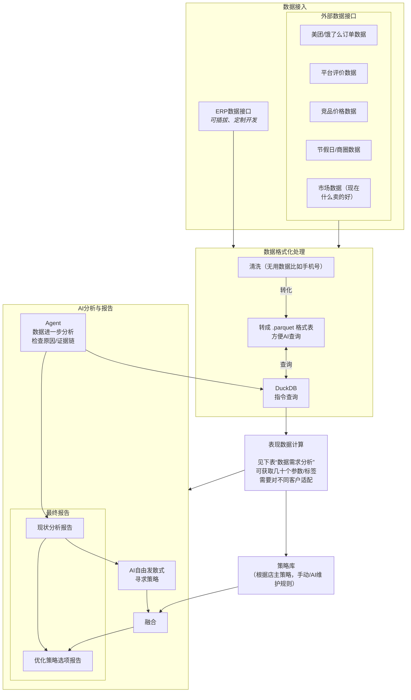

> [!CAUTION]
> **本文档已过时 (DEPRECATED)**
> 本文档编写于项目重构前，内容可能与当前 Monorepo 架构不符。请参考最新的架构设计和代码实现。

# 药店分析系统 - AI 决策辅助 (精简版)报告

## 现状分析报告

现状分析报告只回答：**现在发生了什么、问题在哪里、可能原因是什么、数据是否可靠**。

| 报告章节       | 回答的问题                                                             | 展示方式                                  |
| -------------- | ---------------------------------------------------------------------- | ----------------------------------------- |
| **结论**       | 这家店当前属于增长、下滑、假增长、促销依赖、库存拖累，还是高客流低利润 | 文字标签 + 结论摘要                       |
| **经营概览**   | 销售额、订单数、客单价、毛利、库存金额变化                             | html 📊 图表展示                          |
| **核心异常点** | 哪些指标明显异常                                                       | 红黄绿 颜色标记                           |
| **原因分析**   | 是流量、转化、客单、毛利、库存、促销、履约中的哪个环节出问题           | 说明原因                                  |
| **证据链**     | 为什么系统这么判断                                                     | TOP SKU、趋势对比、库存列表、促销前后对比 |
| **数据可信度** | 哪些结论可靠，哪些因为缺数据只能推测                                   | 高 / 中 / 低置信度                        |

### 输出内容示例

> 本店本月属于 **“高客流低利润 / 促销依赖型增长”**。
>
> 销售额上涨 12%，订单数上涨 18%，但毛利额仅上涨 2%。新增订单主要集中在低毛利 SKU A/B，其中 A/B 贡献了 46% 的新增订单，但只贡献 8% 的新增毛利。
>
> 目前可以判断：
>
> - 流量增长主要来自低价爆品；
> - 高毛利品类销售占比下降；
> - 促销对订单数有效，但对利润贡献有限；
> - 库存中有部分 SKU 长期未动销，存在现金流占用。

### 数据需求分析

数据需求按优先级分为 **P0 基础必需数据、P1 增强分析数据、P2 高级外部数据**。

#### P0：基础经营诊断必须有

| 数据类型                | 需要字段 / 接口                                       | 可以分析什么                               |
| ----------------------- | ----------------------------------------------------- | ------------------------------------------ |
| **销售流水 / 小票明细** | 日期、门店、订单号、SKU、数量、售价、折扣、退款、渠道 | 销售额、订单数、客单价、增长来源、SKU 贡献 |
| **商品主数据**          | SKU、商品名、品类、品牌、规格、是否处方药/非药品      | 品类结构、热销商品、低效商品、商品分组     |
| **成本 / 进货价**       | SKU 成本价、采购价、毛利率                            | 毛利分析、低毛利爆品、销售质量判断         |
| **库存数据**            | SKU 库存量、库存金额、最近销售日期、批次、有效期      | 缺货、滞销、库存周转、临期风险             |
| **采购 / 入库数据**     | 采购单、入库日期、供应商、采购数量、采购金额          | 补货是否合理、是否采购过量、现金流占用     |
| **促销 / 折扣数据**     | 活动 ID、活动 SKU、活动时间、折扣金额、活动渠道       | 促销效果、让利是否有效、是否促销依赖       |
| **门店基础信息**        | 门店 ID、门店类型、区域、营业时间、渠道               | 单店诊断、多店对比、门店分层               |

#### P1：报告效果明显增强

| 数据类型            | 可以增强什么分析                                       |
| ------------------- | ------------------------------------------------------ |
| **会员数据**        | 新客、老客、复购、沉睡会员、慢病复购机会               |
| **O2O 平台数据**    | 曝光、点击、访问、加购、下单、取消、退款、平台漏斗诊断 |
| **评价 / 差评文本** | 服务问题、配送问题、价格问题、药师专业度问题           |
| **员工 / 排班数据** | 人效、时段忙闲、履约慢是人手问题还是流程问题           |
| **活动执行数据**    | 活动有没有真正带来新增，还是只是在让利                 |

#### P2：高级版再接入

| 数据类型                     | 可以增强什么分析                           |
| ---------------------------- | ------------------------------------------ |
| **竞品价格 / 活动**          | 价格竞争力、竞品压制、是否需要跟价         |
| **天气 / 节假日 / 季节数据** | 感冒季、过敏季、降温、节假日造成的销量波动 |
| **商圈 / POI 数据**          | 社区、医院、学校、写字楼等周边人群影响     |
| **平台热销榜 / 搜索词**      | 选品缺口、平台爆品缺货、商品页优化机会     |
| **医保 / 处方 / 追溯数据**   | 医院旁药房、合规风险、处方药库存风险       |

#### 核心分析指标 - 举例

| 分析方向         | 核心指标 / 标签                                                                 | 典型结论                                         |
| ---------------- | ------------------------------------------------------------------------------- | ------------------------------------------------ |
| **销售表现**     | 销售额、订单数、客单价、同比、环比                                              | 是增长、下滑，还是波动式增长                     |
| **增长来源**     | 订单数贡献、客单价贡献、SKU 贡献、渠道贡献                                      | 增长来自客流、涨价、促销，还是爆品               |
| **毛利质量**     | 毛利额、毛利率、低毛利 SKU 占比、折扣金额                                       | 是否“卖得多但不赚钱”                             |
| **库存健康**     | 库存金额、库存天数、动销率、滞销 SKU、缺货 SKU、临期 SKU                        | 是否被库存拖累，是否存在缺货损失                 |
| **促销效果**     | 活动前后订单、毛利、折扣、新老客占比                                            | 促销是真增长，还是低质量让利                     |
| **市场热销匹配** | 市场 TOP50 覆盖率、本店缺失热销 SKU、热销品缺货、价格偏高 SKU、热销但低库存 SKU | 本店是否错过市场需求，哪些商品应补货、上架或调价 |
| **会员复购**     | 新客、老客、复购率、沉睡会员、慢病复购周期                                      | 是否有会员流失或复购机会                         |
| **O2O 问题**     | 曝光、点击、转化、取消、退款、配送时长                                          | 平台流量问题、转化问题、履约问题                 |
| **评价服务**     | 差评率、关键词、服务/价格/配送主题                                              | 顾客真正抱怨什么                                 |
| **经营异常**     | 异常涨跌、退款异常、改价异常、刷单风险                                          | 是否存在异常经营行为                             |
| **报告可信度**   | 数据更新时间、缺失字段、异常值比例                                              | 哪些结论可信，哪些需要补数据                     |

---

## 策略报告（经营动作）

优化策略选项报告回答：**在已经识别出现状问题之后，有哪些可选策略、分别适合什么经营目标、风险是什么、应该如何验证**。

### 输出内容示例

> 现状分析显示：本店当前客流增长主要由低价 SKU A/B 拉动，但新增毛利承接不足。 
> 可选择xx策略：

| 策略选项                       | 适合目标                   | 可能动作                                        |
| ------------------------------ | -------------------------- | ----------------------------------------------- |
| **保留低价引流，加强毛利承接** | 客流优先 / 平台排名优先    | 保留 A/B 引流价，增加组合包、连带商品、会员承接 |
| **小范围测试缩小优惠**         | 利润优先 / 现金流压力大    | 只对部分 SKU、部分时段降低优惠                  |
| **分渠道保留优惠**             | 既要平台流量，又要线下利润 | O2O 保留入口价，线下减少无效折扣                |
| **更换引流品**                 | 降低低毛利爆品依赖         | 找毛利更高、需求稳定的 SKU 做入口               |

### 优化策略数据需求分析

| 策略模块       | 对应问题标签                 | 可生成策略                                  | 判断需要的数据                               | 需要老板确认                         |
| -------------- | ---------------------------- | ------------------------------------------- | -------------------------------------------- | ------------------------------------ |
| **补货优先级** | 缺货风险、库存过低、热销断货 | 立即补货 / 少量试补 / 替代 SKU / 暂不补货   | 当前库存、近 7/30 天销量、供应商交期、采购价 | 现金流是否紧张，是否追求不断货       |
| **库存清理**   | 滞销、临期、库存拖累         | 降价清仓 / 调拨 / 暂缓采购 / 组合销售       | 库存金额、最近销售日期、有效期、毛利         | 是否接受折价，是否优先回收现金       |
| **价格**       | 价格偏高、低价依赖、毛利承压 | 维持低价 / 缩小优惠 / 分渠道定价 / 会员价   | 自家价格、竞品价格、历史销量、毛利率         | 利润优先还是流量优先                 |
| **促销**       | 促销依赖、让利无新增         | 继续促销 / 缩小促销 / 换促销品 / 限时段促销 | 活动前后订单、毛利、折扣、新老客占比         | 目标是拉新、保排名、清库存还是提利润 |
| ...            | ...                          | ...                                         | ...                                          | ...                                  |

---

## 架构

系统整体思路：**确定性计算负责算准，AI 负责解释清楚**。

## 市场是否有类似软件产品

- Zoined Analytics: 零售 BI + AI 交互式数据分析，可实时跟 ERP，自动生成洞察、趋势、报告。
- SYCARDA.AI: 集中交易数据，自动生成可视化报表与业务洞察（销售趋势、热销 SKU、库存走向等）。
- RxData / RxAnalytics: 面向药品零售/医疗机构的 AI 数据分析平台，提供库存预测、合规性与动态补货、趋势洞察等。可集成现有系统数据做智能分析。
- 有些药店 ERP 自带数据洞察/AI 模块：
  - Medify: 可与现有 ERP 集成并提供实时销售/库存洞察。
  - DawaSwit: 类 ERP 平台带 AI 报表与经营分析（多店比较、热销商品趋势等）。

> 未进一步调查
