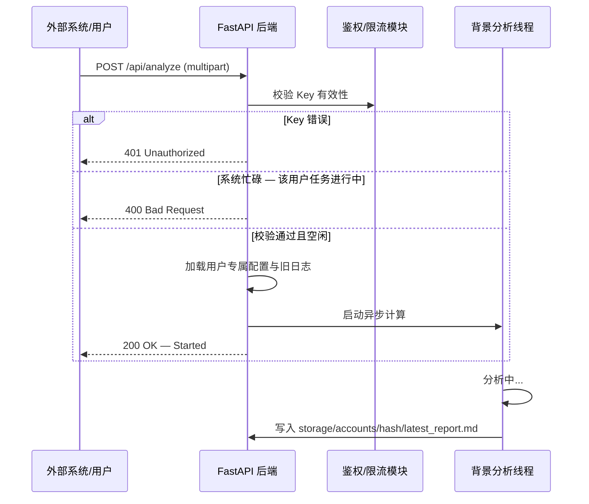

# AI 门店分析系统 API 接口方案 (v2.2 - 带身份鉴权)

本方案在单用户分析逻辑基础上，引入了基于 **User Key** 的多租户隔离机制。

## 1. 核心流程图 (带鉴权)



## 2. 鉴权规范

### 2.1 用户鉴权

用户接口通过 HTTP Header 携带：

- **Header Name**: `x-fzt-key`
- **Value**: 用户的唯一通行证（如 `fzt_abc123...`）

> 所有核心接口均要求提供有效的 `x-fzt-key`，不传 key 将返回 401 Unauthorized。

### 2.2 管理员鉴权

管理员接口通过 HTTP Header 携带：

- **Header Name**: `x-admin-token`
- **Value**: 与服务端环境变量 `ADMIN_TOKEN` 一致的口令

---

## 3. API 接口参考手册

### 3.1 账号管理类

#### [POST] /api/auth/register

- **说明**: 申请一个新的 User Key。受限流保护（3分钟内5次）。
- **Body (JSON, 可选)**: `{"apiKey": "sk-..."}` 或 `{"openaiKey": "sk-..."}`，两者均用于设置全局 LLM API Key。
- **响应 (200)**: `{"userKey": "fzt_完整Key_仅显示一次", "status": "ok"}`
- **错误 (429)**: 注册过于频繁
- **错误 (500)**: 账号初始化失败

#### [POST] /api/auth/verify

- **说明**: 校验当前 Key 是否有效。
- **Header**: `x-fzt-key` (必填)
- **响应 (200)**: `{"status": "ok", "userKey": "fzt_掩码版"}`
- **错误 (401)**: Invalid or expired key

### 3.2 核心分析类

#### [POST] /api/analyze

- **说明**: Multipart 上传入口，提交文件并启动分析。
- **Header**: `x-fzt-key`（必填）
- **Body (Multipart)**: `files` 字段，一个或多个文件。每文件最大 **100MB**，支持 `.json` / `.xlsx` / `.csv` 格式。可选字段 `reasoningEffort` (`low` / `medium` / `high`，默认 `medium`)。
- **响应 (200)**: `{"status": "started", "pipeline": "multifile"}`
- **错误 (400)**: 任务正在运行中 / 文件过大(>100MB) / JSON 解析失败 / 文件读取失败

#### [GET] /api/status

- **说明**: 获取该账户最近一次任务的状态与结果。
- **Header**: `x-fzt-key`（必填）
- **响应 (200)**:

```json
{
  "status": "idle"|"running"|"completed"|"error"|"aborted",
  "errorMessage": "",
  "result": "JSON 格式简化报告 (completed 时有值)",
  "fullResult": "Markdown 格式完整报告 (completed 时有值)"
}
```

#### [GET] /api/logs

- **说明**: 获取该账户最近一次任务的日志快照（全量日志数组）。
- **Header**: `x-fzt-key`（必填）
- **响应 (200)**: `[{log_entry}, ...]` — 日志事件数组，每条含 `type`、`time`、`nodeId` 等字段。

#### [GET] /api/stream

- **说明**: SSE 日志流，供前端实时刷新监控面板。
- **Query**: `?x-fzt-key=...`（必填，通过 URL 查询参数传递，适配 EventSource 场景）
- **响应**: `text/event-stream`，首条事件 `{"type":"reset","time":"HH:MM:SS"}`，后续为日志事件 JSON

#### [POST] /api/stop

- **说明**: 强行停止该账户下的分析任务。
- **Header**: `x-fzt-key`（必填）
- **响应 (200)**: `{"status": "ok"}`

### 3.3 客服会话类

#### [GET] /api/chatbot/history

- **说明**: 读取当前账号的客服会话历史消息。
- **Header**: `x-fzt-key`（必填）
- **响应 (200)**:

```json
{
  "messages": [
    {
      "role": "notice",
      "content": "客服会话已接入",
      "datetime": "2026-06-05T10:29:58+08:00"
    },
    {
      "role": "user",
      "content": "...",
      "datetime": "2026-06-05T10:30:00+08:00"
    },
    {
      "role": "assistant",
      "content": "...",
      "datetime": "2026-06-05T10:30:05+08:00"
    }
  ]
}
```

- **说明补充**: 历史数据存储在 `storage/accounts/{account}/chatbot/chat.jsonl`，每行一条消息记录。`user` 和 `assistant` 消息会额外带 `datetime` 字段；用户消息如果引用附件，会带 `attachments` 元数据。
- **Notice 规则**:
  - `chat.jsonl` 中 `{"role":"system","name":"notice","content":"...","time":"..."}` 会在接口响应中转换为 `{"role":"notice","content":"...","datetime":"..."}`。
  - 普通 `role=system` 消息不会通过历史接口返回给前端。

#### [POST] /api/chatbot/attachments

- **说明**: 上传客服会话附件。图片、PDF、Excel、CSV、压缩包等都按附件处理。
- **Header**: `x-fzt-key`（必填）
- **Body**: `multipart/form-data`
  - `attachments`: 附件文件，可传多个
- **限制**:
  - 单个附件最大 100MB。
  - 单次最多上传 20 个附件。
- **响应 (200)**:

```json
{
  "attachments": [
    {
      "attachmentId": "f4a1...",
      "originalName": "门店照片.png",
      "storedName": "f4a1....png",
      "mimeType": "image/png",
      "size": 123456,
      "sha256": "...",
      "createdAt": "2026-06-05T10:30:00+08:00",
      "relativePath": "files/f4a1....png"
    }
  ]
}
```

- **同名规则**:
  - `originalName` 只用于展示、日志和下载名，不参与服务器唯一性判断。
  - 服务器真实文件名使用 `attachmentId + 原扩展名`，因此同名附件不会覆盖。
  - 同名不同内容允许上传，会得到不同 `attachmentId`。
  - 同名同内容暂时也按两次上传处理，后续可按 `sha256` 做去重优化。
- **存储位置**:
  - 附件元数据：`storage/accounts/{account}/chatbot/attachments.jsonl`
  - 附件文件：`storage/accounts/{account}/chatbot/files/{attachmentId}.{ext}`

#### [POST] /api/chatbot

- **说明**: 发送一条聊天消息，和账号下的客服会话交互，并以流式文本返回结果。
- **Header**: `x-fzt-key`（必填）
- **Body (JSON)**:

```json
{
  "content": "用户输入内容",
  "attachmentIds": ["f4a1..."]
}
```

- **接收字段**:
  - `content`: 主字段；如果本次只上传附件，可以不传或传空字符串
  - `attachmentIds`: 本次会话引用的附件 ID 列表，来自 `/api/chatbot/attachments`
  - `message`: 旧字段，保留但不再作为主要口径
  - `text`: 旧字段，保留但不再作为主要口径

- **说明补充**: 这是对外的简化消息接口，客户端只提交本次输入和附件引用。
- **响应**: `text/plain; charset=utf-8` 的流式文本，不是 JSON。
- **行为说明**:
  - 服务端会读取当前账号的客服历史消息，并将 `assistant.md` 作为动态系统提示词放到本次模型上下文最前面。
  - `assistant.md` 只在发送给模型前动态拼接，不写入 `chat.jsonl`。
  - 服务端会将客服历史消息、本次输入和本次附件清单一起作为会话上下文；历史中的普通 `system` 消息和 `system/name=notice` 消息不发送给模型。
  - 如果只有附件没有文字输入，服务端会按“请查看本次上传的附件。”处理本次输入。
  - 本次附件会以元数据和相对路径形式进入会话上下文；客服会话处理逻辑必要时可读取 `chatbot/files/` 下的附件内容。

- **相关配置**: 客服会话的连接参数来自全局预设 `chatbot` 段，由管理员接口维护，并通过 `/api/admin/llm-presets` 读取和更新。

### 3.4 管理员接口 (需 Header: x-admin-token)

#### [GET] /api/admin/llm-presets

- **说明**: 读取 low/medium/high 三档全局 LLM 预设（包含独立的 `call` 与 `fastcall` 配置，并且在根级平铺挂载 `call` 的参数以向下兼容旧有调用）。
- **补充**: 同一份预设中还包含 `chatbot` 独立连接配置，供 `/api/chatbot` 使用。
- **响应 (200)**: `{"status": "ok", "presets": {"low": {"call": {"baseUrl": "...", "apiKey": "...", "model": "...", "reasoningEffort": "..."}, "fastcall": {...}, "baseUrl": "...", "apiKey": "...", "model": "..."}, "medium": {...}, "high": {...}}}`

#### [POST] /api/admin/llm-presets

- **说明**: 更新全局 LLM 预设。
- **Body (JSON)**:
  - 推荐方式 A: `{"presets": {"low": {"call": {...}, "fastcall": {...}}, "medium": {...}, "high": {...}}}`
  - 兼容方式 B: `{"low": {"call": {...}, "fastcall": {...}}, "medium": {...}, "high": {...}}`
  - 旧版平铺兼容方式: 若单层直接传入 `baseUrl`, `apiKey`, `model` 等字段，后端会自动转换并同时应用于 `call` 与 `fastcall`。
  - 子对象字段（`call` 与 `fastcall`）：`baseUrl` (string), `apiKey` (string, 可选), `apiKeyEnc` (string, 可选), `model` (string), `reasoningEffort` (string)
- **补充**: `chatbot` 配置字段为 `baseUrl`、`apiKey`、`model`，由独立聊天接口使用，不参与 `low/medium/high` 三档分析预设。
- **响应 (200)**: `{"status": "ok", "presets": {"low": {...}, "medium": {...}, "high": {...}}}`

### 3.5 其他接口

- **[GET] /api/examples**: 获取示例数据，返回 `{"files": [{"name": "...", "base64": "..."}]}`。无需鉴权。

---

## 4. 存储隔离规约

系统会根据 `x-fzt-key` 的 SHA256 哈希值定位存储路径：

- **路径**: `/storage/accounts/{sha256(key)}/`
- **内容**: 包含该用户的 `profile.json` (配置), `latest_report.md` (报告), `latest_logs.json` (日志)。
