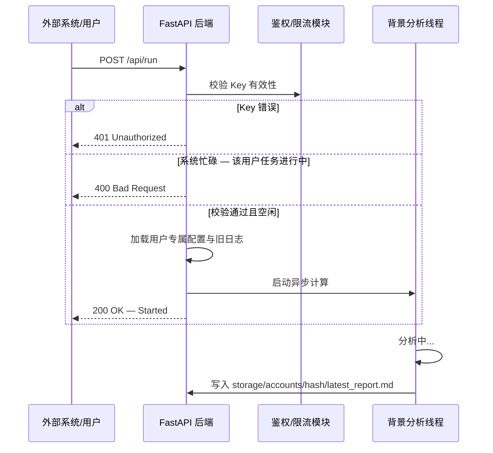

# AI 门店分析系统 API 接口方案 (v2.2 - 带身份鉴权)

本方案在单用户分析逻辑基础上，引入了基于 **User Key** 的多租户隔离机制。

## 1. 核心流程图 (带鉴权)



## 2. 鉴权规范

### 2.1 用户鉴权
用户接口通过 HTTP Header 携带：
- **Header Name**: `x-fzt-key`
- **Value**: 用户的唯一通行证（如 `fzt_abc123...`）

> 所有核心接口均要求提供有效的 `x-fzt-key`，不传 key 将返回 401 Unauthorized。

### 2.2 管理员鉴权
管理员接口通过 HTTP Header 携带：
- **Header Name**: `x-admin-token`
- **Value**: 与服务端环境变量 `ADMIN_TOKEN` 一致的口令

---

## 3. API 接口参考手册

### 3.1 账号管理类

#### [POST] /api/auth/register
- **说明**: 申请一个新的 User Key。受限流保护（3分钟内5次）。
- **Body (JSON, 可选)**: `{"apiKey": "sk-..."}` 或 `{"openaiKey": "sk-..."}`，两者均用于设置全局 LLM API Key。
- **响应 (200)**: `{"userKey": "fzt_完整Key_仅显示一次", "status": "ok"}`
- **错误 (429)**: 注册过于频繁
- **错误 (500)**: 账号初始化失败

#### [GET] /api/auth/me
- **说明**: 检查当前 Key 的有效性及关联配置。
- **Header**: `x-fzt-key` (必填)
- **响应 (200)**: `{"userKey": "fzt_掩码版", "config": {"reasoningEffort": "low"|"medium"|"high", "baseUrl": "...", "model": "...", "hasKey": bool}}`
- **错误 (401)**: Invalid or expired key

#### [POST] /api/auth/verify
- **说明**: 快速校验当前 Key 是否可用。
- **Header**: `x-fzt-key` (必填)
- **响应 (200)**: `{"status": "ok", "userKey": "fzt_掩码版"}`
- **错误 (401)**: Invalid or expired key

### 3.2 配置类

#### [GET] /api/config
- **说明**: 读取当前会话配置（如 `reasoningEffort`、模型、是否已配置 API Key）。
- **Header**: `x-fzt-key`（必填）
- **响应 (200)**: `{"reasoningEffort": "medium", "availableReasoningEfforts": ["high","low","medium"], "baseUrl": "...", "model": "...", "hasKey": bool}`

#### [POST] /api/config
- **说明**: 更新当前会话配置。
- **Header**: `x-fzt-key`（必填）
- **Body (JSON)**: `{"reasoningEffort": "low"}` — 仅接受 `low` / `medium` / `high` 三种值。
- **响应 (200)**: `{"status": "ok", "reasoningEffort": "low", "hasKey": bool}`

### 3.3 核心分析类

#### [POST] /api/run
- **说明**: 前端主流程入口，提交 Base64 编码的文件列表并启动分析。
- **Header**: `x-fzt-key`（必填）
- **Body (JSON)**:
  - `files` (必填, `array`): 文件列表，每项为 `{"name": "文件名.json", "base64": "Base64编码内容"}`
  - `settings` (可选, `object`): 本次任务覆盖配置，如 `{"reasoningEffort": "medium"}`
- **响应 (200)**: `{"status": "started"}`
- **错误 (400)**: 任务正在运行中 (Busy)
- **错误 (400)**: 未提供有效的文件内容
- **错误 (401)**: Invalid or expired key

#### [POST] /api/analyze
- **说明**: Multipart 上传入口，兼容上传式调用。
- **Header**: `x-fzt-key`（必填）
- **Body (Multipart)**: `files` 字段，一个或多个文件。每文件最大 **5MB**，支持 `.json` / `.xlsx` / `.csv` 格式。
- **响应 (200)**: `{"status": "started", "pipeline": "multifile"}`
- **错误 (400)**: 任务正在运行中 / 文件过大(>5MB) / JSON 解析失败 / 文件读取失败

#### [GET] /api/status
- **说明**: 获取该账户最近一次任务的状态与结果。
- **Header**: `x-fzt-key`（必填）
- **响应 (200)**:
```json
{
  "status": "idle"|"running"|"completed"|"error"|"aborted",
  "errorMessage": "",
  "result": "JSON 格式简化报告 (completed 时有值)",
  "fullResult": "Markdown 格式完整报告 (completed 时有值)"
}
```

#### [GET] /api/logs
- **说明**: 获取该账户最近一次任务的日志快照（全量日志数组）。
- **Header**: `x-fzt-key`（必填）
- **响应 (200)**: `[{log_entry}, ...]` — 日志事件数组，每条含 `type`、`time`、`nodeId` 等字段。

#### [GET] /api/stream
- **说明**: SSE 日志流，供前端实时刷新监控面板。
- **Query**: `?x-fzt-key=...`（必填，通过 URL 查询参数传递，适配 EventSource 场景）
- **响应**: `text/event-stream`，首条事件 `{"type":"reset","time":"HH:MM:SS"}`，后续为日志事件 JSON

#### [POST] /api/stop
- **说明**: 强行停止该账户下的分析任务。
- **Header**: `x-fzt-key`（必填）
- **响应 (200)**: `{"status": "ok"}`

### 3.4 管理员接口 (需 Header: x-admin-token)

#### [GET] /api/admin/llm-presets
- **说明**: 读取 low/medium/high 三档全局 LLM 预设。
- **响应 (200)**: `{"status": "ok", "presets": {"low": {"baseUrl":"...","apiKey":"...","model":"..."}, "medium": {...}, "high": {...}}}`

#### [POST] /api/admin/llm-presets
- **说明**: 更新全局 LLM 预设。
- **Body (JSON)**:
  - 推荐方式 A: `{"presets": {"low": {...}, "medium": {...}, "high": {...}}}`（结构稳定，便于后续扩展额外字段）
  - 兼容方式 B: `{"low": {...}, "medium": {...}, "high": {...}}`（仅用于兼容历史调用方）
  - 单档对象字段：`baseUrl` (string), `apiKey` (string, 可选), `apiKeyEnc` (string, 可选), `model` (string)
- **响应 (200)**: `{"status": "ok", "presets": {"low": {...}, "medium": {...}, "high": {...}}}`

### 3.5 其他接口

- **[GET] /api/examples**: 获取示例数据，返回 `{"files": [{"name": "...", "base64": "..."}]}`。无需鉴权。

> 兼容性说明：当前前端工作台默认通过 `POST /api/run` 启动分析，后端需持续保留该端点兼容。

---

## 4. 存储隔离规约
系统会根据 `x-fzt-key` 的 SHA256 哈希值定位存储路径：
- **路径**: `/storage/accounts/{sha256(key)}/`
- **内容**: 包含该用户的 `profile.json` (配置), `latest_report.md` (报告), `latest_logs.json` (日志)。
