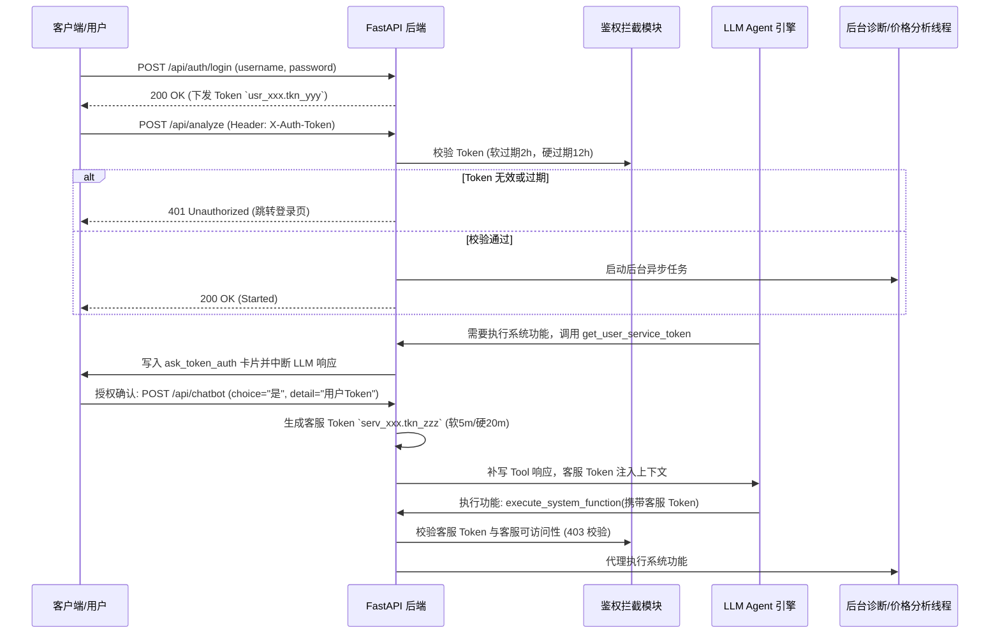

# AI 门店分析系统 API 接口方案 (v3.0 - 带新登录鉴权与完整业务覆盖)

本方案在多租户隔离架构的基础上，引入了基于 **Token 软硬失效** 与 **客服代理授权（Customer Service Token）** 的多级账号与鉴权机制。

---

## 1. 核心流程图 (Token 鉴权与客服授权)



---

## 2. 鉴权规范

### 2.1 用户鉴权 (User Authentication)

核心业务接口要求在 HTTP Header 中携带登录 Token：

- **Header Key**: `X-Auth-Token` 或 `Authorization: Bearer <token>`
- **Token 命名规范**: `usr_{用户ID前3位}_{Hash前6位}_{随机字符}`
- **过期逻辑**: 软过期时间为 **2 小时**（每次发送 API 活动后自动刷新）；硬过期时间为 **12 小时**（无论是否在线都强制失效）。

### 2.2 客服代理鉴权 (Customer Service Authentication)

Agent 代表用户执行敏感系统功能时使用的受限 Token：

- **Token 命名规范**: `serv_{用户ID前3位}_{Hash前6位}_{另随机字符}`
- **过期逻辑**: 软过期时间为 **5 分钟**；硬过期时间为 **20 分钟**。
- **权限限制**: 客服 Token 仅允许执行获取/上传/分析，**严禁执行任何“物理删除”操作**。

### 2.3 管理员鉴权 (Admin Authentication)

系统后台管理接口通过以下 Header 鉴权：

- **Header Key**: `X-Admin-Token`
- **Value**: 与服务端配置的 `ADMIN_TOKEN` 环境变量一致。

---

## 3. API 接口参考手册

### 3.1 账号与鉴权类

#### [POST] /api/auth/register

- **说明**: 申请注册新账户。受防刷保护（3分钟内最多5次）。
- **Body (JSON)**:
  ```json
  {
    "username": "tanghaochen",
    "password": "my_secure_password"
  }
  ```
- **响应 (200)**: `{"status": "ok", "account": "tan***"}`
- **错误 (429)**: 注册过于频繁

#### [POST] /api/auth/login

- **说明**: 账号密码登录验证，成功后下发用户 Token。
- **Body (JSON)**:
  ```json
  {
    "username": "tanghaochen",
    "password": "my_secure_password"
  }
  ```
- **响应 (200)**:
  ```json
  {
    "status": "ok",
    "token": "usr_tan_a1b2c3_randomstring123456",
    "account": "tan***"
  }
  ```
- **错误 (401)**: 账号或密码错误

#### [POST] /api/auth/service-token

- **说明**: 传入有效的用户 Token，生成具有短时效的客服代理 Token。
- **Body (JSON)**:
  ```json
  {
    "token": "usr_tan_a1b2c3_randomstring123456"
  }
  ```
- **响应 (200)**:
  ```json
  {
    "status": "ok",
    "token": "serv_tan_a1b2c3_anothertoken456789",
    "account": "tan***"
  }
  ```
- **错误 (401)**: 用户 token 无效或已过期

#### [POST] /api/auth/logout

- **说明**: 注销接口。物理废除当前的 Token（在 `account_tokens.jsonl` 中标记 `action: revoke`）。
- **Header**: `X-Auth-Token`（必填）
- **响应 (200)**: `{"status": "ok"}`
- **错误 (401)**: Invalid or expired token

#### [POST] /api/auth/verify

- **说明**: 校验当前 Token 是否有效。
- **Header**: `X-Auth-Token`（必填）
- **响应 (200)**: `{"status": "ok", "account": "tan***"}`
- **错误 (401)**: Invalid or expired token

#### [POST] /api/auth/change-password

- **说明**: 安全修改密码接口。支持普通用户修改密码，或管理员直接重置任意账号密码。
- **Header**: 
  - 普通用户：`X-Auth-Token`（必填，必须提供原密码进行校验）
  - 管理员：`X-Admin-Token`（必填，无需原密码校验，可重置任意账号）
- **Body (JSON)**:
  - 普通用户：
    ```json
    {
      "old_password": "current_password",
      "password": "new_password"
    }
    ```
  - 管理员：
    ```json
    {
      "accountId": "tes_1b39fb",
      "password": "new_password"
    }
    ```
- **响应 (200)**: `{"status": "ok", "message": "密码修改成功"}`
- **错误 (400)**: 密码至少需要 4 位 / 缺少原密码 / 原密码错误

#### [GET] /api/config

- **说明**: 获取当前用户的系统基础 LLM 预设配置状态（如是否有 API Key 等，不返回敏感明文）。
- **Header**: `X-Auth-Token`（必填）
- **响应 (200)**:
  ```json
  {
    "reasoningEffort": "medium",
    "availableReasoningEfforts": ["low", "medium", "high"],
    "baseUrl": "https://api.deepseek.com",
    "model": "deepseek-chat",
    "hasKey": true,
    "call": { "baseUrl": "...", "model": "...", "hasKey": true },
    "fastcall": { "baseUrl": "...", "model": "...", "hasKey": true }
  }
  ```

---

### 3.2 门店诊断分析工作流 (Diagnosis Workflow)

#### [POST] /api/analyze

- **说明**: 提交门店销售数据等文件，异步启动智能诊断分析任务。
- **Header**: `X-Auth-Token`（必填）
- **Body (Multipart)**:
  - `files`: 上传一个或多个数据文件（支持 `.xlsx` / `.csv` / `.json`，单文件限 100MB）
  - `reasoningEffort` / `costTier`: 可选。AI 推理力度 (`low` / `medium` / `high`，默认 `medium`)
- **响应 (200)**: `{"status": "started", "pipeline": "custom", "runId": "20260609T170000_abc123"}`
- **错误 (400)**: 任务正在运行中 / 缺少文件

#### [GET] /api/status

- **说明**: 查询指定 `run_id` 的诊断分析状态和结果。
- **Header**: `X-Auth-Token`（必填）
- **Query**: `run_id`（可选，不传时默认使用最新一次任务）
- **响应 (200)**:
  ```json
  {
    "status": "idle" | "queued" | "running" | "completed" | "error" | "aborted",
    "errorMessage": "",
    "result": "JSON 格式的指标/待关注项简化报告 (completed 时返回)",
    "fullResult": "Markdown 格式的完整分析诊断报告 (completed 时返回)",
    "runId": "20260609T170000_abc123"
  }
  ```

#### [GET] /api/logs

- **说明**: 获取特定诊断分析任务的全量执行日志。
- **Header**: `X-Auth-Token`（必填）
- **Query**: `run_id`（可选）
- **响应 (200)**:
  ```json
  {
    "logs": [
      {
        "type": "log",
        "time": "17:00:05",
        "nodeId": "system",
        "level": "info",
        "message": "读取销售数据完成..."
      }
    ]
  }
  ```

#### [GET] /api/stream

- **说明**: SSE 日志推送流，支持前端监控面板的实时渲染。
- **Query**: `?auth-token=usr_xxx&run_id=yyy`（必填）
- **响应**: `text/event-stream`

#### [POST] /api/stop

- **说明**: 强行停止正在运行的诊断分析任务。
- **Header**: `X-Auth-Token`（必填）
- **响应 (200)**: `{"status": "ok"}`

---

### 3.3 商品价格推荐工作流 (Price Recommendation Workflow)

#### [POST] /api/price-recommendations/precheck

- **说明**: 在运行分析前，前置检查上传的竞品/销售数据格式是否合规。
- **Header**: `X-Auth-Token`（必填）
- **Body (Multipart)**:
  - `files`: 待校验的文件列表
  - `productName`: 商品名称（如“感康”）
- **响应 (200)**: 校验结果

#### [POST] /api/price-recommendations

- **说明**: 上传数据文件，异步启动商品智能价格推荐任务。
- **Header**: `X-Auth-Token`（必填）
- **Body (Multipart)**:
  - `files`: 销售及竞品价格文件列表
  - `productName`: 目标商品名称
  - `candidateCount`: 推荐价格的候选数量（默认 3）
  - `reasoningEffort` / `costTier`: AI 推理强度配置
- **响应 (200)**:
  ```json
  {
    "status": "started",
    "taskType": "price_recommendation",
    "workflow": "price_recommendation",
    "runId": "20260609T170500_xyz456"
  }
  ```

#### [GET] /api/price-recommendations/status

- **说明**: 获取特定价格推荐任务的执行状态与推荐结果。
- **Header**: `X-Auth-Token`（必填）
- **Query**: `run_id`（可选）
- **响应 (200)**:
  ```json
  {
    "status": "completed",
    "errorMessage": "",
    "result": "价格推荐列表与弹性估算 JSON",
    "fullResult": "价格推荐分析 Markdown 报告",
    "runId": "20260609T170500_xyz456"
  }
  ```

#### [GET] /api/price-recommendations/logs

- **说明**: 获取指定价格推荐任务的完整日志。
- **Header**: `X-Auth-Token`（必填）
- **Query**: `run_id`（可选）
- **响应 (200)**: `{"logs": [...]}`

#### [GET] /api/price-recommendations/stream

- **说明**: SSE 价格推荐日志监控流。
- **Query**: `?auth-token=usr_xxx&run_id=yyy`（必填）
- **响应**: `text/event-stream`

#### [POST] /api/price-recommendations/stop

- **说明**: 强行停止执行中的价格推荐任务。
- **Header**: `X-Auth-Token`（必填）
- **响应 (200)**: `{"status": "ok"}`

---

### 3.4 诊断分析参数配置类 (Analysis Parameters)

#### [GET] /api/analysis-params

- **说明**: 获取当前用户设定的分析参数及规则限制配置。
- **Header**: `X-Auth-Token`（必填）
- **响应 (200)**: `{"analysis_params": "用户自定义的诊断约束文本"}`

#### [PUT] /api/analysis-params

- **说明**: 更新/设定诊断分析参数限制。
- **Header**: `X-Auth-Token`（必填）
- **Body (JSON)**: `{"analysis_params": "限制客单价分析低于100元的交易..."}`
- **响应 (200)**: `{"status": "ok"}`

#### [GET] /api/analysis-params/presets

- **说明**: 获取系统预设的分析参数模板。
- **响应 (200)**:
  ```json
  {
    "presets": {
      "标准诊断模板": { "analysis_params": "..." }
    }
  }
  ```

---

### 3.5 历史运行报告管理类 (Report History)

#### [GET] /api/reports

- **说明**: 获取该账户所有的历史运行分析报告列表。
- **Header**: `X-Auth-Token`（必填）
- **响应 (200)**:
  ```json
  {
    "status": "ok",
    "runs": [
      {
        "runId": "20260609T170000_abc123",
        "taskType": "diagnosis",
        "createdAt": "2026-06-09 17:00:00",
        "status": "completed",
        "fileNames": ["sales_data.xlsx"],
        "isPublic": false,
        "shareUrl": "http://localhost:3000/public.html?run_id=20260609T170000_abc123&sign=...",
        "downloadUrl": "http://localhost:3000/api/reports/public/download?run_id=...&sign=..."
      }
    ]
  }
  ```

#### [GET] /api/reports/download

- **说明**: 将分析任务产出物（`/workspace/output/` 下所有文件）整体打包为 ZIP 供用户下载。
- **Header**: `X-Auth-Token` (或 query 中传入 `auth-token`)
- **Query**: `run_id`（必填）
- **响应**: `application/zip` 二进制流

#### [POST] /api/reports/{run_id}/public

- **说明**: 设置报告的“公开状态”（允许免登录的外部分享链接查看）。
- **Header**: `X-Auth-Token`（必填）
- **Path**: `run_id`
- **Body (JSON)**: `{"public": true}`
- **响应 (200)**: `{"status": "ok", "isPublic": true, "shareUrl": "...", "downloadUrl": "..."}`

#### [DELETE] /api/reports/{run_id}

- **说明**: 物理删除该运行记录，并删除其对应的磁盘文件夹。**注意：客服 Token (serv\_\*) 无权调用此接口 (返回403)。**
- **Header**: `X-Auth-Token`（必填）
- **Path**: `run_id`
- **响应 (200)**: `{"status": "ok"}`

---

### 3.6 公共免密分享接口 (Public Share Access)

#### [GET] /api/reports/public/status

- **说明**: 外部访客免密获取被设置为 `isPublic=true` 的报告状态。需要通过安全签名校验。
- **Query**: `?run_id=xxx&sign=yyy`（签名 `sign` 基于 `run_id` 和服务器密钥计算，保障防爆破）
- **响应 (200)**:
  ```json
  {
    "status": "completed",
    "errorMessage": "",
    "result": "...",
    "fullResult": "...",
    "runId": "..."
  }
  ```
- **错误 (403)**: 签名不匹配或报告未设置为公开

#### [GET] /api/reports/public/download

- **说明**: 外部访客免密下载被分享报告的 ZIP 文件。同样需携带有效签名。
- **Query**: `?run_id=xxx&sign=yyy`
- **响应**: `application/zip`

#### [GET] /api/reports/{run_id}/assets/{filename}

- **说明**: 获取任务报告中引用的本地资源附件（例如图片、折线图等）。
- **Header**: `X-Auth-Token`（必填）
- **响应 (200)**: 对应资源的二进制内容

#### [GET] /api/reports/public/{run_id}/assets/{filename}

- **说明**: 外部访客免密获取公开报告中包含的资源附件（需通过签名检验）。
- **Query**: `?sign=xxx`
- **响应 (200)**: 对应资源的二进制内容

---

### 3.7 客服会话聊天接口 (Chatbot & Assistant)

#### [GET] /api/chatbot/history

- **说明**: 读取当前账号的客服会话历史消息记录。
- **Header**: `X-Auth-Token`（必填）
- **响应 (200)**:
  ```json
  {
    "messages": [
      {
        "role": "user",
        "content": "帮我做一个门店经营诊断分析。",
        "datetime": "2026-06-09T17:01:00+08:00"
      },
      {
        "role": "assistant",
        "content": "那个“导出聊天，”请问有什么可以帮您的吗？",
        "token_count": 67,
        "datetime": "2026-06-09T17:01:00+08:00"
      },
      {
        "role": "notice",
        "content": "客服会话已接入",
        "datetime": "2026-06-09T17:00:00+08:00"
      },
      {
        "role": "card",
        "name": "ask_token_auth",
        "title": "请求代理操作许可",
        "detail": "需要提交经营分析任务。",
        "options": ["是", "否"],
        "choice": "是",
        "datetime": "2026-06-09T17:01:05+08:00"
      }
    ],
    "last_update": "2026-06-09T17:01:05+08:00"
  }
  ```
  > 注意！只包含以上三种role；`assistant` 消息可额外携带 `token_count` 字段，其他历史字段按现有实现透传。
- **Notice 与 Card 映射规则**:
  - 系统 `notice` 消息会自动转换为前台展示的提示小字。
  - 角色为 `system` 且包含 `title` 字段的系统消息会被转换为 `card` 类型，用于展示交互式卡片（如授权操作卡）。若已完成选择，则带 `choice` 字段指明结果。
  - 传给 LLM 时，授权卡片不会按前端 `role=card` 发送，而会转换为合法的 `role=system` 文本消息，内容包含 `name`、`title`、`detail`、`options` 和 `choice`，使模型能理解用户授权状态。

#### [POST] /api/chatbot/attachments

- **说明**: 上传聊天过程中附加的附件。
- **Header**: `X-Auth-Token`（必填）
- **Body**: `multipart/form-data`
  - `attachments`: 附件文件（单文件限100MB，单次最多20个）
- **响应 (200)**: `{"attachments": [{"attachmentId": "...", "originalName": "...", "relativePath": "chatbot/files/..."}]}`

#### [POST] /api/chatbot

- **说明**: 向会话发送一条新消息，启动后台 Agent 回复计算。此接口立刻落盘并返回，不使用 SSE。
- **Header**: `X-Auth-Token`（必填）
- **Body (JSON)**:
  - 普通聊天：`{"content": "我想做价格推荐", "attachmentIds": []}`
  - 回复授权确认：`{"name": "ask_token_auth", "choice": "是", "detail": "完整用户Token"}`
- **响应 (200)**: `{"status": "ok"}`
- **补充**: 如果当前存在未确认的 `ask_token_auth` 授权卡片，服务端会拒绝新的普通聊天消息，要求用户先选择“是”或“否”。

#### [GET] /api/chatbot/status

- **说明**: 轮询查询 Agent 当前的输入状态和历史最后更新时间戳。
- **Header**: `X-Auth-Token`（必填）
- **限制**: 同一个 token 每 2 秒限查询一次（超频返回 `429`）。
- **响应 (200)**:
  ```json
  {
    "last_update": "2026-06-09T17:01:05+08:00",
    "state": "输入中..." // 仅在 Agent 后台正在计算未落盘时返回，其他情况无此字段
  }
  ```

---

### 3.8 系统管理类接口 (需 Header: X-Admin-Token)

#### [GET] /api/admin/llm-presets

- **说明**: 查看当前的低/中/高三档 LLM 全局连接预设（及 Chatbot 独立模型参数）。
- **响应 (200)**: 包含 presets 配置的 JSON。

#### [POST] /api/admin/llm-presets

- **说明**: 更新系统全局分析预设和聊天模型预设。
- **Body (JSON)**: 预设配置参数包。
- **响应 (200)**: 更新后的预设列表。

#### [GET] /api/admin/accounts

- **说明**: 获取管理员可管理的账号列表。
- **响应 (200)**: `{"accounts": [{"accountId": "...", "accountLabel": "...", "identityDescription": "..."}]}`

#### [GET] /api/admin/accounts/profile

- **说明**: 读取账号的身份描述与基础资料。支持管理员身份（用 `X-Admin-Token`）读取任意账号；也支持普通用户（用 `X-Auth-Token`）读取自身账号。
- **Header**: `X-Admin-Token`（管理员）或 `X-Auth-Token`（普通用户）
- **Query**: `account_id`（管理员必填；普通用户可选，默认返回自身账号，传入他人 ID 时返回 403 越权）
- **响应 (200)**: `{"status": "ok", "accountId": "...", "username": "...", "profile": {"reasoningEffort": "...", "identityDescription": "..."}, "ruleCount": 0, "rules": []}`
- **错误 (403)**: 仅可以查看当前账号的信息 (普通用户越权时)

#### [POST] /api/admin/accounts/profile

- **说明**: 更新指定账号的身份描述。若身份描述发生变化，后端会自动清空该账号的 `service_docs` 规则表。
- **Body (JSON)**: `{"accountId": "...", "identityDescription": "..."}`
- **响应 (200)**: `{"status": "ok", "rulesCleared": true|false}`

#### [GET] /api/admin/service-docs

- **说明**: 获取公共公共说明文档目录结构列表。
- **Query**: `path`（默认 `service_docs/`）
- **响应 (200)**: `{"entries": [...]}`

#### [GET] /api/admin/service-docs/file

- **说明**: 查看特定公共文档的纯文本内容。
- **Query**: `path`
- **响应 (200)**: `{"content": "..."}`

#### [POST] /api/admin/service-docs/file

- **说明**: 写入或覆盖特定的公共文档。
- **Body (JSON)**: `{"path": "...", "content": "..."}`
- **响应 (200)**: `{"status": "ok"}`

#### [POST] /api/admin/service-docs/upload

- **说明**: 上传资源到公共文档区。
- **Body (Multipart)**: `file`
- **响应 (200)**: `{"status": "ok", "path": "..."}`

#### [DELETE] /api/admin/service-docs/file

- **说明**: 删除公共文档区的文件或目录。
- **Query**: `path`
- **响应 (200)**: `{"status": "ok"}`

#### `service_docs` 权限说明

- `service_docs` 访问由账号级正则规则表控制，统一作用于 `list_files`、`search`、`read_file`、`read_document_structure`、`get_resource_link`。
- `list_files` 和 `search` 允许暴露有限的文件名和目录结构，但正文、结构摘要和资源链接仍需命中允许规则。
- `get_resource_link` 除权限规则外，还会继续检查独立的 `.no_download.yaml` 禁止下载列表。
- 权限 AI 通过单次结构化调用维护规则表，不作为 Agent 运行。
- 规则会绑定生成时的目录同级快照；若后续 `service_docs` 目录结构变化，后台会被动刷新并失效旧规则，访问命中时也会再做一次按需兜底校验。

---

### 3.9 其他通用接口

#### [GET] /api/examples

- **说明**: 无需鉴权，获取系统的示例数据文件包（供初次使用下载）。
- **响应 (200)**: `{"files": [{"name": "sales.xlsx", "base64": "..."}]}`

---

## 4. 存储隔离规约

系统按注册账户的**唯一 ID（由账号名前 3 位明文及 SHA256 哈希值前 6 位拼接而成）**在磁盘进行物理数据隔离：

- **根目录路径**: `/storage/accounts/usr_{账号前三位}_{哈希前六位}/`
  - **`account.json`**: 用户账户配置（密码哈希、创建日期）。
  - **`account_tokens.jsonl`**: 会话 Token 状态追加日志（创建、活跃、登出记录）。
  - **`profile.json`**: 用户偏好与身份描述。
  - **`service_docs_access_rules.json`**: 当前账号的 `service_docs` 正则权限规则表。
  - **`service_docs_access_audit.jsonl`**: `service_docs` 权限申请与 AI 判定审计日志。
  - **`analysis_params.json`**: 用户自定义的分析约束。
  - **`chatbot/chat.jsonl`**: 客服会话聊天全量历史；`assistant` 消息会附带本轮 `token_count`（如有）。
  - **`chatbot/attachments.jsonl`**: 上传的聊天附件索引数据库。
  - **`chatbot/files/`**: 存储具体的聊天原始附件。
  - **`chatbot/workspace/`**: Chatbot Agent 执行分析计算的隔离沙箱区。
  - **`runs/{task_type}/{run_id}/`**: 历史运行任务存档目录。
    - **`session.json`**: 任务单次运行的参数和状态。
    - **`logs.jsonl`**: 任务分析输出的日志。
    - **`workspace/output/`**: 诊断/调价产出的最终报告及配图等。
