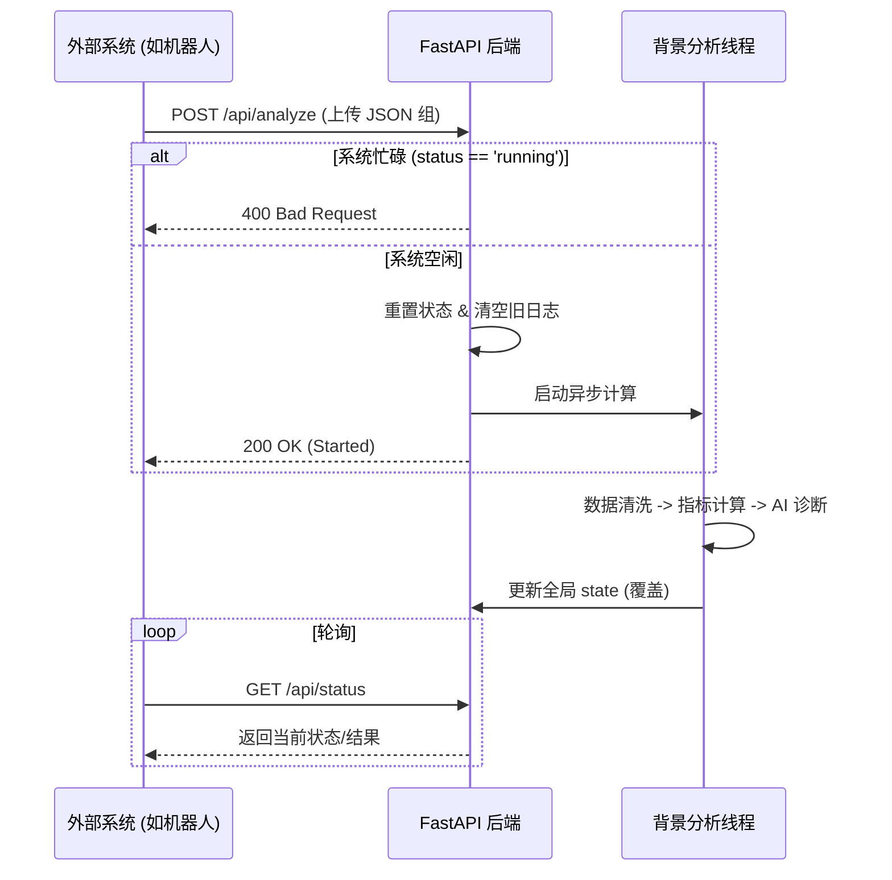

# AI 门店分析系统 API 接口方案与文档

本方案专为单用户自动化场景设计。系统不保存历史记录，每次分析都会覆盖上一次的结果。

## 1. 核心流程图



## 2. 设计原则
- **无状态 ID**：不使用 Task ID，所有接口均针对“当前唯一任务”进行操作。
- **覆盖式更新**：新任务启动时，会自动清空旧日志；新报告生成时，覆盖旧文件。
- **排他性锁**：同一时间仅允许一个活跃任务。

---

## 3. API 接口参考手册

### 3.1 基础与配置类

#### [GET] /api/health
- **说明**: 检查后端服务是否存活。
- **响应**: `{"status": "ok"}`

#### [GET] /api/config
- **说明**: 获取当前的 AI 模型配置（BaseURL, Model, 是否有 Key）。
- **响应**: `{"baseUrl": "...", "model": "...", "hasKey": true}`

#### [POST] /api/config
- **说明**: 修改 AI 配置。
- **Body (JSON)**: `{"baseUrl": "...", "apiKey": "...", "model": "..."}`
- **响应**: `{"status": "ok"}`

### 3.2 核心分析类

#### [POST] /api/analyze
- **说明**: 上传文件并启动新一轮 AI 分析。会清空上一次的结果。
- **Body (Multipart)**:
  - `files`: 多文件上传（接受 .json 文件）。
- **响应**:
  - `200`: `{"status": "started"}` (任务成功启动)
  - `400`: `{"detail": "任务正在运行中"}` (系统忙碌)

#### [GET] /api/status
- **说明**: 获取当前任务的状态、精简报告及完整报告。
- **响应**:
```json
{
  "status": "idle | running | completed | error",
  "errorMessage": "错误信息 (如果有)",
  "result": "{...精简 JSON 字符串...}",
  "fullResult": "# 完整 Markdown 报告正文..."
}
```

#### [GET] /api/logs
- **说明**: 获取当前任务执行至今的所有日志快照。
- **响应 (Array)**:
```json
[
  {
    "type": "log",
    "nodeId": "clean",
    "message": "开始清洗数据...",
    "status": "processing",
    "time": "15:30:00"
  }
]
```

#### [POST] /api/stop
- **说明**: 强行停止当前正在运行的异步分析任务。
- **响应**: `{"status": "ok"}`

### 3.3 辅助类

#### [GET] /api/examples
- **说明**: 获取系统内置的示例数据（用于演示）。
- **响应**: `{"files": [...JSON 数据列表...]}`

#### [GET] /api/stream (SSE)
- **说明**: 浏览器长连接推送，用于前端实时展示日志流。
- **响应**: `text/event-stream`

---

## 4. 文件存储规约
- **最新报告**: `/storage/latest_report.md` (Markdown 格式)
- **上传缓存**: `/storage/uploads/current/` (包含本次分析的所有 JSON)
