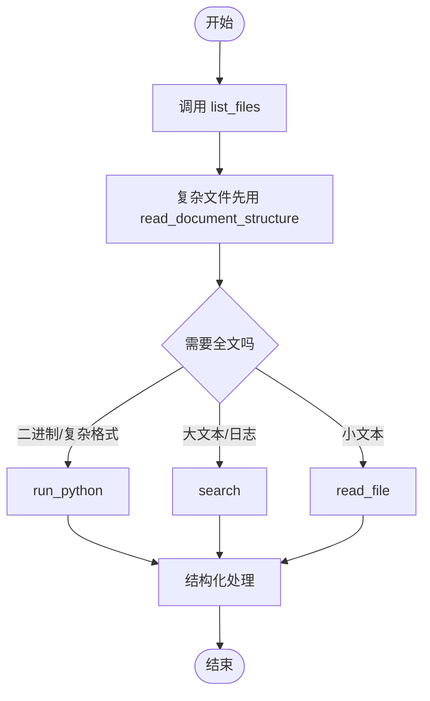

# Agent Tools API 设计规范与参考指南

本文档说明诊断 Agent 工具链的接口契约、参数表、返回结构和推荐调用范式，供开发与集成参考。

---

## 1. 设计原则

1. 防爆上下文：不直接把大文件或二进制全文塞进 LLM 上下文。
2. 侦察与精读分离：先用 `list_files`、`read_document_structure` 看结构，再用 `read_file`、`search` 做局部定位。
3. 结构化返回：工具返回统一为 JSON 字符串，方便模型解析。
4. 安全沙箱：复杂处理放到 `run_python`。
5. 多域可见：chatbot 场景下 `chatbot/` 与 `service_docs/` 是独立读域，返回会显式带域名和绝对路径。

---

## 2. 文件与数据工具

### 2.1 `list_files`
* 功能：按文件域列出目录树中的文件和目录，多域时按域分组返回。
* 参数：

| 参数名 | 类型 | 是否必填 | 默认值 | 描述 |
| :--- | :--- | :--- | :--- | :--- |
| `subdir` | string | 否 | `""` | 相对工作区的路径。多域时需带域名前缀，如 `chatbot/` 或 `service_docs/`。为空时遍历所有读域。 |

* 返回：

```json
{
  "domains": [
    {
      "domain": "chatbot",
      "root_path": "chatbot/",
      "root_absolute_path": "/abs/path/chatbot",
      "entries": [
        {
          "path": "chatbot/empty_dir",
          "absolute_path": "/abs/path/chatbot/empty_dir",
          "name": "empty_dir",
          "type": "directory",
          "children_count": 0,
          "is_empty": true
        },
        {
          "path": "chatbot/files/sales_data.csv",
          "absolute_path": "/abs/path/chatbot/files/sales_data.csv",
          "name": "sales_data.csv",
          "type": "file",
          "size": 1048576,
          "size_human": "1.0MB",
          "ext": ".csv",
          "kind": "csv",
          "recommended_tool": "read_document_structure"
        }
      ],
      "totals": {
        "files": 1,
        "directories": 1,
        "empty_directories": 1,
        "bytes": 1048576,
        "bytes_human": "1.0MB"
      }
    }
  ]
}
```

### 2.2 `read_file`
* 功能：分页或首尾截取读取文本文件。
* 参数：

| 参数名 | 类型 | 是否必填 | 默认值 | 描述 |
| :--- | :--- | :--- | :--- | :--- |
| `path` | string | 是 | - | 相对工作区的文件路径。 |
| `offset` | integer | 否 | `0` | 起始行号。 |
| `limit` | integer | 否 | `2000` | 最大读取行数。 |
| `head` | integer | 否 | `null` | 从头读取的行数。 |
| `tail` | integer | 否 | `null` | 从尾读取的行数。 |

* 返回：JSON 对象，包含 `content`、`has_more`、`next_offset`、`truncated` 等字段。

### 2.3 `write_file`
* 功能：写入文本文件，支持覆盖和追加。
* 参数：`path`、`content`、`mode=overwrite|append`
* 返回：JSON 对象，包含 `ok`、`path`、`bytes_written`、`size`。

### 2.4 `replace_text`
* 功能：唯一匹配替换文本。
* 参数：`path`、`old_text`、`new_text`
* 限制：`old_text` 必须只出现 1 次。

### 2.5 `copy_file`
* 功能：复制工作区单个文件到新路径。
* 参数：`source_path`、`destination_path`

### 2.6 `search`
* 功能：在单个路径、指定文件域或整个工作区内搜索关键词/正则。
* 能力：
  * 默认跨所有文件域搜索。
  * 按域独立统计结果。
  * 支持文件名、目录名、文本内容、以及常见文档/数据文件的轻量结构预览。
  * `chat_history` 作为虚拟域，搜索聊天历史记录。
* 参数：

| 参数名 | 类型 | 是否必填 | 默认值 | 描述 |
| :--- | :--- | :--- | :--- | :--- |
| `pattern` | string | 是 | - | 文本子串或正则。 |
| `domain` | string | 否 | `"all"` | 可选 `"all"`、`"chat_history"`，或域路径如 `chatbot/`、`service_docs/`。 |
| `path` | string | 否 | `null` | 限定到某个文件或目录。 |
| `regex` | boolean | 否 | `false` | 是否按正则搜索。 |
| `max_matches` | integer | 否 | `50` | 单域最大匹配数。 |

* 返回：JSON 对象，包含 `domains`、`total_files_searched`、`total_directories_searched`、`total_matches_found`、`hit_limit`。

* 搜索范围说明：
  * 文本类：`.txt`、`.log`、`.md`、`.py`、`.csv`、`.json`、`.jsonl`
  * 结构化文档：`.xlsx`、`.pdf`、`.docx`、`.sqlite`、`.zip`、`.tar`、`.gz`、`.rar`
  * 目录与文件名：目录名、文件名都会参与匹配

### 2.7 `read_document_structure`
* 功能：对文档做结构侦察，不返回全文。
* 支持：Excel、CSV、Word、PDF、JSON、Markdown、Zip、SQLite、文本日志。
* 返回：`summary` 中包含列名、大纲、样例行、表结构等结构化信息。

### 2.8 `duckdb_query`
* 功能：在 `analysis.duckdb` 上执行只读 SQL。
* 限制：只允许 `SELECT`。

### 2.9 `query_sqlite`
* 功能：对本地 SQLite 文件执行只读 SQL。
* 限制：只读连接，结果数量有上限。

### 2.10 `run_python`
* 功能：在工作区沙箱内运行 Python 脚本。
* 常用库：`pandas`、`duckdb`、`openpyxl`、`pdfplumber`、`python-docx`

---

## 3. 工作流辅助工具

| 工具 | 作用 |
| :--- | :--- |
| `read_plan` | 读取任务计划 |
| `check_plan` | 验证步骤并推进状态 |
| `finish_task` | 结束或中止任务 |
| `read_context` | 读取静态上下文文档 |
| `list_tables` | 查看 DuckDB 已注册表 |

---

## 4. 调用建议


