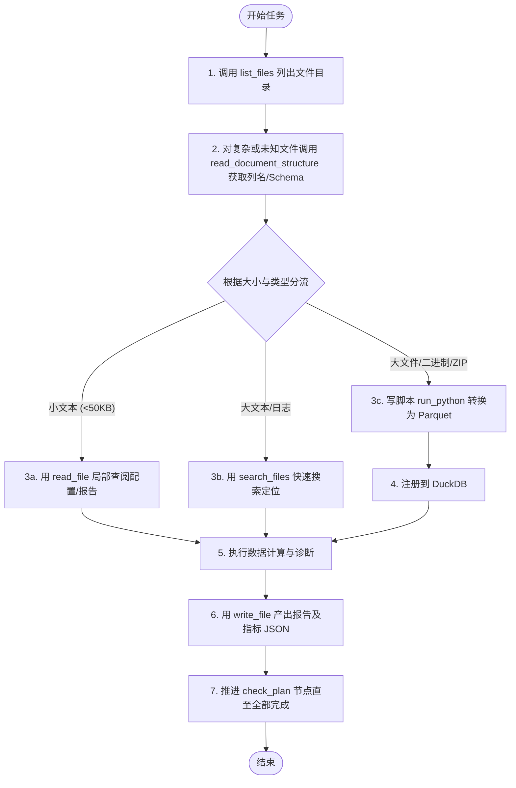

# Agent Tools API 设计规范与参考指南

本文档规定了福州门店AI分析系统中诊断 Agent 工具链（Tools）的接口契约、参数表、返回结构及最佳调用范式，供开发人员查阅及系统集成使用。

---

## 1. 设计哲学与核心原则

为了保障 Agent 执行的稳定性、效率和安全性，工具链遵循以下核心原则：

1. **防爆上下文（Context Safety）**：任何工具都禁止在未经截断的情况下将大文件或二进制全文直接塞入 LLM 的上下文。
2. **侦察与精读分离**：优先使用“侦察工具”（如 `list_files`、`read_document_structure`）了解结构，再用“精读/定位工具”（如 `read_file`、`search_files`）读取局部细节。
3. **结构化 JSON 返回**：所有文件与数据查询工具的返回均采用统一、预期的 JSON 字符串结构，便于 Agent 准确解析和预测下一步动作。
4. **安全沙箱隔离**：敏感的数据处理、解析及重组逻辑一律封装在 Python 脚本中，通过 `run_python` 执行，与主服务隔离。

---

## 2. 核心工具 API 参考

### 2.1 `list_files`
* **功能描述**：探测指定子目录下的文件列表，辅助 Agent 决定下一步使用精读还是脚本处理工具。
* **参数列表**：

| 参数名 | 类型 | 是否必填 | 默认值 | 描述 |
| :--- | :--- | :--- | :--- | :--- |
| `subdir` | string | 否 | `""` | 相对工作区的子目录路径，如 `"input"`, `"tables"`, `"output"`。若为空则代表工作区根目录。 |

* **返回格式 (JSON 数组)**：
  ```json
  [
    {
      "path": "input/sales_data.csv",
      "name": "sales_data.csv",
      "size": 1048576,
      "size_human": "1.0MB",
      "ext": ".csv",
      "kind": "csv",
      "recommended_tool": "read_document_structure"
    }
  ]
  ```

---

### 2.2 `read_file`
* **功能描述**：分页或首尾截取读取工作区内文本文件内容。非文本文件或超过安全阈值的大文件将被拒绝。
* **参数列表**：

| 参数名 | 类型 | 是否必填 | 默认值 | 描述 |
| :--- | :--- | :--- | :--- | :--- |
| `path` | string | 是 | - | 相对工作区的文件路径。 |
| `offset` | integer | 否 | `0` | 从第几行开始读取（0-based 行索引）。若设置 `head` 或 `tail`，则忽略该参数。 |
| `limit` | integer | 否 | `2000` | 最大读取行数（最高且默认值为 2000 行）。 |
| `head` | integer | 否 | `null` | 从文件开头读取的行数。若设置，优先按 `head` 模式读取。 |
| `tail` | integer | 否 | `null` | 从文件结尾读取的行数。若与 `head` 同时设置，将合并提取文件首尾，省去中间内容。 |

* **返回格式 (JSON 对象)**：
  ```json
  {
    "path": "output/log.txt",
    "size": 51200,
    "size_human": "50.0KB",
    "line_start": 0,
    "line_end": 10,
    "total_lines": 120,
    "has_more": true,
    "next_offset": 10,
    "truncated": false,
    "content": "...(实际文本内容)...",
    "note": "文件未读完，请用 next_offset 继续分页读取。"
  }
  ```

---

### 2.3 `write_file`
* **功能描述**：向工作区内写入文本数据。采用临时文件写入后再重命名替换的原子化覆盖机制，确保写入安全。
* **参数列表**：

| 参数名 | 类型 | 是否必填 | 默认值 | 描述 |
| :--- | :--- | :--- | :--- | :--- |
| `path` | string | 是 | - | 相对工作区的文件写入路径，父目录若不存在会自动创建。 |
| `content` | string | 是 | - | 要写入的文本内容。 |
| `mode` | string | 否 | `"overwrite"` | 写入模式。可选值为 `"overwrite"`（原子覆盖）或 `"append"`（追加内容）。 |

* **返回格式 (JSON 对象)**：
  ```json
  {
    "ok": true,
    "path": "output/report.json",
    "mode": "overwrite",
    "bytes_written": 1024,
    "size": 1024,
    "size_human": "1.0KB"
  }
  ```

---

### 2.4 `search_files`
* **功能描述**：在指定文件或整个工作区内快速检索关键字，返回匹配的行号及摘要，避免读取大文件的全文。
* **参数列表**：

| 参数名 | 类型 | 是否必填 | 默认值 | 描述 |
| :--- | :--- | :--- | :--- | :--- |
| `pattern` | string | 是 | - | 检索的文本子串或正则表达式。 |
| `path` | string | 否 | `null` | 指定检索的单个文件路径。若为空，则全局检索工作区内所有文本文件。 |
| `regex` | boolean | 否 | `false` | 是否将 `pattern` 视为正则表达式进行匹配。默认 `false`。 |
| `max_matches` | integer | 否 | `50` | 返回的最大匹配项数量。默认 `50`。 |

* **返回格式 (JSON 数组)**：
  ```json
  [
    {
      "path": "input/system.log",
      "total_matches": 2,
      "matches": [
        { "line": 42, "text": "2026-05-27 ERROR: Failed to compute margin" },
        { "line": 108, "text": "2026-05-27 ERROR: Database connection lost" }
      ]
    }
  ]
  ```

---

### 2.5 `read_document_structure`
* **功能描述**：对各类文档（Excel、CSV、Word、PDF、JSON、Markdown、Zip、SQLite）进行**结构化结构侦察**，绝不返回全文内容，保障上下文安全。
* **参数列表**：

| 参数名 | 类型 | 是否必填 | 默认值 | 描述 |
| :--- | :--- | :--- | :--- | :--- |
| `path` | string | 是 | - | 探测的目标文件相对路径。 |

* **返回格式 (JSON 对象，根据文件类型 `kind` 自动适配 `summary` 字段)**：
  ```json
  {
    "path": "input/report.xlsx",
    "kind": "xlsx",
    "size": 524288,
    "size_human": "512.0KB",
    "summary": {
      "sheets": [
        {
          "name": "业绩概览",
          "columns": ["日期", "销售额", "毛利润", "毛利率"],
          "total_rows": 100,
          "sample_rows": [
            { "日期": "2026-05-01", "销售额": 15000.0, "毛利润": 4500.0, "毛利率": 0.3 }
          ]
        }
      ]
    },
    "recommended_next_tool": "run_python"
  }
  ```
* **各格式 `summary` 返回规范**：
  * **`.xlsx / .xls`**: 返回 Sheet 列表、各 Sheet 的列名、总行数及首行数据样例。
  * **`.csv`**: 返回列名、总行数、检测到的分隔符（逗号/分号/Tab）及首行数据样例。
  * **`.pdf`**: 返回总页数、包含的表格数量统计、前 2 页的文本大纲/关键元数据概览。
  * **`.docx`**: 返回段落数、表格数，以及**大纲结构**（通过 `python-docx` 提取样式为 `Heading` 的标题层级与行号）和前 3 个表格的维度（行x列）与表头预览（直接遍历 `doc.tables` 单元格，易实现且不依赖第三方转换工具）。
  * **`.json`**: 返回根节点类型、键值列表（含值类型）、列表长度（若为数组）或顶层嵌套字段结构示意。
  * **`.md`**: 返回标题层级大纲（如 `#`, `##`）及其对应的行号，并提取探测到的 **Markdown 表格表头及列名**（忽略粗体、斜体等无意义的文本样式，仅提取表格结构）。
  * **`.txt`**: 返回文件大小、总行数、前 5 行文本预览，并执行**结构特征自动识别**：
    * **伪 CSV/TSV 检测**：若前数行包含一致的逗号/Tab/竖线分隔符，提示 Agent 其为“结构化数据”，并返回预测的列名。
    * **日志特征检测**：若包含常见的时间戳及日志等级（`INFO`/`WARNING`/`ERROR`），将其标记为“日志文件”，推荐使用 `search_files`。
  * **`.zip`**: 返回压缩包内的目录树结构、文件路径清单及压缩前后的文件大小。
  * **`.sqlite`**: 返回数据库中包含的表名、索引、各表的字段定义（Schema）及总记录数。

---

### 2.6 `duckdb_query`
* **功能描述**：在工作区的 DuckDB（`analysis.duckdb`）上执行只读 SELECT 查询，用于结构化分析指标。
* **参数列表**：

| 参数名 | 类型 | 是否必填 | 默认值 | 描述 |
| :--- | :--- | :--- | :--- | :--- |
| `sql` | string | 是 | - | 待执行的只读 SELECT SQL 语句。特殊字符或中文列名需双引号包裹。 |

* **使用限制**：
  * 仅限只读 SELECT 语句，禁止任何写操作（如 `INSERT`/`UPDATE`/`DROP`/`ALTER`）。
  * DuckDB 标识符中若带有特殊字符或中文，请务必用双引号包裹（如 `SELECT "销售额(元)" FROM sales`）。
* **返回格式 (JSON 数组)**：
  ```json
  [
    { "month": "2026-05", "total_sales": 1250000.0 },
    { "month": "2026-06", "total_sales": 1380000.0 }
  ]
  ```

---

### 2.7 `query_sqlite`
* **功能描述**：对本地 SQLite 数据库（`.sqlite`、`.db`）文件执行只读 SELECT 查询，提供高防护的数据检索支持。
* **参数列表**：

| 参数名 | 类型 | 是否必填 | 默认值 | 描述 |
| :--- | :--- | :--- | :--- | :--- |
| `path` | string | 是 | - | SQLite 数据库文件在工作区的相对路径。 |
| `sql` | string | 是 | - | 只读 SELECT 查询 SQL 语句。 |

* **安全设计**：
  * 必须以 `mode=ro`（只读 URI 模式）连接数据库，任何写操作都会在数据库驱动层被拦截拒绝。
  * 内置返回数量上限（默认为 100 行），防爆模型上下文。
* **返回格式**：与 `duckdb_query` 一致，返回查得的数据行 JSON 数组。

---

### 2.8 `run_python`
* **功能描述**：在工作区受控沙箱环境下运行自定义的 Python 脚本，用以处理大文件清洗、分块解析、文件格式转换等复杂逻辑。
* **参数列表**：

| 参数名 | 类型 | 是否必填 | 默认值 | 描述 |
| :--- | :--- | :--- | :--- | :--- |
| `script_path` | string | 是 | - | 待执行脚本在工作区的相对路径，脚本必须统一存放在 `scripts/` 目录下（如 `scripts/wash_data.py`）。 |

* **安全机制与沙箱环境能力**：
  * 脚本拥有标准输入输出（stdout/stderr）抓取。
  * 沙箱环境内置并支持以下库：`pandas`、`duckdb`、`openpyxl`、`pdfplumber`、`python-docx`。

---

## 3. 工作流与计划辅助工具

为了规范 Agent 运行逻辑并支撑可视化进度条，系统提供了三个辅助工作流状态的工具：

| 工具名称 | 输入参数 (Markdown 表见下文) | 作用与返回说明 |
| :--- | :--- | :--- |
| **`read_plan`** | 无 | 读取当前执行计划的 JSON 配置（包括各步骤标题、细节和完成状态），使 Agent 随时核对工作位置。 |
| **`check_plan`** | `step_index` (integer, 必填) | 传入当前完成的步骤索引，系统会自动调用对应的 python 验证代码进行结果断言。验证通过后向前推进计划进度并更新全局状态。返回格式如：`{"step_index": 0, "ok": true, "errors": []}`。 |
| **`read_context`** | `topic` (string, 必填) | 获取系统注入的静态规则。如传入 `"指标计算文档"`，返回相关的标准列映射公式及业务指标体系定义。 |
| **`list_tables`** | 无 | 查看当前 DuckDB 数据库中已成功注册的表名、对应的数据列及总行数。 |

#### 辅助工具参数表

* **`check_plan`** 参数：

| 参数名 | 类型 | 是否必填 | 默认值 | 描述 |
| :--- | :--- | :--- | :--- | :--- |
| `step_index` | integer | 是 | - | 当前验证步骤的索引 (0-based)。 |

* **`read_context`** 参数：

| 参数名 | 类型 | 是否必填 | 默认值 | 描述 |
| :--- | :--- | :--- | :--- | :--- |
| `topic` | string | 是 | - | 静态文档的主题名称，如 `"指标计算文档"`。 |

---

## 4. Agent 最佳实践建议（提示词引导指南）


