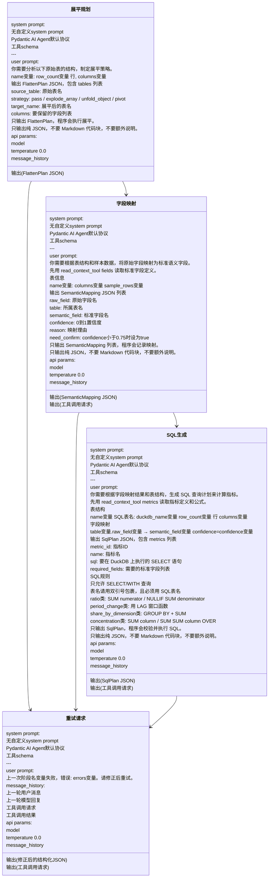

# Pydantic 管线 — LLM API 调用链路

```mermaid
classDiagram
    class 展平规划 {
        system prompt:
        无自定义system prompt
        Pydantic AI Agent默认协议
        工具schema
        ---
        user prompt:
        你需要分析以下原始表的结构，制定展平策略。
        name变量: row_count变量 行, columns变量
        输出 FlattenPlan JSON，包含 tables 列表
        source_table: 原始表名
        strategy: pass / explode_array / unfold_object / pivot
        target_name: 展平后的表名
        columns: 要保留的字段列表
        只输出 FlattenPlan，程序会执行展平。
        只输出纯 JSON，不要 Markdown 代码块，不要额外说明。
        api params:
        model
        temperature 0.0
        message_history
        输出(FlattenPlan JSON)
    }

    class 字段映射 {
        system prompt:
        无自定义system prompt
        Pydantic AI Agent默认协议
        工具schema
        ---
        user prompt:
        你需要根据表结构和样本数据，将原始字段映射为标准语义字段。
        先用 read_context_tool fields 读取标准字段定义。
        表信息
        name变量: columns变量 sample_rows变量
        输出 SemanticMapping JSON 列表
        raw_field: 原始字段名
        table: 所属表名
        semantic_field: 标准字段名
        confidence: 0到1置信度
        reason: 映射理由
        need_confirm: confidence小于0.75时设为true
        只输出 SemanticMapping 列表，程序会记录映射。
        只输出纯 JSON，不要 Markdown 代码块，不要额外说明。
        api params:
        model
        temperature 0.0
        message_history
        输出(SemanticMapping JSON)
        输出(工具调用请求)
    }

    class SQL生成 {
        system prompt:
        无自定义system prompt
        Pydantic AI Agent默认协议
        工具schema
        ---
        user prompt:
        你需要根据字段映射结果和表结构，生成 SQL 查询计划来计算指标。
        先用 read_context_tool metrics 读取指标定义和公式。
        表结构
        name变量 SQL表名: duckdb_name变量 row_count变量 行 columns变量
        字段映射
        table变量.raw_field变量 → semantic_field变量 confidence=confidence变量
        输出 SqlPlan JSON，包含 metrics 列表
        metric_id: 指标ID
        name: 指标名
        sql: 要在 DuckDB 上执行的 SELECT 语句
        required_fields: 需要的标准字段列表
        SQL规则
        只允许 SELECT/WITH 查询
        表名请用双引号包裹，且必须用 SQL表名
        ratio类: SUM numerator / NULLIF SUM denominator
        period_change类: 用 LAG 窗口函数
        share_by_dimension类: GROUP BY + SUM
        concentration类: SUM column / SUM SUM column OVER
        只输出 SqlPlan，程序会校验并执行 SQL。
        只输出纯 JSON，不要 Markdown 代码块，不要额外说明。
        api params:
        model
        temperature 0.0
        message_history
        输出(SqlPlan JSON)
        输出(工具调用请求)
    }

    class 重试请求 {
        system prompt:
        无自定义system prompt
        Pydantic AI Agent默认协议
        工具schema
        ---
        user prompt:
        上一次阶段名变量失败，错误: errors变量。请修正后重试。
        message_history:
        上一轮用户消息
        上一轮模型回复
        工具调用请求
        工具调用结果
        api params:
        model
        temperature 0.0
        message_history
        输出(修正后的结构化JSON)
        输出(工具调用请求)
    }

    展平规划 --> 字段映射
    字段映射 --> SQL生成
    展平规划 --> 重试请求
    字段映射 --> 重试请求
    SQL生成 --> 重试请求
```
