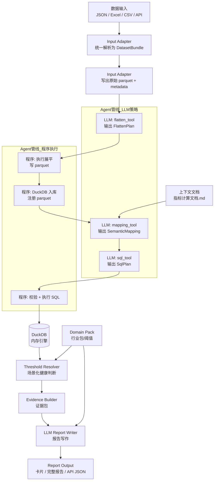
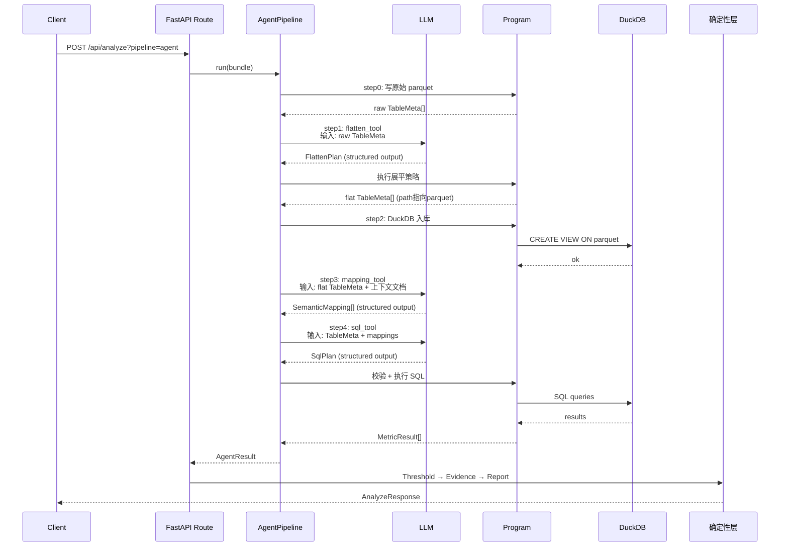
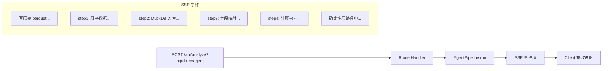

# Pydantic AI Agent — 架构设计

> 主线候选方案：单一 Agent + 4 步 Tool 调用 + DuckDB 引擎 + 确定性后处理

---

## 设计目标

| 维度 | 目标 |
|------|------|
| 输入鲁棒性 | 任意嵌套 JSON / 多 sheet Excel / CSV，稳定展平为二维表 |
| 字段映射 | 读上下文文档，场景感知匹配标准字段 |
| SQL 生成 | 覆盖 ratio / period_change / share_by_dimension / concentration / top_contribution |
| DeepSeek 兼容 | OpenAI-compatible provider，function calling + structured output 正常 |
| 工程可维护 | FastAPI 集成、SSE 复用、Pydantic model 类型安全 |

---

## 职责边界

**LLM 负责（策略层）**：
- 判断展平策略（哪些字段要展开、怎么展开）
- 生成字段映射（原始字段 → 标准语义字段）
- 生成 SQL plan（要算什么指标、怎么写 SQL）

**程序负责（执行层）**：
- 执行 Python 展平代码
- 写 parquet 落盘
- 建 DuckDB 表 / 视图
- 校验 SQL 语法安全
- 执行 SQL 取结果
- 计算阈值
- 组装 evidence

---

## 总体流程



---

## 数据契约（核心）

**任何时候 LLM 和程序之间不传递 DataFrame JSON 数据。** 只传递 metadata：

```python
class TableMeta(BaseModel):
    name: str                    # 表名，如 "sales_daily"
    path: str                    # parquet 路径，如 "artifacts/report_xxx/sales_daily.parquet"
    columns: list[ColumnMeta]    # 字段定义
    row_count: int               # 行数
    sample_rows: list[dict]      # 前 3~5 行，供 LLM 看数据样貌

class ColumnMeta(BaseModel):
    name: str
    dtype: str                   # int64 / float64 / string / date / …
    null_count: int
    sample_values: list[any]     # 几个样本值
```

生产数据存放在 parquet 文件中，路径规范：

```
artifacts/
  {report_id}/
    raw/              # 原始数据的 parquet（Input Adapter 产出）
    flattened/        # 展平后的 parquet（flatten_tool 产出）
```

---

## 组件设计

### AgentPipeline（统一接口）

对外只暴露一个接口：

```python
class AgentPipeline:
    async def run(bundle: DatasetBundle) -> AgentResult:
        ...
```

内部编排：

```python
class AgentPipeline:
    def __init__(self, model: AgentModel, db: DuckDBEngine, artifact_dir: str):
        self.agent = Agent(
            model=model,
            tools=[flatten_tool, mapping_tool, sql_tool],
        )

    async def run(self, bundle: DatasetBundle) -> AgentResult:
        # step0: write raw parquet
        raw_metas = await write_raw_parquet(bundle, self.artifact_dir)
        # step1: LLM plan → program flatten
        plan: FlattenPlan = await self.agent.run("制定展平策略", raw_metas)
        flat_metas = await execute_flatten(plan, raw_metas, self.artifact_dir)
        # step2: program DuckDB register
        await register_tables(flat_metas, self.db)
        # step3: LLM mapping → structured output
        mappings: list[SemanticMapping] = await self.agent.run("字段映射", flat_metas)
        # step4: LLM sql plan → program validate + execute
        sql_plan: SqlPlan = await self.agent.run("生成 SQL 计划", flat_metas, mappings)
        metrics = await execute_sql(sql_plan, self.db)
        return AgentResult(tables=flat_metas, mappings=mappings, metrics=metrics)
```

### 数据流



---

## LLM 工具定义

### 1. `flatten_tool` — 输出展平策略

**LLM 输入**：`list[TableMeta]`（原始数据 metadata）

**LLM 输出**（Pydantic structured output）：

```python
class FlattenPlan(BaseModel):
    tables: list[FlattenTablePlan]

class FlattenTablePlan(BaseModel):
    source_table: str                         # 原始表名
    strategy: Literal["pass", "explode_array", "unfold_object", "pivot"]
    target_name: str                          # 目标表名
    columns: list[str]                        # 保留的字段
    notes: str = ""                           # 说明

class FlattenColumnPlan(BaseModel):
    source_field: str                         # 原始字段路径
    target_column: str                        # 展平后的列名
    extract_strategy: Literal["direct", "unnest", "json_extract"]
```

**程序执行**：按 plan 执行 Python 展平 → 写 parquet（pandas + pyarrow）→ 返回 `list[TableMeta]`

### 2. `mapping_tool` — 输出字段映射

**LLM 输入**：`list[TableMeta]`（展平后 metadata + sample_rows） + 上下文文档

**LLM 输出**（Pydantic structured output）：

```python
class SemanticMapping(BaseModel):
    raw_field: str
    table: str
    semantic_field: str
    confidence: float          # 0~1
    reason: str
    need_confirm: bool = False
```

**程序执行**：nothing（只需存储 mapping，供 SQL plan 参考）

### 3. `sql_tool` — 输出 SQL plan

**LLM 输入**：`list[TableMeta]` + `list[SemanticMapping]` + 指标需求

**LLM 输出**（Pydantic structured output）：

```python
class SqlPlan(BaseModel):
    metrics: list[MetricSql]

class MetricSql(BaseModel):
    metric_id: str
    name: str
    sql: str                   # 要在 DuckDB 上执行的 SQL
    required_fields: list[str]
    depends_on: list[str] = [] # 依赖的中间表
```

**程序执行**：
1. 校验 SQL 语法（sqlparse / DuckDB parser）
2. 安全检查（只允许 SELECT，不允许 DDL/DML）
3. 执行 SQL
4. 返回 `MetricResult[]`

---

## FastAPI 集成



```python
@router.post("/analyze")
async def analyze(
    request: Request,
    file: UploadFile = None,
    pipeline: str = Query("deterministic"),
):
    if pipeline == "agent":
        return await agent_route_handler(request, file)
    # deterministic pipeline as before
    ...
```

API 输出兼容现有 `AnalyzeResponse`：

```ts
type AnalyzeResponse = {
  reportId: string;
  scene: SceneContext;
  mapping: SemanticMapping[];
  metrics: MetricResult[];
  cards: ReportCard[];
  fullReport: string;
  warnings: string[];
};
```

---

## 确定性层（不变）

Agent 管线输出的指标结果仍然走现有的确定性层：

```text
MetricResult[] → Threshold Resolver → Evidence Builder → LLM Report Writer
```

| 组件 | 不变内容 |
|------|---------|
| Threshold Resolver | 行业包阈值 + 场景化健康判断 |
| Evidence Builder | 指标值 → 证据包，含映射记录 |
| LLM Report Writer | 根据证据包写报告/卡片 |
| Domain Packs | common.yaml / pharmacy.yaml 等 |

---

## 目录结构（已建）

```text
packages/
  agents/                           # Agent 管线代码（新增，独立于 core/）
    __init__.py
    models.py                       # 共享 Pydantic 模型（TableMeta, FlattenPlan, SqlPlan, AgentResult...）
    base.py                         # AgentPipeline 抽象基类
    workspace.py                    # 隔离工作区管理（parquet / manifest / 文件 I/O）
    pydantic_pipeline.py            # Pydantic 线：LLM 出策略 → 程序执行
    smol_pipeline.py                # Smolagents 线：CodeAgent 写代码 → 沙箱执行
    tools/                          # 共享工具（两边 pipeline 共用）
      __init__.py
      file_tool.py                  # 工作区文件读/写/列表
      duckdb_tool.py                # DuckDB 建库/注册 parquet/执行 SQL
      python_tool.py                # 沙箱内执行 Python 脚本
      context_tool.py               # 读取指标文档/字段定义/行业规则
      validate_tool.py              # 校验 manifest/mapping/metrics
      profile_tool.py               # 查看表结构/样本/空值率
    prompts/                        # Agent 系统提示词
      pydantic.md                   # Pydantic 线提示词
      smol.md                       # Smolagents 线提示词
  core/                             # 现有确定性逻辑不变
    ...
apps/api/src/
  routes/
    agent_route.py                  # 单路由：pipepline 参数切换 pydantic/smol
```

---

## 对比确定性管线

| 维度 | 确定性管线 | Agent 管线 |
|------|-----------|-----------|
| 输入格式 | 需预知 schema | 任意格式，LLM 动态判断展平策略 |
| 字段映射 | KEYWORD_MAP 死字典 | 读上下文文档，LLM 匹配，structured output |
| SQL 生成 | Metric Registry 注册制 | LLM 生成 SQL plan，程序校验后执行 |
| 数据传递 | 内存 DataFrame | parquet 文件 + metadata，避免爆 token |
| 可解释性 | 高，每步有类型约束 | 中，但 LLM 输出有 structured model |
| 性能 | 毫秒级 | 秒级（LLM 调用次数可控） |
| 兜底 | — | Agent 失败回退确定性管线 |

---

## 评判标准

| 维度 | 期望 |
|------|------|
| 嵌套 JSON 展平 | 5 层以上深度稳定展平，不丢字段 |
| 生成 SQL 正确率 | 覆盖 5 种计算器，数值误差 < 0.01% |
| DeepSeek 兼容 | function calling + structured output 正常 |
| FastAPI 接入 | routes / SSE / 异常处理复用现有代码 |
| 字段映射准确率 | 读取指标计算文档后匹配准确率 > 90% |
| 内存安全 | 任何步骤不将 DataFrame JSON 传入 LLM |
