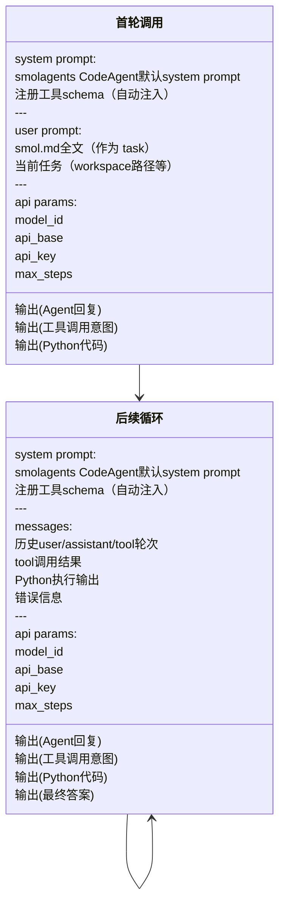

# Smol 管线 — LLM API 调用链路

## 提示词构成

| 层级 | 来源 | 内容 |
|------|------|------|
| **system prompt** | `CodeAgent.initialize_system_prompt()` | smolagents 内置：角色定义、代码执行规则、**注册的 tool 自动注入**（名称+描述+参数）、授权 imports |
| **user prompt（首轮）** | `_build_prompt()` → `agent.run(task)` | `prompts/smol.md` 全文 + 当前任务信息（workspace 路径、input 文件列表等）|
| **user msg（后续轮次）** | `CodeAgent.write_memory_to_messages()` | 历史 assistant 回复、tool 调用结果、Python 执行输出、错误信息 |
| **current_plan** ❗ | `_PlanInjectModel.__call__()` 中 `messages.append(...)` | **当前未生效**——`CodeAgent` 调用的是 `model.generate()` 而非 `model()`，plan 注入代码在 `__call__` 中，实际未执行 |

### 说明

- **smol.md 不是 system prompt**，而是作为 `task` 传给 `agent.run(task)`，最终成为 **user 消息**。模型首轮看到的结构是 `[system(含 tool defs), user(smol.md 内容)]`。
- **工具列表在 smol.md 中冗余**：框架自动将注册 tool 注入 system prompt，无需手写。
- **plan 相关说明在 smol.md 中冗余**：plan 本应由 `_PlanInjectModel` 自动附加到每次请求末尾（当前有 bug，待修复），模型自然能看到。

