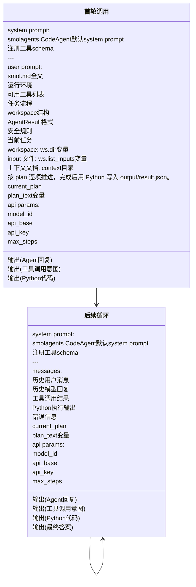

# Smol 管线 — LLM API 调用链路

```mermaid
classDiagram
    class 首轮调用 {
        system prompt:
        smolagents CodeAgent默认system prompt
        注册工具schema
        ---
        user prompt:
        smol.md全文
        运行环境
        可用工具列表
        任务流程
        workspace结构
        AgentResult格式
        安全规则
        当前任务
        workspace: ws.dir变量
        input 文件: ws.list_inputs变量
        上下文文档: context目录
        按 plan 逐项推进，完成后用 Python 写入 output/result.json。
        current_plan
        plan_text变量
        api params:
        model_id
        api_base
        api_key
        max_steps
        输出(Agent回复)
        输出(工具调用意图)
        输出(Python代码)
    }

    class 后续循环 {
        system prompt:
        smolagents CodeAgent默认system prompt
        注册工具schema
        ---
        messages:
        历史用户消息
        历史模型回复
        工具调用结果
        Python执行输出
        错误信息
        current_plan
        plan_text变量
        api params:
        model_id
        api_base
        api_key
        max_steps
        输出(Agent回复)
        输出(工具调用意图)
        输出(Python代码)
        输出(最终答案)
    }

    首轮调用 --> 后续循环
    后续循环 --> 后续循环
```
