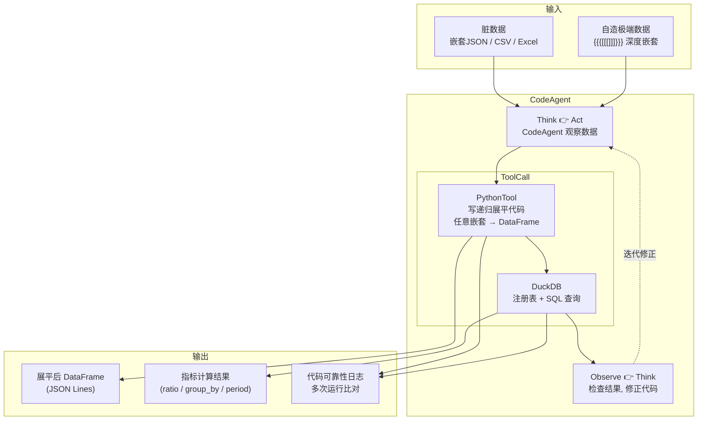
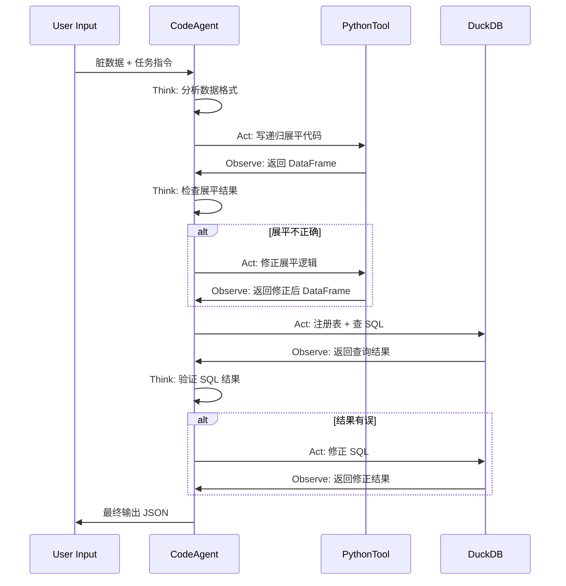
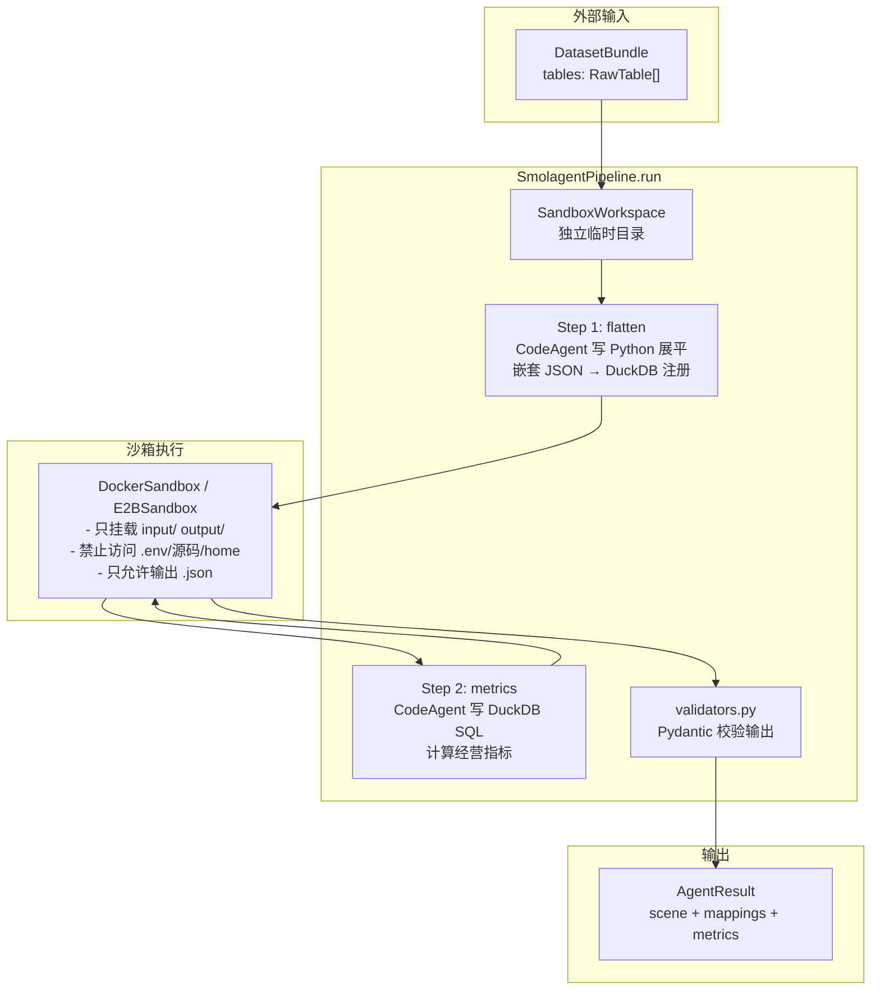

# Smolagents CodeAgent — 架构设计（方法2）

> 脏数据处理管线。利用 CodeAgent 写 Python 动态展平 + DuckDB SQL 计算，应对深层嵌套和不规则输入。

---

## 总体流程



---

## 入口点

只有一个 Python 入口，喂入脏数据，看 CodeAgent 能不能自己搞定：

```python
# scripts/run_smolagent_poc.py
from smolagents import CodeAgent, HfApiModel, PythonTool, tool

@tool
def duckdb_query(sql: str) -> str:
    """在 DuckDB 上执行 SQL 并返回 JSON 结果"""
    ...

agent = CodeAgent(
    tools=[PythonTool(), duckdb_query],
    model=HfApiModel("deepseek-chat"),
    max_iterations=10,
)

result = agent.run("""
读取 data/examples/概览-日.json，
将其展平为二维表并注册到 DuckDB，
然后计算：总营收、渠道占比、环比变化。
输出 JSON。
""")
```

评判标准：

- CodeAgent 是否自己写出递归展平代码（不依赖外部库）
- 生成的 SQL 是否正确
- 多次跑同输入，代码和结果是否稳定

---

## 组件设计

### 1. CodeAgent

| 属性     | 值                                                             |
| -------- | -------------------------------------------------------------- |
| 类       | `smolagents.CodeAgent`                                         |
| 模型     | `HfApiModel` → DeepSeek-compatible API                         |
| 最大迭代 | 10 步（Think → Act → Observe）                                 |
| 计划类型 | `plan_first`（先写计划再执行）vs `react`（边做边想），对比测试 |

### 2. PythonTool

smolagents 内置的 `PythonTool`，允许 CodeAgent 写任意 Python 代码并执行。

PoC 中 Agent 会用它来：

- 读取 JSON/CSV/Excel 文件
- 写递归展平逻辑处理嵌套结构
- 处理脏数据（空值、类型混用、错位字段）
- 调用 DuckDB Python API 注册表 + 查表

```python
# Agent 自己会写出类似这样的代码（不需要我们写）：
import json, duckdb, pandas as pd

with open("data/examples/概览-日.json") as f:
    raw = json.load(f)

def flatten(obj, prefix=""):
    rows = []
    if isinstance(obj, dict):
        if all(isinstance(v, (int, float, str)) for v in obj.values()):
            rows.append({prefix.strip("."): obj})
        else:
            for k, v in obj.items():
                rows.extend(flatten(v, f"{prefix}{k}."))
    elif isinstance(obj, list):
        for item in obj:
            rows.extend(flatten(item, prefix))
    return rows

df = pd.DataFrame(flatten(raw))
con = duckdb.connect()
con.register("data_tbl", df)
con.execute("SELECT SUM(retail_amount) as total_revenue FROM data_tbl").fetchdf()
```

### 3. DuckDB 工具

通过 `@tool` 装饰的自定义工具，封装 DuckDB SQL 执行。

```python
@tool
def duckdb_query(sql: str) -> str:
    """在内存 DuckDB 实例上执行 SQL 返回 JSON

    Args:
        sql: 要执行的 SQL 语句
    Returns:
        JSON 字符串格式的查询结果
    """
    import json, duckdb
    con = duckdb.connect(":memory:")
    try:
        result = con.execute(sql).fetchdf()
        return json.dumps(json.loads(result.to_json(orient="records")), ensure_ascii=False)
    finally:
        con.close()
```

注意：PoC 阶段不保留 DuckDB 状态，每次独立 `connect`/`close`。

---

## Agent 推理流程



---

## 测试数据

| 文件               | 来源     | 特征                            |
| ------------------ | -------- | ------------------------------- |
| `概览-日.json`     | 现有仓库 | 多层嵌套, 字段别名              |
| `概览-月.json`     | 现有仓库 | 多层嵌套, 字段别名              |
| `o2o营业-日.json`  | 现有仓库 | 嵌套 + 字段别名                 |
| `商品资料.csv`     | 现有仓库 | 纯表格, 字段多                  |
| `deep_nested.json` | 自造     | `{{{[[[]]]}}}` 深度嵌套, 测极限 |

测试数据路径：`data/examples/`

---

## 评判标准

| 维度           | 期望                                       | 测量方式                |
| -------------- | ------------------------------------------ | ----------------------- |
| 嵌套 JSON 展平 | 自己写递归展平，不依赖外部库               | 看 Agent 生成的代码     |
| 脏数据鲁棒性   | 空值 / 类型混用 / 错位字段能兜底           | 注入脏数据测试          |
| SQL 生成       | 能完成 ratio / group_by / period_change 等 | 看输出结果              |
| 代码可靠性     | 同一输入多次跑，代码和结果稳定             | 跑 5 次比对输出         |
| 迭代收敛       | 能在 10 步内完成，不无限循环               | `max_iterations` 不超限 |

---

## 成功后抽取为子模块

如果 PoC 效果好，把 CodeAgent 的 Python 代码生成能力抽取为：

```
packages/core/agent_tools/
  ├── codegen_parser.py   ← 输入原始数据 → 输出 DataFrame
  └── codegen_mapper.py   ← 输入字段列表 → 输出字段映射
```

主框架仍走 Pydantic AI，但解析/映射两步可换成 CodeAgent 生成代码执行。

---

## 统一接口契约

两个 Agent 分支（Pydantic AI / Smolagents）必须交付**同一个接口**，保证可互换：

```python
@dataclass
class DatasetBundle:
    source_type: str
    tables: List[RawTable]
    received_at: str

@dataclass
class AgentResult:
    scene: dict
    mappings: List[dict]
    metrics: List[MetricResult]
    raw_output: str

class AgentPipeline:
    async def run(self, bundle: DatasetBundle) -> AgentResult:
        ...
```

---

## 包结构

```
packages/agents/
  ├── __init__.py               # 导出 AgentPipeline, DatasetBundle, AgentResult
  ├── models.py                 # 共享 Pydantic 数据模型
  ├── base.py                   # AgentPipeline 抽象接口
  ├── workspace.py              # AgentWorkspace (独立临时目录)
  ├── smol_pipeline.py          # SmolPipeline 实现
  ├── pydantic_pipeline.py      # PydanticPipeline 实现
  ├── tools/                    # 共享工具（两边共用）
  │   ├── __init__.py
  │   ├── file_tool.py          # read/write/list workspace 文件
  │   ├── duckdb_tool.py        # DuckDB SQL 查询 + 注册 parquet
  │   ├── python_tool.py        # 在 workspace 沙箱内执行 Python 脚本
  │   ├── context_tool.py       # 读上下文文档（指标/字段规则）
  │   ├── validate_tool.py      # 校验输出结构
  │   └── profile_tool.py       # 数据画像
  ├── prompts/
  │   ├── smol.md               # Smolagent 系统提示词
  │   └── pydantic.md           # Pydantic AI 系统提示词
  └── tests/
      └── __init__.py

apps/api/src/routes/
  └── agent_route.py            # 单路由 POST /api/agent/analyze?pipeline=smol|pydantic
```

## Smolagent 管线流程



## 安全策略

| 要求                            | 实现                                            |
| ------------------------------- | ----------------------------------------------- |
| executor_type="docker" 或 "e2b" | `sandbox.py` 中 `DockerSandbox` / `E2BSandbox`  |
| 禁止本地裸 PythonTool           | CodeAgent 没有 PythonTool，代码在沙箱内执行     |
| 每次任务独立 workspace          | `SandboxWorkspace` 每次 `tempfile.mkdtemp()`    |
| 只挂载 input/ 和 output/        | Docker volume 只挂载 output/，input/ 打包进镜像 |
| 不挂载 .env / 源码 / home       | Dockerfile 只 COPY input/，不挂载卷             |
| 只允许输出 parquet/json         | `SandboxWorkspace._output_dir` 限定写入目录     |
| 最终输出再过 Pydantic 校验      | `validators.py` → `validate_agent_output()`     |

| 维度         | Smolagents CodeAgent              | Pydantic AI             |
| ------------ | --------------------------------- | ----------------------- |
| 代码生成     | 内置 PythonTool，Agent 自己写代码 | 需要自己实现 tool       |
| 结构化输出   | 弱，依赖 prompt 约束              | 强，Pydantic model 约束 |
| FastAPI 集成 | 无开箱支持                        | 有 `AgentService` 示例  |
| 生产级       | 否（PoC）                         | 是（主线候选）          |
| 脏数据处理   | 预期更强（Agent 动态写代码）      | 依赖预定义 tool         |
| 稳定性       | 待验证                            | 预期更稳定              |
| 学习成本     | 低，API 简洁                      | 中等，概念多            |

---

## 参考

- [Smolagents 文档](https://huggingface.co/docs/smolagents)
- [CodeAgent 示例](https://huggingface.co/docs/smolagents/tutorials/building_good_agents)
- [Pydantic AI Agent 文档](../pydantic-ai-agent/文档.md) — 对照方案
- [Agent 方案讨论](../../agent-方案讨论.md) — 总体决策
- [架构设计](../../架构设计.md) — 系统整体架构
