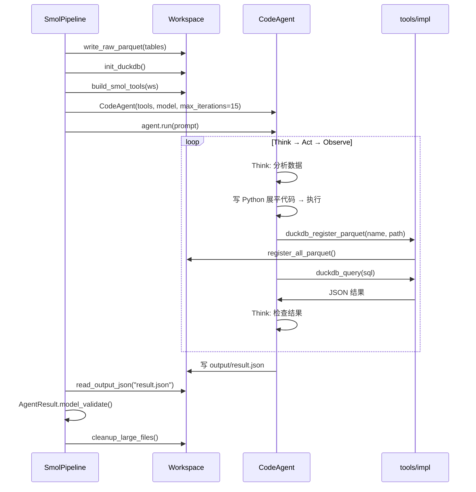

# Smolagents CodeAgent — 架构设计（方法2）

> 脏数据处理管线。利用 CodeAgent 写 Python 动态展平 + DuckDB SQL 计算，应对深层嵌套和不规则输入。

---

## 总体流程

```mermaid
flowchart TD
    A[DatasetBundle<br/>tables: RawTable[]] --> B[Workspace<br/>write_raw_parquet]

    subgraph SmolPipeline.run
        direction TB
        B --> C["init_duckdb()<br/>注册所有 parquet 为视图"]
        C --> D["build_smol_tools(ws)<br/>闭包注入 workspace"]
        D --> E["CodeAgent<br/>tools + model + max_iterations"]
        E --> F["Agent 写 Python 展平<br/>Agent 写 DuckDB SQL 计算"]
        F --> G["Agent 用 Python 写<br/>output/result.json"]
    end

    subgraph 产物
        H["AgentResult<br/>report_id + scene + mapping + metrics"]
        I["审计文件<br/>agent_trace.json / manifest.json / scripts/"]
    end

    G --> H
    F --> I
    G --> I
```

---

## SmolPipeline

```python
class SmolPipeline(AgentPipeline):
    name = "smol"

    async def run(self, bundle: DatasetBundle) -> AgentResult:
        ws = Workspace(label="smol")
        try:
            ws.write_raw_parquet(bundle.tables)      # 写入 parquet
            self._stage_context(ws)                  # 注入指标文档到 context/
            ws.init_duckdb()                         # 注册 DuckDB 视图

            tools = build_smol_tools(ws)             # 闭包适配器
            agent = CodeAgent(
                tools=tools,
                model=LiteLLMModel("deepseek/deepseek-chat"),
                max_iterations=15,
                additional_authorized_imports=["json","pandas","duckdb","pathlib","os","glob","re"],
            )
            raw = await asyncio.to_thread(agent.run, prompt)
            return self._collect_result(raw, ws)
        finally:
            ws.cleanup_large_files()                 # 只清 parquet + duckdb
```

---

## 组件设计

### 1. Workspace

持久化工作区 `storage/artifacts/{report_id}/`，非临时目录。

| 目录/文件 | 用途 |
|-----------|------|
| `input/` | 原始上传文件 |
| `tables/` | parquet 数据表 |
| `output/` | 产物（result.json 等） |
| `context/` | 注入的上下文文档 |
| `scripts/` | Agent 生成的 Python 脚本 |
| `analysis.duckdb` | DuckDB 持久数据库 |
| `manifest.json` | 表清单 |
| `agent_trace.json` | Agent 执行日志 |

### 2. 三层架构

```
packages/agents/
  ├── tools/impl/        ← 纯函数实现层（无状态，显式传 ws）
  │   ├── file_impl.py       read_file_impl(ws, path)
  │   ├── duckdb_impl.py     duckdb_query_impl(ws, sql)
  │   ├── context_impl.py    read_context_impl(ws, doc)
  │   ├── profile_impl.py    profile_table_impl(ws, path)
  │   ├── python_impl.py     run_python_impl(ws, path)
  │   ├── setup_impl.py      setup/cleanup/list_tables_impl(ws)
  │   └── validate_impl.py   validate_result_impl(data)
  ├── tools/             ← 薄封装层
  │   ├── file_tool.py       → impl 层
  │   ├── duckdb_tool.py     → impl 层
  │   └── ...
  └── adapters/          ← 框架适配层
      ├── smol_tools.py      build_smol_tools(ws) → smolagents @tool
      └── pydantic_tools.py  register_pydantic_tools(ws) → Pydantic AI tools
```

### 3. CodeAgent

| 属性 | 值 |
|------|-----|
| 类 | `smolagents.CodeAgent` |
| 模型 | `LiteLLMModel("deepseek/deepseek-chat")` — 支持任意 OpenAI-compatible API |
| 最大迭代 | 15 步（Think → Act → Observe） |
| 授权导入 | `json, pandas, duckdb, pathlib, os, glob, re` |

CodeAgent 每步写 Python 代码并执行，不需要内置 PythonTool。

### 4. 工具适配器

`build_smol_tools(ws)` 用闭包捕获 workspace，为 tools/impl 层的纯函数创建 smolagents @tool 包装：

```python
def build_smol_tools(ws: Workspace):
    from smolagents import tool

    @tool
    def setup_workspace() -> str:
        return setup_workspace_impl(ws)

    @tool
    def duckdb_query(sql: str) -> str:
        return duckdb_query_impl(ws, sql)

    @tool
    def validate_result(raw: str) -> str:
        return str(validate_result_impl(json.loads(raw)))

    ...  # 共 14 个 tool
```

CodeAgent 也可以直接用 Python 完成文件操作（`open()` / `os.listdir()` / `pandas` / `duckdb.connect()`），tool 作为受控入口补充。

---

## 推理流程



---

## 安全策略

| 要求 | 实现 |
|------|------|
| 工作区隔离 | Workspace 限定在 `storage/artifacts/{id}/` |
| 代码授权导入 | `additional_authorized_imports` 白名单 |
| DuckDB 只读 | `duckdb_query_impl` 只执行 SELECT |
| 路径越界防护 | `Workspace.resolve()` 校验路径在其目录内 |
| 审计可追溯 | `agent_trace.json` / `manifest.json` / `scripts/` 保留 |
| 大文件清理 | `cleanup_large_files()` 只删 parquet + duckdb |

---

## 包结构

```
packages/agents/
  ├── __init__.py
  ├── models.py          # DatasetBundle, AgentResult, SceneContext, Manifest...
  ├── base.py            # AgentPipeline 抽象接口
  ├── workspace.py       # Workspace（持久化，含 duckdb/manifest/trace）
  ├── smol_pipeline.py   # SmolPipeline 实现
  ├── pydantic_pipeline.py
  ├── tools/
  │   ├── __init__.py
  │   ├── file_tool.py / duckdb_tool.py / ...
  │   ├── setup_tool.py
  │   └── impl/          # 纯函数实现层
  │       ├── file_impl.py / duckdb_impl.py / context_impl.py
  │       ├── profile_impl.py / python_impl.py / setup_impl.py
  │       └── validate_impl.py
  ├── adapters/
  │   ├── smol_tools.py       # build_smol_tools(ws) → @tool 列表
  │   └── pydantic_tools.py   # register_pydantic_tools(ws)
  ├── prompts/
  │   ├── smol.md
  │   └── pydantic.md
  └── tests/

apps/api/src/routes/
  └── agent_route.py    # POST /api/agent/analyze?pipeline=smol|pydantic
```

---

## 参考

- [Smolagents 文档](https://huggingface.co/docs/smolagents)
- [CodeAgent 示例](https://huggingface.co/docs/smolagents/tutorials/building_good_agents)
- [Pydantic AI Agent 文档](../pydantic-ai-agent/文档.md)
- [Agent 方案讨论](../../agent-方案讨论.md)
- [架构设计](../../架构设计.md)
