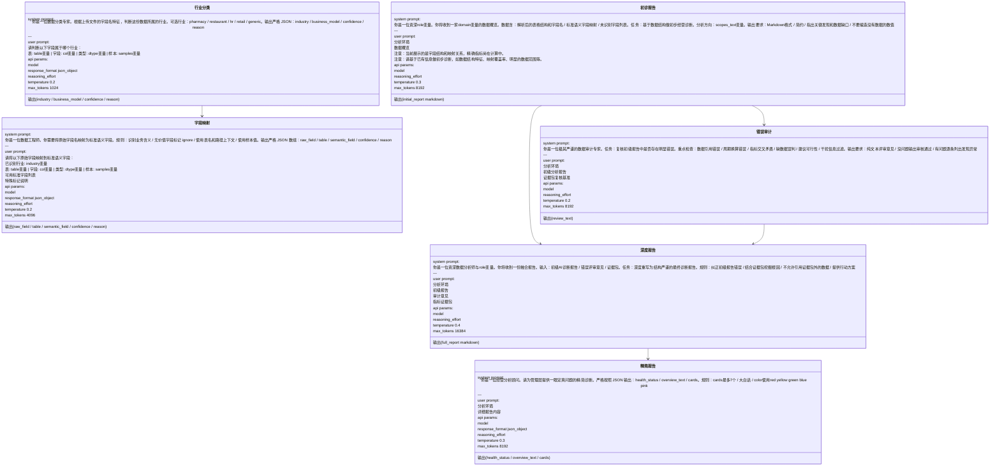

# 传统管线 — LLM API 调用链路

```mermaid
classDiagram
    class 行业分类 {
        system prompt:
        你是一位数据分类专家。根据上传文件的字段名特征，判断这份数据所属的行业。可选行业：pharmacy / restaurant / hr / retail / generic。输出严格 JSON：industry / business_model / confidence / reason
        ---
        user prompt:
        请判断以下字段属于哪个行业：
        表: table变量 | 字段: col变量 | 类型: dtype变量 | 样本: samples变量
        api params:
        model
        response_format json_object
        reasoning_effort
        temperature 0.2
        max_tokens 1024
        输出(industry / business_model / confidence / reason)
    }

    class 字段映射 {
        system prompt:
        你是一位数据工程师。你需要将原始字段名映射为标准语义字段。规则：识别业务含义 / 无价值字段标记 ignore / 使用表名和路径上下文 / 使用样本值。输出严格 JSON 数组：raw_field / table / semantic_field / confidence / reason
        ---
        user prompt:
        请将以下原始字段映射到标准语义字段：
        已识别行业: industry变量
        表: table变量 | 字段: col变量 | 类型: dtype变量 | 样本: samples变量
        可用标准字段列表
        特殊标记说明
        api params:
        model
        response_format json_object
        reasoning_effort
        temperature 0.2
        max_tokens 4096
        输出(raw_field / table / semantic_field / confidence / reason)
    }

    class 初诊报告 {
        system prompt:
        你是一位资深role变量。你将收到一家domain变量的数据概览。数据含：解析后的表格结构和字段名 / 标准语义字段映射 / 未识别字段列表。任务：基于数据结构做初步经营诊断。分析方向：scopes_text变量。输出要求：Markdown格式 / 简约 / 指出关键发现和数据缺口 / 不要编造没有数据的数值
        ---
        user prompt:
        分析环境
        数据概览
        注意：当前展示的是字段结构和映射关系，精确指标尚在计算中。
        注意：请基于已有信息做初步诊断，如数据结构特征、映射覆盖率、明显的数据范围等。
        api params:
        model
        reasoning_effort
        temperature 0.3
        max_tokens 8192
        输出(initial_report markdown)
    }

    class 错误审计 {
        system prompt:
        你是一位极其严谨的数据审计专家。任务：复核初级报告中是否存在明显错误。重点检查：数据引用错误 / 周期换算错误 / 指标交叉矛盾 / 缺数据误判 / 建议可行性 / 干扰信息过滤。输出要求：纯文本评审意见 / 没问题输出审核通过 / 有问题逐条列出发现异常
        ---
        user prompt:
        分析环境
        初级分析报告
        证据包复核基准
        api params:
        model
        reasoning_effort
        temperature 0.2
        max_tokens 8192
        输出(review_text)
    }

    class 深度报告 {
        system prompt:
        你是一位资深数据分析师与role变量。你将收到一份融合报告。输入：初级AI诊断报告 / 错误评审意见 / 证据包。任务：深度重写为结构严谨的最终诊断报告。规则：纠正初级报告错误 / 结合证据包挖掘根因 / 不允许引用证据包外的数据 / 提供行动方案
        ---
        user prompt:
        分析环境
        初级报告
        审计意见
        指标证据包
        api params:
        model
        reasoning_effort
        temperature 0.4
        max_tokens 16384
        输出(full_report markdown)
    }

    class 精简报告 {
        system prompt:
        你是一位经营分析顾问。请为管理层提供一眼定真问题的精简诊断。严格按照 JSON 输出：health_status / overview_text / cards。规则：cards最多7个 / 大白话 / color使用red yellow green blue pink
        ---
        user prompt:
        分析环境
        详细报告内容
        api params:
        model
        response_format json_object
        reasoning_effort
        temperature 0.3
        max_tokens 8192
        输出(health_status / overview_text / cards)
    }

    行业分类 --> 字段映射
    初诊报告 --> 错误审计
    初诊报告 --> 深度报告
    错误审计 --> 深度报告
    深度报告 --> 精简报告
```
