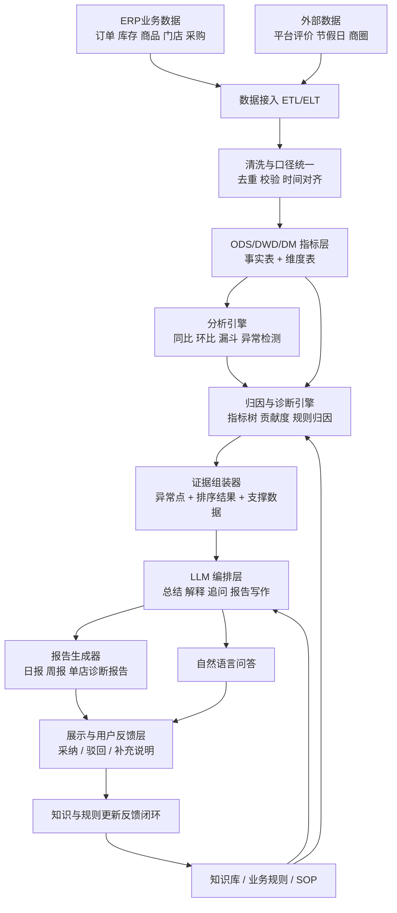
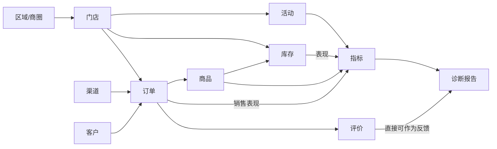
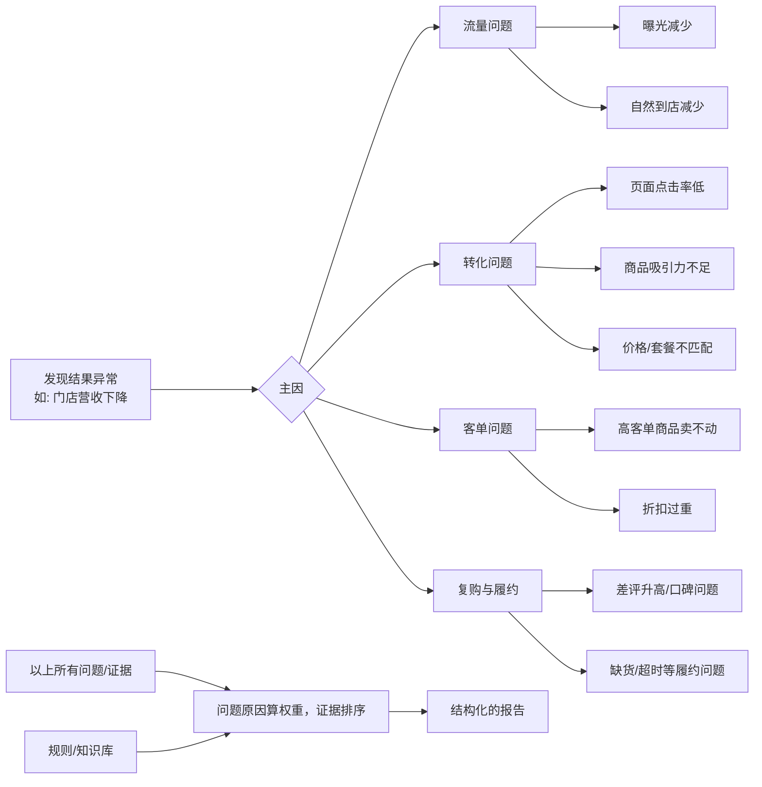
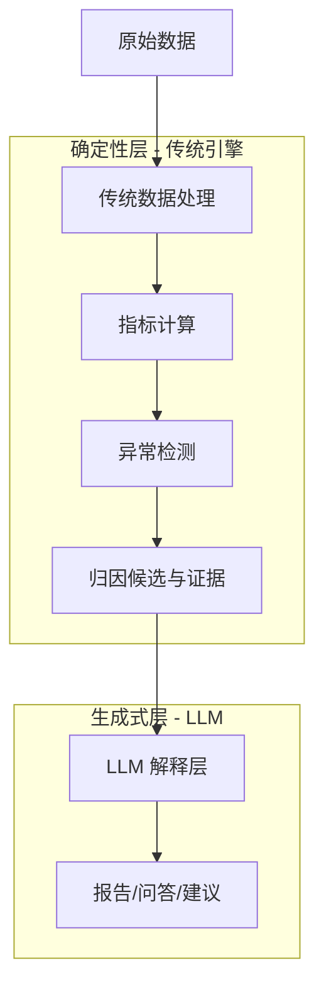
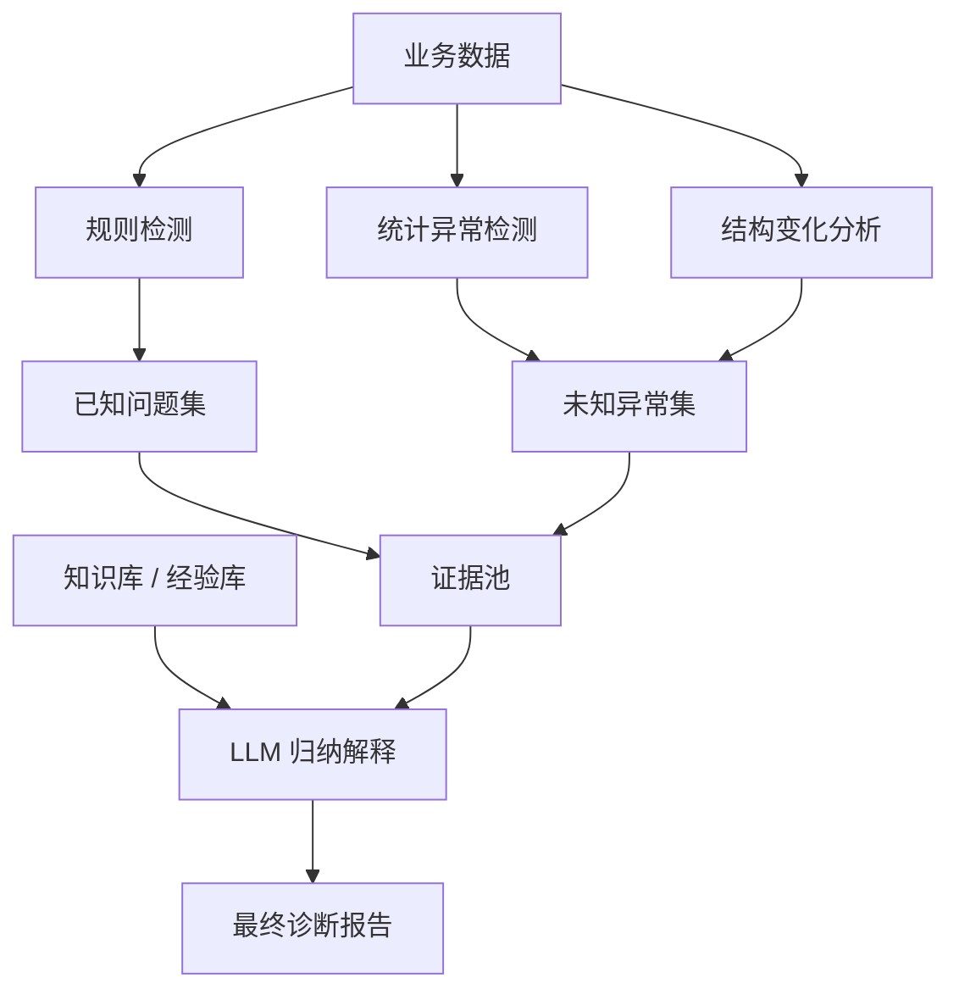
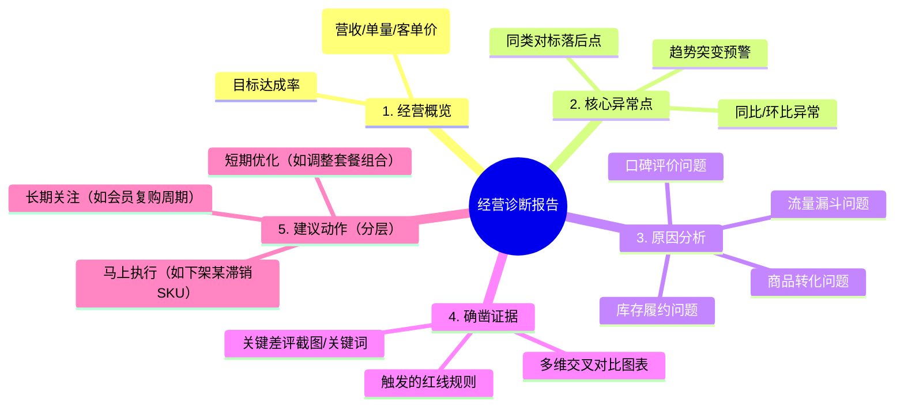
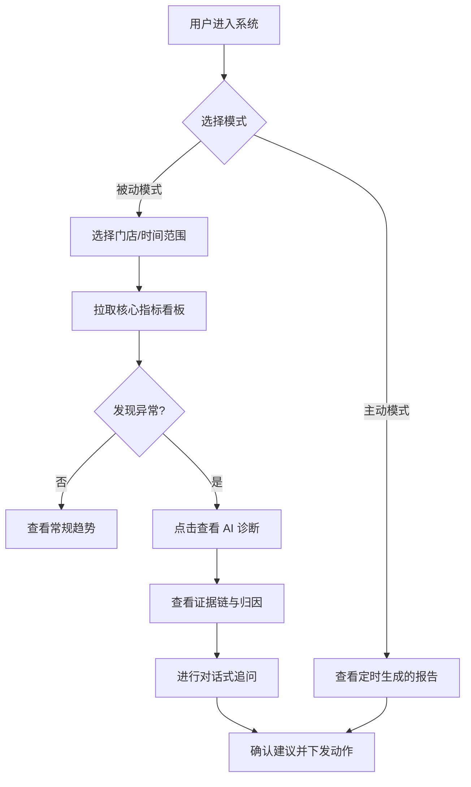
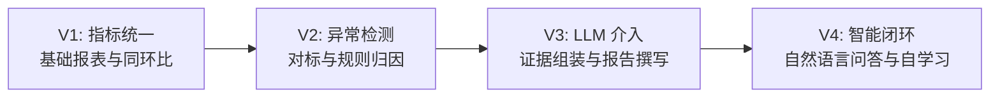

### 整体结构

```mermaid
flowchart TD
    A[ERP业务数据<br/>订单 库存 商品 门店 采购] --> B[数据接入 ETL/ELT]
    C[外部数据<br/>平台评价 节假日 商圈] --> B

    B --> D[清洗与口径统一<br/>去重 校验 时间对齐]
    D --> E[ODS/DWD/DM 指标层<br/>事实表 + 维度表]
    E --> F[分析引擎<br/>同比 环比 漏斗 异常检测]
    E --> G[归因与诊断引擎<br/>指标树 贡献度 规则归因]
    F --> G

    H[知识库 / 业务规则 / SOP] --> G

    G --> I[证据组装器<br/>异常点 + 排序结果 + 支撑数据]
    I --> J[LLM 编排层<br/>总结 解释 追问 报告写作]
    H --> J

    J --> K[报告生成器<br/>日报 周报 单店诊断报告]
    J --> L[自然语言问答]

    K --> M[展示与用户反馈层<br/>采纳 / 驳回 / 补充说明]
    L --> M
    M --> N[知识与规则更新反馈闭环]
    N --> H
```

---

### “问题”怎么来的

```mermaid
graph LR
    Region["区域/商圈"]
    Store[门店]
    Channel[渠道]
    Customer[客户]
    Order[订单]
    SKU[商品]
    Inventory[库存]
    Campaign[活动]
    Review[评价]
    Metric[指标]
    Report[诊断报告]

    Region --> Store
    Store --> Campaign
    Store --> Inventory
    Store --> Order

    Channel --> Order
    Customer --> Order
    Order --> SKU


    SKU --> Inventory
    SKU --> Metric
    Campaign --> Metric
    Order --> |销售表现| Metric
    Order --> Review
    Inventory --> |表现| Metric

    Metric --> Report
    Review --> |直接可作为反馈|Report
```

---

### 常见问题分类

```mermaid
flowchart LR
    A[发现结果异常<br/>如: 门店营收下降] --> B{主因}
    B --> C[流量问题]
    B --> D[转化问题]
    B --> E[客单问题]
    B --> F[复购与履约]

    C --> C1[曝光减少]
    C --> C2[自然到店减少]

    D --> D1[页面点击率低]
    D --> D2[商品吸引力不足]
    D --> D3[价格/套餐不匹配]

    E --> E1[高客单商品卖不动]
    E --> E2[折扣过重]

    F --> F1[差评升高/口碑问题]
    F --> F2[缺货/超时等履约问题]

    G[以上所有问题/证据] --> I[问题原因算权重，证据排序]
    H[规则/知识库] --> I
    I --> J[结构化的报告]
```

---

## 3.1 职责边界：确定性层 vs 生成式层

```mermaid
flowchart TD
    A[原始数据] --> B[传统数据处理]
    B --> C[指标计算]
    C --> D[异常检测]
    D --> E[归因候选与证据]
    E --> F[LLM 解释层]
    F --> G[报告/问答/建议]

    subgraph Deterministic[确定性层 - 传统引擎]
        B
        C
        D
        E
    end

    subgraph Generative[生成式层 - LLM]
        F
        G
    end
```

---

## 3.2 混合诊断机制：已知规则 + 未知发现

```mermaid
graph TD
    A[业务数据] --> B[规则检测]
    A --> C[统计异常检测]
    A --> D[结构变化分析]
    B --> E[已知问题集]
    C --> F[未知异常集]
    D --> F
    E --> G[证据池]
    F --> G
    H[知识库 / 经验库] --> I[LLM 归纳解释]
    G --> I
    I --> J[最终诊断报告]
```

---

## 6. 用户体验与报告结构

```mermaid
mindmap
  root((经营诊断报告))
    1. 经营概览
      核心指标(营收/单量/客单价)
      目标达成率
    2. 核心异常点
      同比/环比异常
      同类对标落后点
      趋势突变预警
    3. 原因分析
      流量漏斗问题
      商品转化问题
      库存履约问题
      口碑评价问题
    4. 确凿证据
      多维交叉对比图表
      关键差评截图/关键词
      触发的红线规则
    5. 建议动作（分层）
      马上执行（如下架某滞销SKU）
      短期优化（如调整套餐组合）
      长期关注（如会员复购周期）
```

---

## 6.1 用户操作路径：主动 vs 被动

```mermaid
flowchart TD
    A[用户进入系统] --> B{选择模式}
    B -- 主动模式 --> C[查看定时生成的报告]
    B -- 被动模式 --> D[选择门店/时间范围]
    D --> E[拉取核心指标看板]
    E --> F{发现异常?}
    F -- 否 --> G[查看常规趋势]
    F -- 是 --> H[点击查看 AI 诊断]
    H --> I[查看证据链与归因]
    I --> J[进行对话式追问]
    J --> K[确认建议并下发动作]
    C --> K
```

---

## 7. MVP 落地的工程节奏

```mermaid
flowchart LR
    A[V1: 指标统一<br/>基础报表与同环比] --> B[V2: 异常检测<br/>对标与规则归因]
    B --> C[V3: LLM 介入<br/>证据组装与报告撰写]
    C --> D[V4: 智能闭环<br/>自然语言问答与自学习]
```

```mermaid
flowchart TD
    A[ERP业务数据<br/>订单 库存 商品 门店 采购] --> B[数据接入 ETL/ELT]
    C[外部数据<br/>平台评价 节假日 商圈] --> B

    B --> D[清洗与口径统一<br/>去重 校验 时间对齐]
    D --> E[ODS/DWD/DM 指标层<br/>事实表 + 维度表]
    E --> F[分析引擎<br/>同比 环比 漏斗 异常检测]
    E --> G[归因与诊断引擎<br/>指标树 贡献度 规则归因]
    F --> G

    H[知识库 / 业务规则 / SOP] --> G

    G --> I[证据组装器<br/>异常点 + 排序结果 + 支撑数据]
    I --> J[LLM 编排层<br/>总结 解释 追问 报告写作]
    H --> J

    J --> K[报告生成器<br/>日报 周报 单店诊断报告]
    J --> L[自然语言问答]

    K --> M[展示与用户反馈层<br/>采纳 / 驳回 / 补充说明]
    L --> M
    M --> N[知识与规则更新反馈闭环]
    N --> H
```
