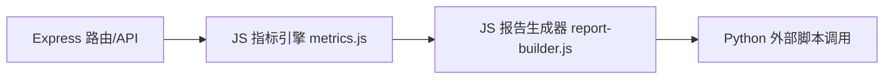
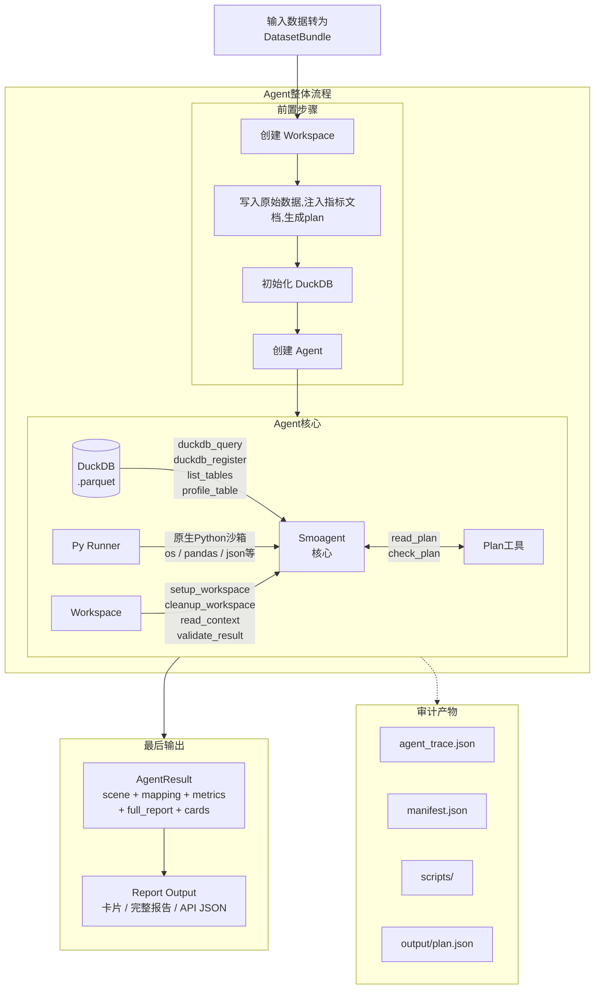
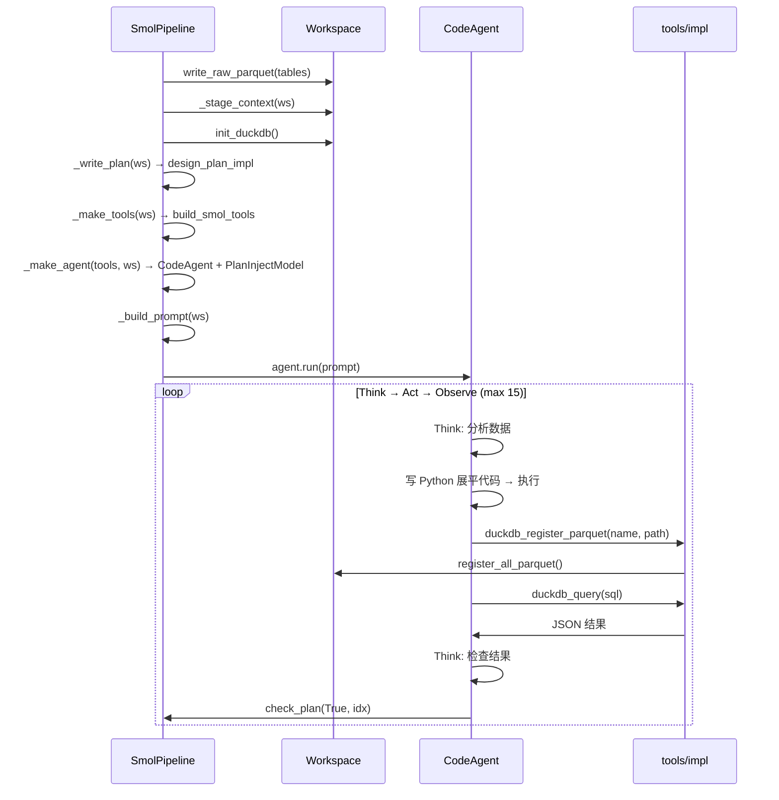
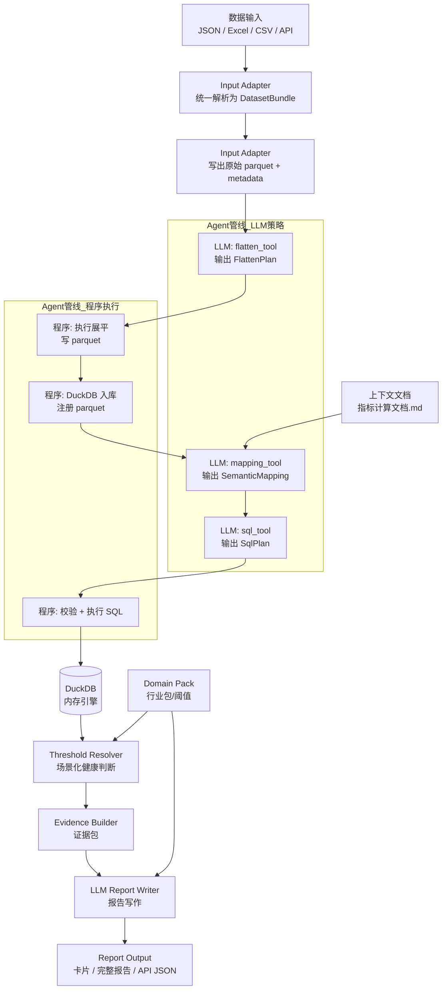
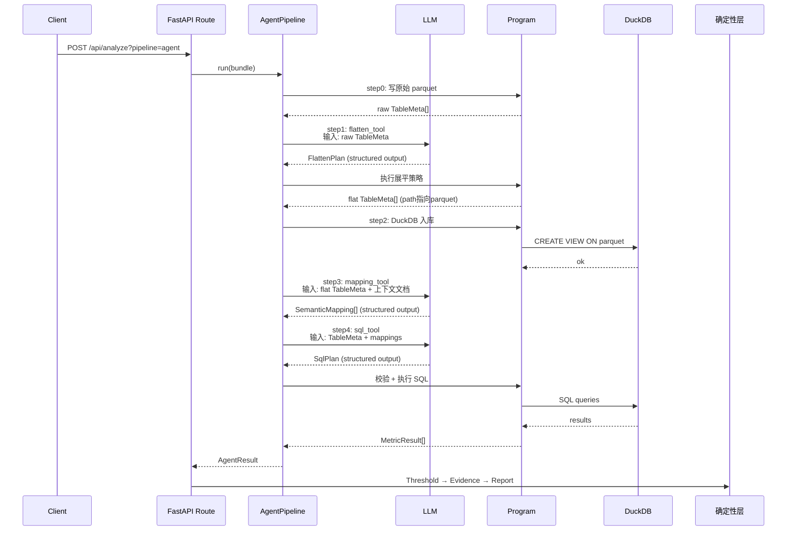

# 历史尝试与弃用方案记录 (History of Attempts & Deprecated Solutions)

本篇文档专门用于记录福州门店 AI 分析系统在开发过程中**尝试过但最终弃用、重构或删除**的早期方案、框架 POC 以及技术路线。本篇只保留历史遗迹，不混杂当前系统的最新设计，以便于后续回溯工作记录。

---

## 1. 弃用的 Node.js/JavaScript 混合后端方案

### 1.1 历史背景
在项目初期，后端曾采用 Node.js（Express 框架）配合 JavaScript 脚本的架构，而 Python 只作为数据清洗脚本存在。

### 1.2 弃用原因与教训
1. **多语言维护成本过高**：核心的指标分析（Pandas/DuckDB）和 AI 调用库（OpenAI SDK）在 Python 生态中更为成熟，但当时 API 路由和任务调度由 Node.js 承担，数据在 JS 与 Python 之间频繁通过 JSON 传递，导致类型定义碎片化、通信开销高。
2. **异步流式输出（SSE）控制困难**：在长文本推理生成时，JS 端难以平滑、低延迟地捕获 Python 背景线程的运行日志与思考过程，无法满足秒级打字机回显的需求。
3. **类型安全漏洞**：缺少像 Pydantic 这样原生支持数据校验的机制，导致数据入库和字段映射极易因空值报错。

### 1.3 物理清理的文件清单
- `packages/core/` 目录下的：`metrics.js`、`report-builder.js`、`index.js`、`cleaner.js`
- `packages/ai/` 目录下的：`index.js`、`error-reviewer.js`、`ai-caller.js`
- `packages/db/` 目录下的整个 JS 部分（已彻底移除该目录）
- `apps/api/src/` 下的 `server.js` 及整个 `routes/` 目录（JS 路由定义文件）
- 根目录及 `apps/api/` 下不再需要的 node modules 声明文件（如 `apps/api/package.json`）。

---

## 2. 弃用的 Smolagents 编程 Agent 方案 (Smolagents POC)

### 2.1 尝试方案
在探索大模型自主分析时，曾尝试引入 Hugging Face 的 `smolagents` 框架，在 `packages/agents/smol_pipeline.py` 中编写了一个 POC。

#### A. 整体架构与数据流转图

#### B. 执行时序图

### 2.2 弃用原因
1. **沙箱执行的开销与安全限制**：由于大模型自主编写的 Python 代码需要在受限环境中运行，框架提供的 `PythonInterpreter` 工具在环境隔离、安全拦截和性能开销上无法做到绝对轻量。
2. **日志可控性差**：`smolagents` 的内部运行逻辑较为黑盒，难以精准提取每一步的代码执行错误并流式实时推送到前端的 SSE 日志流。
3. **已清理的辅助参考资料**：
   - 删除了 PoC 阶段复制的官方说明书：`docs/agent-poc/smolagents-codeagent-poc/smolagents_guided_tour.md`、`smolagents_text_to_sql.md`、`smolagents_exemple_text_to_sql.md`。

---

## 3. 弃用的 Pydantic-AI 声明式 Agent 方案 (Pydantic-AI POC)

### 3.1 尝试方案
为了解决 Smolagents 这种“代码编写型”Agent 难以监控的缺点，曾尝试引入声明式的 Pydantic-AI 框架，在 `packages/agents/pydantic_pipeline.py` 中搭建了一个多阶段的状态转换 Pipeline。

#### A. 整体架构与流转图

#### B. 执行时序图

### 3.2 弃用原因
1. **高频校验回退 (ValidationError Loops)**：Pydantic-AI 基于强类型签名（Type Signatures）工作。当 AI 返回的 SQL 缺少字段或 JSON 语法微调时，Pydantic-AI 会触发重试循环。在处理复杂、大批量的门店列名映射时，高频的 ValidationError 导致轮次超限，不仅分析慢且造成大量无意义的 Token 浪费。
2. **框架笨重性**：Pydantic-AI 处于 Beta 阶段，许多机制不够稳定（如不支持一些复杂的流式 Tool Call 捕获），与系统的 SSE 日志流适配比较困难。
3. **已清理的辅助参考资料**：
   - 删除了 PoC 调试时留存的官方手册：`docs/agent-poc/pydantic-ai-agent/PydanticAI官方文档_llms.txt`。
