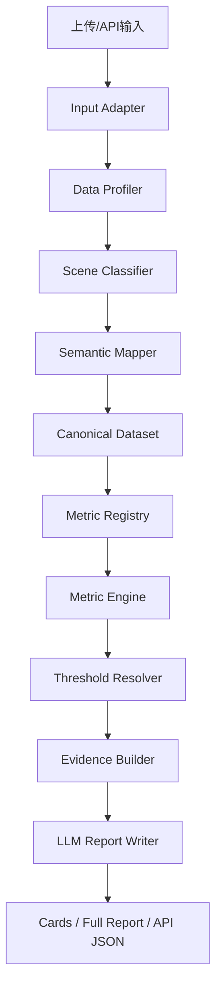
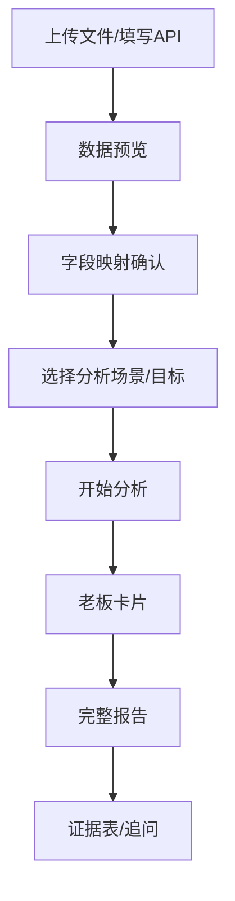
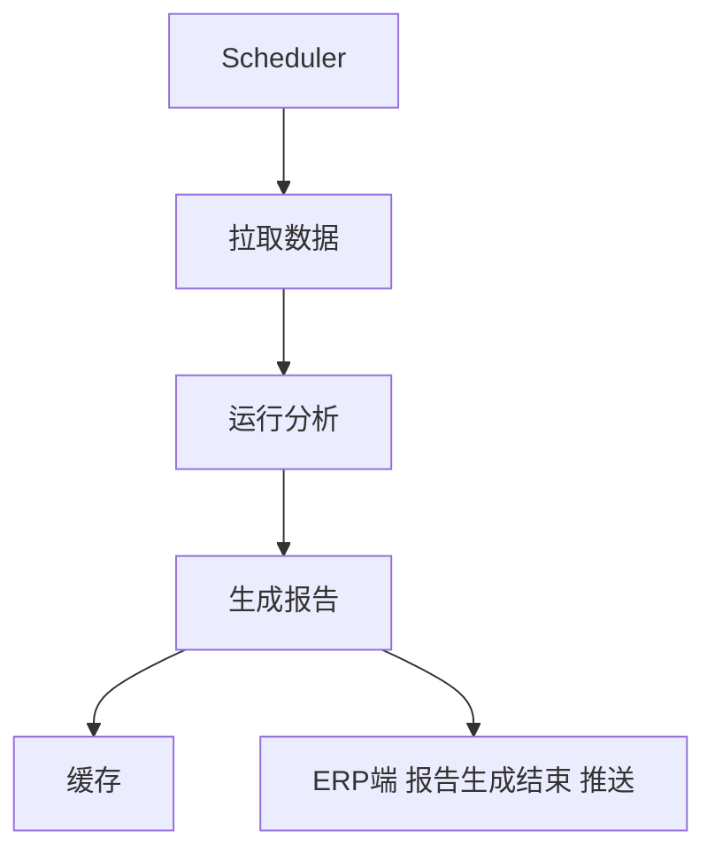

# 开发文档

> 相关文档：[架构设计](./架构设计.md) | [指标计算](./指标计算文档.md) | [AI调用](./AI调用文档.md) | [API接口方案](./API接口设计方案.md)

## 1. 架构概览

项目采用 **Python/FastAPI + Pandas**。

核心流程：



---

## 2. 目录结构

```text
apps/
  web/                      # 前端页面
packages/
  api/                      # FastAPI入口
    main.py
    routes_analyze.py
    routes_reports.py
    routes_connectors.py
  core/
    input_adapter.py         # JSON/Excel/CSV/API解析
    profiler.py              # 数据画像
    semantic_mapper.py       # 字段语义映射
    scene_classifier.py      # 行业/业态识别
    canonical.py             # 标准语义数据层
    metric_registry.py       # 指标注册表
    metric_engine.py         # 指标计算
    threshold_resolver.py    # 健康/报警判断
    evidence_builder.py      # 证据包
  ai/
    ai_caller.py
    prompts/
      semantic_mapping.md
      scene_classify.md
      report_writer.md
      audit.md
  domain_packs/
    common.yaml
    pharmacy.yaml
    restaurant.yaml
    hr.yaml
  storage/
    uploads/
    cache/
    reports/
    mappings/
```

---

## 3. 核心模块

### 3.1 `input_adapter.py`

支持：

- JSON
- Excel
- CSV
- API JSON

输出：

```py
DatasetBundle = {
    "source_type": "json|excel|csv|api",
    "tables": [RawTable],
    "received_at": "2026-05-12T10:00:00"
}
```

规则：

- Excel 每个 sheet 转一张表
- JSON 数组转表
- JSON 嵌套字段保留路径
- API 返回结构按配置转表

---

### 3.2 `profiler.py`

输出每个字段的数据画像：

```py
ColumnProfile = {
    "table": "orders",
    "column": "营业额",
    "dtype": "number",
    "samples": [2467, 4214, 1639],
    "null_rate": 0.0,
    "unique_count": 31,
    "min": 1200,
    "max": 5600
}
```

用于后续字段语义映射。

---

### 3.3 `scene_classifier.py`

输出：

```py
SceneContext = {
    "industry": "pharmacy|restaurant|hr|retail|generic",
    "business_model": "o2o_driven|offline_driven|delivery_heavy|internal_department|unknown",
    "data_scope": ["sales", "channel", "inventory"],
    "analysis_goal": "经营诊断",
    "confidence": 0.91
}
```

根据原始字段名和样本值识别行业/业态/分析目标，为后续语义映射提供场景上下文。

低置信度时前端给用户选：

```text
药店经营 / 餐饮经营 / HR组织分析 / 通用表格分析
```

---

### 3.4 `semantic_mapper.py`

输入：字段名、样本值、表名 + 场景上下文（来自 scene_classifier）。

输出：

```py
SemanticMapping = {
    "raw_field": "零售金额",
    "semantic_field": "revenue",
    "confidence": 0.94,
    "need_confirm": False,
    "reason": "字段名和数值范围符合销售额"
}
```

场景感知映射：例如 `"评分"` 在 HR 场景下映射到 `performance_score`，在餐饮场景下映射到 `rating`。

确认规则：

```text
confidence < 0.75 -> 前端确认
0.75 <= confidence < 0.9 -> 自动使用，但标记低置信
confidence >= 0.9 -> 自动使用
```

字段映射结果保存到：

```text
storage/mappings/{tenant_id}.json
```

同一客户下次优先复用历史映射。

---

### 3.5 `canonical.py`

将原始表转为标准语义表。

例：

| 原字段     | 标准字段         |
| ---------- | ---------------- |
| `零售金额` | `revenue`        |
| `来客数`   | `customer_count` |
| `平台`     | `channel`        |
| `商品名称` | `product_name`   |

输出：

```py
CanonicalDataset = {
    "tables": {
        "sales": DataFrame,
        "products": DataFrame,
        "inventory": DataFrame
    },
    "mapping": [SemanticMapping],
    "scene": SceneContext
}
```

---

### 3.6 `metric_registry.py`

指标注册表示例：

```yaml
metric_id: avg_order_value
name: 客单价
required_fields: [revenue, order_count]
optional_fields: [channel]
domains: [pharmacy, restaurant, retail]
calculator: ratio
health_profiles: [default]
```

匹配规则：

- 必需字段齐全 -> 可计算
- 可选字段存在 -> 增强分析
- 字段缺失 -> 返回 `uncountable`

---

### 3.7 `metric_engine.py`

只运行系统内置计算器。

禁止生产环境让 AI 生成 Python 后执行。

计算器：

| calculator           | 用途               |
| -------------------- | ------------------ |
| `sum`                | 汇总               |
| `ratio`              | 比率               |
| `period_change`      | 环比/同比          |
| `share_by_dimension` | 渠道/商品/部门占比 |
| `concentration`      | 集中度             |
| `trend_slope`        | 趋势               |
| `anomaly_detect`     | 异常检测           |
| `top_contribution`   | TOP贡献            |

---

### 3.8 `threshold_resolver.py`

输入指标值和场景，输出健康状态。

```py
MetricStatus = "pass|attention|warning|uncountable"
```

示例：

```py
{
    "metric_id": "channel_concentration",
    "value": 88,
    "status": "attention",
    "reason": "O2O型药店线上占比高可接受，但单平台集中偏高"
}
```

---

### 3.9 `evidence_builder.py`

输出证据包：

```py
EvidenceItem = {
    "metric_id": "revenue_change",
    "title": "营收环比下降",
    "value": -34.0,
    "status": "attention",
    "source_fields": ["revenue", "date"],
    "evidence_table": [...],
    "confidence": 0.95
}
```

报告只能引用证据包中的数据。

---

### 3.10 `report_writer.py`

输入：

```py
{
    "scene": SceneContext,
    "metrics": [MetricResult],
    "evidence": [EvidenceItem],
    "data_quality": {},
    "user_options": {}
}
```

输出：

```py
ReportOutput = {
    "health_status": "波动下",
    "overview_text": "...",
    "cards": [ReportCard],
    "full_report": "...",
    "evidence_index": [EvidenceItem]
}
```

---

## 4. API设计

### 4.1 上传并分析

```http
POST /api/analyze
```

请求：

```json
{
  "tenant_id": "demo_shop",
  "input_type": "upload",
  "user_options": {
    "scene": "auto",
    "goal": "经营诊断",
    "output": "cards+full_report"
  }
}
```

响应：

```json
{
  "report_id": "rpt_001",
  "status": "running"
}
```

---

### 4.2 获取字段映射

```http
GET /api/reports/{report_id}/mapping
```

用于前端展示字段确认页。

---

### 4.3 确认字段映射

```http
POST /api/reports/{report_id}/mapping/confirm
```

请求：

```json
{
  "mappings": [{ "raw_field": "营业额", "semantic_field": "revenue" }]
}
```

---

### 4.4 获取报告

```http
GET /api/reports/{report_id}
```

响应：

```json
{
  "scene": {},
  "metrics": [],
  "cards": [],
  "full_report": "...",
  "warnings": []
}
```

---

### 4.5 SSE日志

```http
GET /api/stream/{report_id}
```

日志类型：

```text
input_received
profile_done
mapping_done
need_user_confirm
metrics_done
report_done
error
```

---

## 5. 前端交互

流程：



字段确认页需要展示：

| 原字段      | 样本值 | 系统识别         | 置信度 | 用户修正 |
| ----------- | ------ | ---------------- | -----: | -------- |
| `turnover`  | 12000  | `revenue`        |   0.91 | 下拉选择 |
| `guest_num` | 300    | `customer_count` |   0.88 | 下拉选择 |

---

## 6. 添加新指标

步骤：

1. 在 `domain_packs/common.yaml` 或行业包中注册指标
2. 选择已有 calculator
3. 不够用时在 `metric_engine.py` 新增 calculator
4. 写测试样例
5. 加入 evidence 输出字段

示例：

```yaml
metric_id: delivery_timeout_rate
name: 配送超时率
required_fields: [delivery_duration]
optional_fields: [channel, date]
domains: [restaurant, pharmacy]
calculator: threshold_rate
params:
  field: delivery_duration
  threshold: 30
  op: ">"
health_profiles: [delivery_heavy]
```

---

## 7. 添加行业包

行业包结构：

```yaml
industry: restaurant
aliases: [餐饮, 饭店, 外卖店]
standard_fields:
  turnover: revenue
  dish_name: product_name
  platform: channel
metrics:
  - revenue_change
  - avg_order_value
  - channel_share
  - dish_top_contribution
threshold_profiles:
  delivery_heavy:
    channel_concentration:
      attention: 85
      warning: 95
```

---

## 8. 定时任务

适用：API/数据库接入客户/商搏ERP推送。

流程：



> 关于 ERP 推送，具体接口查看 [推送发送json](./XiaoTangPush_send.json) 和 [推送接收json](./XiaoTangPush_recv.json) <br/>注意要对“Markdown格式的完整报告”使用 [自动附加转义符](../packages/core/connectors.py)脚本后才能放到json中。

配置：

```yaml
tenant_id: demo_shop
source: api
cron: "0 8 * * *"
analysis_goal: 经营诊断
output: cards+full_report
```

---

## 9. AI Prompt维护

Prompt 文件：

```text
packages/ai/prompts/semantic_mapping.md
packages/ai/prompts/scene_classify.md
packages/ai/prompts/report_writer.md
packages/ai/prompts/audit.md
```

要求：

- 字段映射必须输出 JSON
- 报告只能使用 evidence 数据
- 低置信度要标记 `need_confirm`
- 不允许 AI 编造缺失指标
- 不允许 AI 生成生产计算代码

---

## 10. 调试与测试

测试重点：

- 文件解析是否正确
- 字段映射是否稳定
- 指标缺字段时是否返回 `uncountable`
- 同一数据重复运行结果是否一致
- 报告是否只引用证据包

建议测试目录：

```text
tests/
  test_input_adapter.py
  test_profiler.py
  test_semantic_mapper.py
  test_metric_registry.py
  test_metric_engine.py
  test_threshold_resolver.py
  fixtures/
    pharmacy_demo/
    restaurant_demo/
    hr_demo/
```

---

## 11. 实现状态 (2026-05-12)

### 已完成

| 模块               | 文件                                  | 状态                                                       |
| ------------------ | ------------------------------------- | ---------------------------------------------------------- |
| Input Adapter      | `packages/core/input_adapter.py`      | ✅ JSON/Excel/CSV 解析，输出 DatasetBundle                 |
| Data Profiler      | `packages/core/profiler.py`           | ✅ 字段类型推断、画像输出                                  |
| Semantic Mapper    | `packages/core/semantic_mapper.py`    | ✅ 关键字规则匹配；LLM辅助留桩                             |
| Scene Classifier   | `packages/core/scene_classifier.py`   | ✅ 行业/业态关键字识别；LLM留桩                            |
| Canonical Dataset  | `packages/core/canonical.py`          | ✅ 原始表→标准语义表转换                                   |
| Metric Registry    | `packages/core/metric_registry.py`    | ✅ 字段匹配 + YAML行业包加载                               |
| Metric Engine      | `packages/core/metric_engine.py`      | ✅ 10种通用计算器                                          |
| Threshold Resolver | `packages/core/threshold_resolver.py` | ✅ 场景化健康判断                                          |
| Evidence Builder   | `packages/core/evidence_builder.py`   | ✅ 证据包构建                                              |
| Domain Packs       | `packages/domain_packs/`              | ✅ common.yaml, pharmacy.yaml                              |
| 主流程接入         | `apps/api/src/main.py`                | ✅`/api/analyze` 支持多文件，新增 `run_multifile_analysis` |

### 待完成

- LLM 辅助字段映射（`semantic_mapper.llm_map_profiles`）
- LLM 辅助场景识别（`scene_classifier.llm_classify_scene`）
- 前端字段确认页对接
- 行业包扩展（restaurant.yaml, hr.yaml）
- 定时任务功能
- 测试用例编写

---

## 12. AI 调用一览

当前管线共 4 次 LLM 调用（初诊 → 审计 → 深度 → 精简卡片），串行执行。
完整的提示词、参数表格、输入输出格式见 **[AI调用文档](./AI调用文档.md)**。
