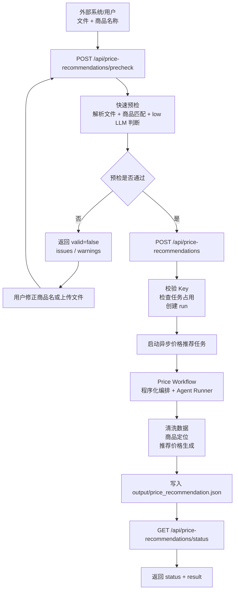

# 最优价格推荐 API 接口方案 (v0.1)

本方案用于新增一组独立的“最优价格推荐”接口。该能力与现有 `/api/analyze` 的门店经营诊断属于不同业务任务，但复用现有 **User Key 鉴权**、文件上传、任务状态、日志流、LLM 预设与 Agent Workspace 基础设施。

当前阶段先固定外围 workflow 与接口契约，内部算法、曲线拟合方式、定价模型可以后续替换。

## 1. 核心流程图



---

## 2. 鉴权规范

沿用现有用户鉴权。

- **Header Name**: `x-fzt-key`
- **Value**: 用户的唯一通行证（如 `fzt_abc123...`）

> 所有最优价格核心接口均要求提供有效的 `x-fzt-key`，不传 key 返回 401 Unauthorized。

---

## 3. API 接口参考手册

### 3.1 快速预检

#### [POST] /api/price-recommendations/precheck

- **说明**: 对上传文件和商品名称做快速合法性检查。该接口用于前置拦截明显不可分析的请求，目标是极快返回。
- **Header**: `x-fzt-key`（必填）
- **Content-Type**: `multipart/form-data`
- **Body (Multipart)**:
  - `files`: 一个或多个文件。每文件最大 **5MB**。
  - `productName`: 商品名称，必填。
  - `reasoningEffort`: 可选，默认 `low`。预检阶段原则上使用低成本模型。
- **支持格式**: `.json` / `.xlsx` / `.xls` / `.csv`，后续可复用现有上传解析能力扩展更多格式。

**响应 (200, 通过)**:

```json
{
  "status": "ok",
  "valid": true,
  "productName": "阿莫西林胶囊 0.25g*24粒",
  "productNameQuality": {
    "status": "ok",
    "message": "商品名称足够具体"
  },
  "fileQuality": {
    "status": "ok",
    "message": "文件可解析，包含价格与销售相关字段"
  },
  "productDataMatch": {
    "status": "ok",
    "matchedRows": 128,
    "confidence": 0.91
  },
  "issues": [],
  "warnings": []
}
```

**响应 (200, 不通过)**:

```json
{
  "status": "failed",
  "valid": false,
  "productName": "阿莫西林",
  "issues": [
    {
      "code": "product_name_too_broad",
      "message": "商品名称过宽，请提供更具体的规格或完整品名"
    },
    {
      "code": "product_not_found",
      "message": "上传文件中没有找到该商品的销售记录"
    }
  ],
  "warnings": []
}
```

**错误**:

| 状态码 | 含义 |
| :--- | :--- |
| `400` | 缺少 `productName` |
| `400` | 文件超过 5MB |
| `400` | 不支持的文件格式 |
| `400` | 文件解析失败 |
| `401` | Key 无效或缺失 |

### 3.2 启动价格推荐任务

#### [POST] /api/price-recommendations

- **说明**: 提交文件与商品名称，启动异步价格推荐任务。
- **Header**: `x-fzt-key`（必填）
- **Content-Type**: `multipart/form-data`
- **Body (Multipart)**:
  - `files`: 一个或多个文件。每文件最大 **5MB**。
  - `productName`: 商品名称，必填。
  - `reasoningEffort`: 可选，`low` / `medium` / `high`，默认 `high`。
  - `candidateCount`: 可选，返回推荐价格数量，默认 `2`。
- **响应 (200)**:

```json
{
  "status": "started",
  "taskType": "price_recommendation",
  "workflow": "price_recommendation",
  "runId": "20260526T153000_ab12cd"
}
```

**错误**:

| 状态码 | 含义 |
| :--- | :--- |
| `400` | 任务正在运行中 |
| `400` | 缺少 `productName` |
| `400` | 文件超过 5MB |
| `400` | 文件解析失败 |
| `401` | Key 无效或缺失 |

### 3.3 查询任务状态与结果

#### [GET] /api/price-recommendations/status

- **说明**: 获取该账户最近一次价格推荐任务的状态与结果。
- **Header**: `x-fzt-key`（必填）
- **响应 (200)**:

```json
{
  "status": "completed",
  "errorMessage": "",
  "result": {
    "taskType": "price_recommendation",
    "productName": "阿莫西林胶囊 0.25g*24粒",
    "recommendations": [
      {
        "rank": 1,
        "price": 18.8,
        "unit": "元",
        "reason": "在历史销量和毛利约束下综合收益最高",
        "confidence": 0.82
      },
      {
        "rank": 2,
        "price": 19.9,
        "unit": "元",
        "reason": "收益略低但毛利更稳",
        "confidence": 0.76
      }
    ],
    "validPriceRange": {
      "min": 15.9,
      "max": 22.9,
      "unit": "元"
    },
    "evidence": {
      "matchedRows": 128,
      "priceField": "售价",
      "salesField": "销量",
      "timeField": "日期"
    },
    "warnings": []
  },
  "fullResult": "Markdown 格式的完整说明，可选"
}
```

`status` 枚举值沿用现有任务状态：

| 值 | 含义 |
| :--- | :--- |
| `idle` | 当前账户暂无价格推荐任务 |
| `queued` | 已提交，等待执行 |
| `running` | 正在执行 |
| `completed` | 执行完成 |
| `error` | 执行失败 |
| `aborted` | 用户终止 |
| `interrupted` | 服务重启导致中断 |

### 3.4 日志快照

#### [GET] /api/price-recommendations/logs

- **说明**: 获取该账户最近一次价格推荐任务的日志快照。
- **Header**: `x-fzt-key`（必填）
- **响应 (200)**:

```json
{
  "logs": [
    {
      "type": "log",
      "time": "15:30:02",
      "nodeId": "price_init",
      "level": "info",
      "message": "价格推荐任务初始化完成",
      "progress": 8
    },
    {
      "type": "log",
      "time": "15:30:05",
      "nodeId": "price_field_mapping",
      "level": "status",
      "message": "🔍 正在进行商品字段语义识别...",
      "progress": 35,
      "step": "price_field_mapping"
    }
  ]
}
```

### 3.5 实时日志流

#### [GET] /api/price-recommendations/stream

- **说明**: SSE 日志流，供前端实时刷新价格推荐进度与日志。
- **Query**: `?x-fzt-key=...`（必填，通过 URL 查询参数传递，适配 EventSource 场景）
- **响应**: `text/event-stream`

首条事件为：

```json
{"type": "reset", "time": "15:30:02"}
```

后续日志事件的推送格式如下：

```json
{
  "type": "log",
  "time": "15:30:05",
  "nodeId": "price_field_mapping",
  "level": "info",
  "message": "识别到目标字段: 销售数量",
  "progress": 40
}
```

### 3.6 停止任务

#### [POST] /api/price-recommendations/stop

- **说明**: 强行停止该账户下正在执行的价格推荐任务。
- **Header**: `x-fzt-key`（必填）
- **响应 (200)**:

```json
{
  "status": "ok"
}
```

---

## 4. 结果 JSON 规范

价格推荐任务的最终结果文件建议固定为：

```text
workspace/output/price_recommendation.json
```

结构如下：

```json
{
  "taskType": "price_recommendation",
  "productName": "阿莫西林胶囊 0.25g*24粒",
  "recommendations": [
    {
      "rank": 1,
      "price": 18.8,
      "unit": "元",
      "reason": "推荐理由",
      "confidence": 0.82
    }
  ],
  "validPriceRange": {
    "min": 15.9,
    "max": 22.9,
    "unit": "元"
  },
  "evidence": {
    "matchedRows": 128,
    "priceField": "售价",
    "salesField": "销量",
    "timeField": "日期",
    "notes": []
  },
  "warnings": []
}
```

字段约束：

| 字段 | 类型 | 说明 |
| :--- | :--- | :--- |
| `taskType` | string | 固定为 `price_recommendation` |
| `productName` | string | 用户提交的商品名称 |
| `recommendations` | array | 推荐价格列表，默认返回 2 个 |
| `recommendations[].rank` | number | 推荐排序，从 1 开始 |
| `recommendations[].price` | number | 推荐价格 |
| `recommendations[].unit` | string | 价格单位，默认 `元` |
| `recommendations[].reason` | string | 推荐理由，必须基于数据证据 |
| `recommendations[].confidence` | number | 0 到 1 的置信度 |
| `validPriceRange` | object | 建议可接受价格区间 |
| `evidence` | object | 字段匹配、样本量、关键证据 |
| `warnings` | array | 数据不足、字段弱匹配等警告 |

---

## 5. 预检规则

预检分为确定性规则与低成本 LLM 判断。

### 5.1 确定性规则

- 文件必须可解析。
- 至少存在一张非空表。
- 至少存在疑似商品字段，如 `商品名称` / `品名` / `SKU` / `product_name`。
- 至少存在疑似价格字段，如 `价格` / `售价` / `零售价` / `price`。
- 至少存在疑似销售表现字段，如 `销量` / `销售额` / `订单量` / `sales`。
- 商品名称需能在数据中命中一定数量的记录，具体阈值后续按数据规模配置。

### 5.2 低成本 LLM 判断

低成本 LLM 只做快速辅助判断：

- 商品名称是否过宽或过模糊。
- 上传文件是否像销售/价格相关数据。
- 商品字段、价格字段、销量字段是否存在语义歧义。
- 是否需要用户补充更具体的商品规格。

LLM 不负责最终推荐价格，不作为基础合法性检查的唯一依据。

---

## 6. 存储隔离规约

价格推荐任务采用**物理子目录隔离**设计，不再与门店经营诊断任务直接混杂在同一个 `runs` 根目录下，也不再使用统一的 `latest_run.json` 索引文件。

### 目录结构

每个价格推荐任务运行时，会在专门的 `price_recommendation` 子目录下创建专属于该次运行的 `run_id` 文件夹：

```text
storage/accounts/{account_slug}/runs/price_recommendation/{run_id}/
  ├── session.json                      # 本次运行的元数据与状态
  ├── logs.json                         # 本次运行的 SSE 格式日志
  └── workspace/                        # Agent 工作区
        ├── input/                      # 原始上传文件
        ├── output/                     # 处理产物
        │     └── price_recommendation.json
        ├── summary.md
        ├── plan.json
        └── analysis.duckdb
```

### 最新任务（Latest Run）定位机制

当查询任务状态（`/status`）或获取日志（`/logs`）且内存缓存失效时，定位最新一次任务运行的逻辑如下：

1. **扫描目录**：后端直接遍历 `storage/accounts/{account_slug}/runs/price_recommendation/` 文件夹。
2. **过滤非法及隐藏文件**：
   - 必须是目录，排除 `.DS_Store` 等系统隐藏文件。
   - 文件夹名称应符合时间戳命名格式正则（如 `\d{8}T\d{6}_[a-z0-9]+`）。
3. **从新到旧排序**：按文件夹名称降序排列。
4. **防御性遍历校验**：
   - **不**直接盲信第一个文件夹，而是**从最新到最旧进行遍历**。
   - 每次检查该目录下的 `session.json` 是否存在且能够被成功反序列化为 JSON 字典。
   - 命中第一个能够成功读取并解析 `session.json` 的有效目录即为最新运行目录，直接返回它；如果遍历完均无效，则判定为暂无任务（返回 `idle`）。
5. **向后兼容**：
   - 现有的门店经营诊断任务依旧存放在 `storage/accounts/{account_slug}/runs/{run_id}/` 下，保持原样不用改动。
   - 历史旧数据和旧的 `latest_run.json` 留在原地不做强制迁移。

### session.json 元数据

在 `session.json` 中，应显式声明 `taskType`：

```json
{
  "taskType": "price_recommendation",
  "status": "completed",
  "result": {},
  "fullResult": ""
}
```
