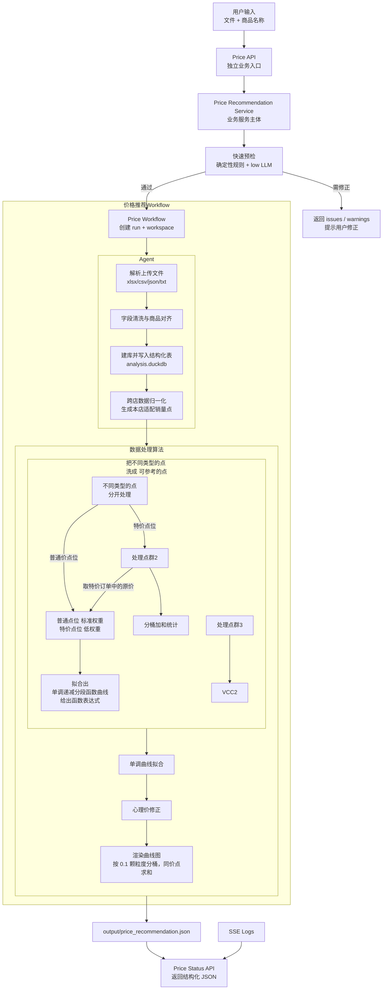

# 最优价格推荐架构设计

## 流程图



---

## 设计目标

最优价格推荐作为独立 workflow 实现，与现有 `/api/analyze` 的经营诊断语义分离。

核心目标：

- **接口独立**：使用 `/api/price-recommendations/*` 表达新的业务能力。
- **基础设施复用**：复用 User Key 鉴权、上传解析、run 目录、日志、SSE、LLM 预设、Agent Workspace。
- **算法分层**：先做跨店归一化换算，再做单调曲线、连续价格搜索、库存约束和心理价格修正。
- **预检极快**：先用确定性规则过滤，再用低成本 LLM 做快速语义判断。
- **输出结构稳定**：最终返回固定 JSON，方便外部系统直接入库或调用。

价格推荐 Workflow 以 Agent 清洗与建库为入口，以归一化换算、曲线拟合和程序化选优为主体，统一输出结构化结果。

---

## 函数算法

### 执行分层

系统以“离散点 -> 单调曲线 -> 连续搜索 -> 修正层”为主流程。

核心过程：

1. 统一时间口径，例如半月销量换算为日均销量。
2. 估算参考门店到本店的折算系数。
3. 将友商或异店销量转换为“本店适配销量”。
4. 按价格汇总为离散点：`price -> normalized_qty`。
5. 对离散点做单调曲线拟合，得到连续价格-销量曲线。
6. 计算价格-销售额、价格-利润等曲线，并在连续价格区间中搜索最优价格。
7. 叠加库存积压和价格心理修正，渲染曲线图时按 0.1 颗粒度分桶，同价点求和后整理最终返回结果。

离散点是中间产物，连续曲线与推荐价格是最终产物。

```json
{
  "normalized_points": [
    {
      "price": 6.0,
      "normalizedQty": 42.0
    },
    {
      "price": 6.5,
      "normalizedQty": 39.0
    }
  ]
}
```

曲线拟合使用 `IsotonicRegression`，用于将归一化后的离散点整理为单调下降的价格-销量函数。

最终展现给用户的结果包含一条或多条连续曲线：售价-销售额、售价-销售数、售价-利润、销售额-利润。

```json
{
  "curves": [
    {
      "name": "售价-销售额",
      "x_label": "售价",
      "y_label": "销售额",
      "points": [
        [0.0, 0.0],
        [0.1, 3.2],
        [0.2, 6.4],
        [100.0, 12800.0]
      ]
    },
    {
      "name": "售价-利润",
      "x_label": "售价",
      "y_label": "利润",
      "points": [
        [0.0, -100.0],
        [0.1, -96.8],
        [100.0, 1200.0]
      ]
    }
  ]
}
```

- Agent 结束后的处理流程

```mermaid
graph TP

```

---

## 命名约定

| 名称            | 含义                                                                           |
| --------------- | ------------------------------------------------------------------------------ |
| Service         | 对外业务能力，如分析报告服务、最优价格推荐服务                                 |
| Workflow        | 服务内部的一套执行流程，可同步、异步、分叉、早停                               |
| Runner          | Workflow 里的执行器，如调用 AgentLoop 的 Agent Runner                          |
| AgentLoop       | 真正的大 Agent 主体，负责 messages、tool calls、循环执行                       |
| Plan Template   | Agent 内部模拟 workflow 的任务清单                                             |
| Legacy Pipeline | 历史上用于区分 traditional / pydantic / smol / custom 四种报告生成实现的旧命名 |

---

## 模块边界

| 模块                 | 路径建议                                                                     | 职责                                                          |
| -------------------- | ---------------------------------------------------------------------------- | ------------------------------------------------------------- |
| Price API            | `apps/api/src/main.py`，接口稳定后可拆分为 `routes_price_recommendations.py` | 暴露预检、启动、状态、日志、停止接口                          |
| Price Service        | `packages/price_recommendation/service.py`                                   | 最优价格推荐服务入口，承接 API 请求并调度 workflow            |
| Price Workflow       | `packages/price_recommendation/workflow.py`                                  | 业务 workflow，负责预检、Agent 调度、建库、归一化、拟合、选优 |
| Precheck             | `packages/price_recommendation/precheck.py`                                  | 快速解析、字段检查、商品匹配，决定是否进入推荐任务            |
| Result Schema        | `packages/price_recommendation/models.py`                                    | 定义预检结果和推荐结果结构                                    |
| Result Reader        | `packages/price_recommendation/result_reader.py`                             | 从 workspace 读取 `price_recommendation.json` 并返回 API 结果 |
| Agent Runner         | `packages/agents/price_recommendation/runner.py`                             | 负责解析上传文件、清洗字段、组织建库、调用拟合与修正工具      |
| Price Plan Template  | `packages/agents/price_recommendation/plan_template.py`                      | Agent 内层任务清单                                            |
| Price Prompt Builder | `packages/agents/price_recommendation/prompt_builder.py`                     | 价格推荐专用 system/user prompt                               |
| Agent Core           | `packages/agents/core/`                                                      | AgentLoop、Workspace、工具转换、基础模型                      |

路由可先写在 `main.py`，接口稳定后再拆成独立 route 文件。

---

## Workflow 分层

### 1. 快速预检

输入：

```text
files + productName
```

处理步骤：

- 使用确定性规则检查字段、表结构、商品命中情况。
- 低成本 LLM 用于补充语义判断与异常提示。
- 返回 `valid`、`issues`、`warnings`、`matchedRows`、`confidence`。

预检用于回答“是否进入推荐任务”，仅返回校验结果。

### 2. 异步价格推荐

推荐接口创建后台任务，流程与现有分析任务一致。

输入：

```text
files + productName + candidateCount + reasoningEffort
```

处理步骤：

1. 创建 run 目录与 workspace，保存原始文件。
2. Agent 解析 xlsx/csv/json/txt，完成字段清洗、商品对齐、结构化入库，并注册 `analysis.duckdb`。
3. Workflow 执行时间颗粒度统一、跨店归一化换算，输出带 `timeGranularity` 的 `normalized_price_points.json`。
4. Workflow 使用 `IsotonicRegression` 生成单调曲线，计算销售额、利润等连续曲线，并搜索最优价格。
5. Workflow 叠加库存积压与价格心理修正，校验 `output/price_recommendation.json`。
6. `/api/price-recommendations/status` 返回结构化结果。

---

## 输出产物

Workspace 建议结构：

```text
workspace/
  input/
    原始上传文件
  tables/
    结构化中间表
  output/
    product_match.json
    field_mapping.json
    normalized_price_points.json
    price_curves.json
    price_recommendation.json
  plan.json
  各种中间产物
  解析脚本
  函数拟合脚本
  analysis.duckdb
```

最终 API 优先读取：

```text
workspace/output/price_recommendation.json
```

---

## 状态与日志

状态枚举复用现有任务状态：

```text
idle / queued / running / completed / error / aborted / interrupted
```

内存状态按 `(key_hash, task_type)` 隔离。价格推荐使用 `task_type=price_recommendation`，与诊断服务分开维护 `SessionState`。

日志事件使用新的分级与进度 SSE 格式。当 `type` 为 `"log"` 时，传输的结构示例如下：

```json
{
  "type": "log",
  "time": "15:30:02",
  "nodeId": "price_field_mapping",
  "level": "info",
  "message": "识别到价格字段: 售价，销量字段: 销量",
  "progress": 35,
  "step": "price_field_mapping",
  "error_details": ""
}
```

### 字段说明

- **`level`**: 日志级别，控制前端的展示逻辑：
  - `debug`: 调试日志。前端过滤。
  - `info`: 信息日志。前端追加到滚动日志面板中。
  - `status`: 状态日志。前端用于更新常驻的“当前状态”提示词。
  - `error`: 错误日志。前端以红色加粗样式追加到滚动日志面板中。
- **`progress`**: 当前任务百分比进度值（`0` - `100` 的整数）。前端收到后直接将进度条更新为该绝对值，无需进行任何前端算法估算或伪平滑。
- **`step`**: 可选。当前执行的步骤或小节标识。
- **`error_details`**: 可选。在 `level` 为 `error` 时提供后台的详细堆栈或错误详情。

### 推荐 nodeId

为了使前端工作流节点高亮能正确流转，价格推荐 Workflow 建议使用以下 `nodeId`：

| nodeId                | 对应工作流节点 | 含义                   |
| --------------------- | -------------- | ---------------------- |
| `price_precheck`      | precheck       | 快速预检               |
| `price_init`          | init           | 任务初始化             |
| `price_parse`         | parse          | 文件解析               |
| `price_product_match` | product_match  | 商品匹配               |
| `price_field_mapping` | field_mapping  | 字段识别与清洗         |
| `price_db`            | db             | 建库与结构化入库       |
| `price_normalize`     | normalize      | 跨店归一化换算         |
| `price_curve_fit`     | curve_fit      | 单调曲线拟合           |
| `price_adjust`        | adjust         | 库存/心理价修正        |
| `price_recommend`     | recommend      | 连续价格搜索与推荐计算 |
| `price_validate`      | validate       | 结果校验               |
| `price_done`          | done           | 任务完成               |

---

两者共享底层 Agent 能力，业务入口、workflow、输出结构、plan template 各自独立。历史上的 pipeline 命名保留在旧报告服务内部实现中，新价格服务以 workflow 作为主概念。
