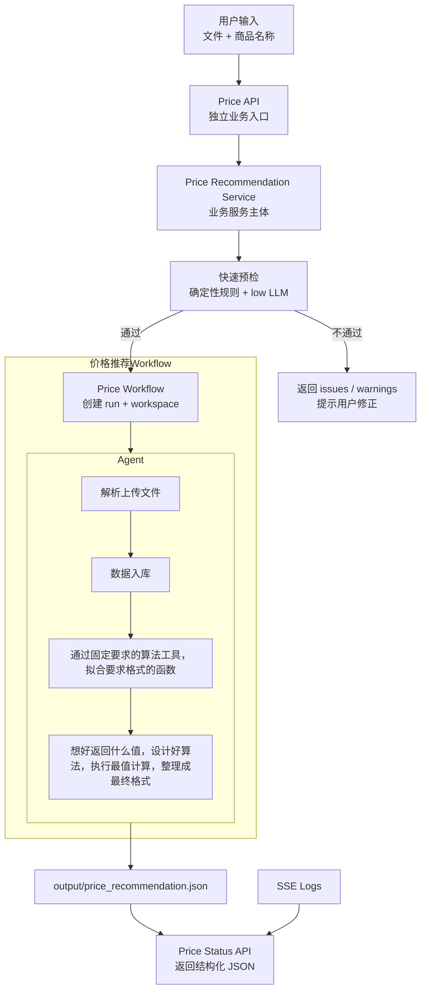

# 最优价格推荐架构设计

## 流程图



---

## 设计目标

最优价格推荐作为独立 workflow 实现，不和现有 `/api/analyze` 的经营诊断语义混用。

核心目标：

- **接口独立**：使用 `/api/price-recommendations/*` 表达新的业务能力。
- **基础设施复用**：复用 User Key 鉴权、上传解析、run 目录、日志、SSE、LLM 预设、Agent Workspace。
- **算法可替换**：当前只固定输入输出和 workflow，内部推荐算法、拟合曲线、约束模型后续迭代。
- **预检极快**：先用确定性规则过滤，再用低成本 LLM 做快速语义判断。
- **输出结构稳定**：最终返回固定 JSON，方便外部系统直接入库或调用。

当前 MVP 先打通确定性 workflow：预检、任务状态、日志、独立存储、基准价格推荐。Agent Runner、价格弹性模型和曲线拟合放到后续增强。

---

## 命名约定

| 名称            | 含义                                                                           |
| --------------- | ------------------------------------------------------------------------------ |
| Service         | 对外业务能力，如分析报告服务、最优价格推荐服务                                 |
| Workflow        | 服务内部的一套执行流程，可同步、异步、分叉、早停                               |
| Runner          | Workflow 里的执行器，如调用 AgentLoop 的 Agent Runner                          |
| AgentLoop       | 真正的大 Agent 主体，负责 messages、tool calls、循环执行                       |
| Plan Template   | Agent 内部模拟 workflow 的任务清单                                             |
| Legacy Pipeline | 历史上用于区分 traditional / pydantic / smol / custom 四种报告生成实现的旧命名 |

整体结构：

```text
程序主体 / Backend App
  ├── 分析报告服务 / Report Analysis Service
  │   ├── custom agent workflow
  │   │   ├── 初始化 workspace / 输入文件
  │   │   ├── 启动 custom agent
  │   │   └── 收尾处理 / 读取报告产物
  │   └── legacy workflows
  │       ├── traditional
  │       ├── pydantic
  │       └── smol
  │
  └── 算价格服务 / Price Recommendation Service
      └── price recommendation workflow
          ├── 快速预检
          ├── 解析文件
          ├── 商品匹配
          ├── 程序化数据检查
          ├── agent 辅助分析 / 推荐
          └── 输出推荐 JSON
```

---

## 模块边界

| 模块                 | 路径建议                                                            | 职责                                                          |
| -------------------- | ------------------------------------------------------------------- | ------------------------------------------------------------- |
| Price API            | `apps/api/src/main.py` 或后续拆分 `routes_price_recommendations.py` | 暴露预检、启动、状态、日志、停止接口                          |
| Price Service        | `packages/price_recommendation/service.py`                          | 最优价格推荐服务入口，承接 API 请求并调度 workflow            |
| Price Workflow       | `packages/price_recommendation/workflow.py`                         | 业务 workflow，负责预检、分支、早停、异步任务编排             |
| Precheck             | `packages/price_recommendation/precheck.py`                         | 快速解析、字段检查、商品匹配；fastcall/low LLM 后续增强       |
| Result Schema        | `packages/price_recommendation/models.py`                           | 定义预检结果和推荐结果结构                                    |
| Result Reader        | `packages/price_recommendation/result_reader.py`                    | 从 workspace 读取 `price_recommendation.json` 并返回 API 结果 |
| Agent Runner         | `packages/agents/price_recommendation/runner.py`                    | Workflow 中负责调用 AgentLoop 的执行器；当前预留边界          |
| Price Plan Template  | `packages/agents/price_recommendation/plan_template.py`             | Agent 内层任务清单                                            |
| Price Prompt Builder | `packages/agents/price_recommendation/prompt_builder.py`            | 价格推荐专用 system/user prompt                               |
| Agent Core           | `packages/agents/core/`                                             | AgentLoop、Workspace、工具转换、基础模型                      |

当前阶段可以先把路由写在 `main.py`，等接口稳定后再拆成独立 route 文件。

---

## Workflow 分层

### 1. 快速预检（异步）

输入：

```text
files + productName
```

处理步骤：

-使用两次llm调用快速检测上传内容是否合理。

- 返回 `valid`、`issues`、`warnings`、`matchedRows`、`confidence`。

预检只回答“能不能进入推荐任务”，不输出推荐价格。

### 2. 异步价格推荐

推荐接口创建后台任务，流程与现有分析任务一致。

输入：

```text
files + productName + candidateCount + reasoningEffort
```

处理步骤：

1. 创建 run 目录与 workspace。
2. 保存原始文件。
3. 将结构化表写入 workspace，并注册 DuckDB。
4. 拟合价格-销量-利润曲线，通过求最值的方式找出最优价格
5. 使用agent按步骤完成收集候选价格
6. Workflow 程序化校验 `output/price_recommendation.json`。
7. `/api/price-recommendations/status` 返回结构化结果。

---

## 输出产物

Workspace 建议结构：

```text
workspace/
  input/
    原始上传文件
  tables/
    结构化中间表
  output/
    product_match.json
    field_mapping.json
    price_candidates.json
    price_recommendation.json
  plan.json
  各种中间产物
  解析脚本
  函数拟合脚本
  analysis.duckdb
```

最终 API 优先读取：

```text
workspace/output/price_recommendation.json
```

---

## 状态与日志

状态枚举复用现有任务状态：

```text
idle / queued / running / completed / error / aborted / interrupted
```

内存状态按 `(key_hash, task_type)` 隔离。价格推荐使用 `task_type=price_recommendation`，不会和诊断服务共享同一个 `SessionState`。

日志事件使用新的分级与进度 SSE 格式。当 `type` 为 `"log"` 时，传输的结构示例如下：

```json
{
  "type": "log",
  "time": "15:30:02",
  "nodeId": "price_field_mapping",
  "level": "info",
  "message": "识别到价格字段: 售价，销量字段: 销量",
  "progress": 35,
  "step": "price_field_mapping",
  "error_details": ""
}
```

### 字段说明

- **`level`**: 日志级别，控制前端的展示逻辑：
  - `debug`: 调试日志。前端过滤，不予展示。
  - `info`: 信息日志。前端追加到滚动日志面板中。
  - `status`: 状态日志。前端不追加日志，而是更新常驻的“当前状态”提示词。
  - `error`: 错误日志。前端以红色加粗样式追加到滚动日志面板中。
- **`progress`**: 当前任务百分比进度值（`0` - `100` 的整数）。前端收到后直接将进度条更新为该绝对值，无需进行任何前端算法估算或伪平滑。
- **`step`**: 可选。当前执行的步骤或小节标识。
- **`error_details`**: 可选。在 `level` 为 `error` 时提供后台的详细堆栈或错误详情。

### 推荐 nodeId

为了使前端工作流节点高亮能正确流转，价格推荐 Workflow 建议使用以下 `nodeId`：

| nodeId                | 对应工作流节点 | 含义       |
| --------------------- | -------------- | ---------- |
| `price_precheck`      | precheck       | 快速预检   |
| `price_init`          | init           | 任务初始化 |
| `price_parse`         | parse          | 文件解析   |
| `price_product_match` | product_match  | 商品匹配   |
| `price_field_mapping` | field_mapping  | 字段识别   |
| `price_recommend`     | recommend      | 推荐计算   |
| `price_validate`      | validate       | 结果校验   |
| `price_done`          | done           | 任务完成   |

---

两者共享底层 Agent 能力，但业务入口、workflow、输出结构、plan template 保持隔离。历史上的 pipeline 命名只作为旧报告服务内部实现名称保留，新价格服务不继续使用 pipeline 作为主概念。
