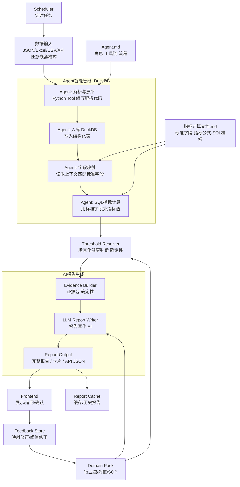
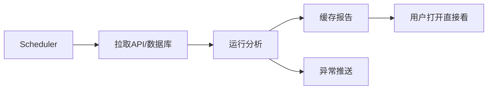

# 架构设计

## 流程图



---

## 启动

在项目根目录下执行：

```bash
npm install
npm run dev:api
```

启动后访问：`http://localhost:3000`

---

## 两条管线

| 管线 | 适用场景 | 原理 |
|------|---------|------|
| **Agent 管线** (新) | 任意格式输入，特别是嵌套 JSON / 不规则表格 / 新行业数据 | Agent 写 Python 解析 + DuckDB SQL 算指标 |
| **确定性管线** (旧) | 标准药店 ERP JSON / 格式固定的文件 | 硬编码 input_adapter → metric_engine |

两条管线在 Evidence Builder 处汇合，下游共享。

---

## 核心设计

### 1. Agent: 解析与展平

**用途**：Agent 收到任意格式的原始数据后，用 Python Tool 写代码解析成扁平表。

**触发**：用户上传文件后，文件内容以文本/二进制方式注入 Agent 上下文。

**输出**：一份 pandas DataFrame（或多表），列名为原始字段名，行为数据行。

处理能力：

- 深层嵌套 JSON（`{{{[[[]]]]}}}`）：Agent 写 `pd.json_normalize` 或递归展平
- Excel 多 sheet：Agent 逐个 sheet 读入
- CSV：直接 `pd.read_csv`
- API JSON：Agent 按返回结构展平
- 混合格式多文件：Agent 识别各文件类型，分别处理

Agent 上下文注入：

- `Agent.md`：告知 Agent 角色、可用工具、输出规范
- 原始数据内容

**关键原则**：Agent 不修改原始字段名，仅做结构展平。字段语义映射留给下一步。

---

### 2. Agent: 入库 DuckDB

**用途**：Agent 将展平后的 DataFrame 写入 DuckDB，后续所有查询走 SQL。

```text
Agent 执行:
  import duckdb
  conn = duckdb.connect(':memory:')  # 或持久化到临时文件
  conn.register('raw_data', df)      # 注册为 DuckDB 表
```

也可以从 parquet 文件读入（DuckDB 原生支持 `SELECT * FROM 'data.parquet'`）。

**DuckDB 选型理由**：

- 零配置，不需要服务端进程
- 完整 SQL 支持（窗口函数、GROUP BY、CTE、CASE WHEN）
- 直接读 pandas/parquet/CSV/JSON
- 单文件部署，适合本项目场景

---

### 3. Agent: 字段映射

**用途**：Agent 读取 `指标计算文档.md`，将原始字段名映射为标准语义字段。

**上下文注入**：

- `指标计算文档.md` 中「标准语义字段」章节（字段名 + 别名 + 示例原始字段名）
- DuckDB 表的 schema 和样本数据（Agent 执行 `DESCRIBE` 和 `SELECT * LIMIT 5` 获取）

**Agent 自行判断**：

- 根据字段名、样本值、表结构匹配标准字段
- 同一个原始字段在不同行业下可能映射不同标准字段（场景感知消歧），如 `评分` 在 HR 场景映射 `performance_score`，在餐饮场景映射 `rating`
- 未匹配到的字段标记 `unknown`，不参与后续计算

**输出**：字段映射表 `SemanticMapping[]`

```ts
type SemanticMapping = {
  rawField: string;
  semanticField: string;
  confidence: number;
  reason: string;
  needConfirm: boolean;  // confidence < 0.75 时前端确认
};
```

**用户确认**：低置信度映射通过 SSE 推送给前端，用户修正后重新计算。

---

### 4. Agent: SQL 指标计算

**用途**：Agent 根据字段映射结果和 `指标计算文档.md` 中的指标公式，编写 SQL 查询计算各项指标。

**上下文注入**：

- `指标计算文档.md` 中「通用计算器」「通用指标」「行业指标包」章节
- 字段映射结果 `SemanticMapping[]`
- DuckDB 表结构

**Agent 执行流程**：

```
1. 从 SemanticMapping 得知有哪些标准字段可用
2. 读 指标计算文档.md，找出「requiredFields 全部满足」的指标
3. 对每个可用指标，Agent 编写 SQL：
   - ratio 类：SELECT SUM(numerator) / SUM(denominator)
   - period_change 类：LAG() 窗口函数 + 环比公式
   - share_by_dimension 类：GROUP BY + SUM + 占比计算
   - concentration 类：MAX / SUM
   - top_contribution 类：ORDER BY DESC + LIMIT N + SUM
   - trend_slope 类：REGR_SLOPE
   - anomaly_detect 类：z-score via AVG/STDDEV 窗口
   - threshold_rate 类：COUNTIF / CASE WHEN
4. Agent 执行 SQL，将结果包装为 MetricResult[]
```

**输出格式**：

```ts
type MetricResult = {
  metricId: string;
  name: string;
  value: any;
  unit?: string;
  status: "pass";  // 健康判断由 Threshold Resolver 完成
  requiredFields: string[];
  missingFields?: string[];
  confidence: number;
  sql: string;  // 记录生成的 SQL，便于审计/复现
};
```

**安全边界**：

- Agent 在 DuckDB 内执行的 SQL 是只读查询（SELECT only）
- 每条 SQL 记录到结果中，可回放审计
- Agent 不写文件、不调用外部 API

---

### 5. Threshold Resolver

**用途**：同一个指标，不同场景使用不同健康判断。保持确定性实现。

例：

```json
{
  "metricId": "channel_concentration",
  "value": 88,
  "scene": {
    "industry": "pharmacy",
    "businessModel": "o2o_driven"
  },
  "status": "attention",
  "reason": "O2O型药店可以接受较高线上占比，但单平台集中度偏高"
}
```

健康判断依据：

- 行业包阈值
- 业态阈值
- 历史基线
- 同类对标
- 用户目标

---

### 6. Evidence Builder

**用途**：把计算结果整理成报告证据。保持确定性实现。

```ts
type EvidenceItem = {
  metricId: string;
  title: string;
  value: any;
  status: "pass" | "attention" | "warning" | "uncountable";
  evidenceTable?: any[];
  sourceFields: string[];
  confidence: number;
};
```

证据类型：

- 指标值
- 趋势变化
- TOP列表
- 异常点
- 字段映射记录
- 缺失字段说明
- 口径说明
- **SQL 记录**（Agent 管线特有一一记录生成的 SQL）

---

### 7. LLM Report Writer

**用途**：根据证据包生成完整报告、老板卡片和摘要。

输入：

```json
{
  "scene": {},
  "metricResults": [],
  "evidence": [],
  "dataQuality": {},
  "userOptions": {}
}
```

输出：

```ts
type ReportOutput = {
  healthStatus: string;
  overviewText: string;
  cards: ReportCard[];
  fullReport: string;
  evidenceIndex: EvidenceItem[];
};
```

---

## Agent 上下文文件

Agent 管线依赖以下上下文文件运作：

| 文件 | 注入阶段 | 内容 |
|------|---------|------|
| `Agent.md` | 全程 | Agent 角色定义、可用工具（Python execution、DuckDB SQL）、输出格式约束、安全边界 |
| `指标计算文档.md` | 字段映射 + 指标计算 | 标准字段定义、别名、通用计算器公式、指标注册表、行业指标包 |

Agent 不需要修改这些文件——它们是**静态上下文**，Agent 只读取并据此决策。

---

## 行业包

### 1. 通用经营包

适用：零售、餐饮、药店、普通经营数据。

包含：

- 营收趋势
- 订单趋势
- 客单价
- 毛利率
- 渠道占比
- TOP贡献度
- 异常波动
- 数据完整度

### 2. 药店包

包含：

- O2O占比
- 平台集中度
- 会员渗透率
- 热销缺货
- 热销500覆盖
- 动销SKU
- 刚需品承接风险

### 3. 餐饮包

包含：

- 堂食/外卖占比
- 菜品销售排行
- 菜品毛利
- 时段峰谷
- 出餐/配送履约
- 翻台率（有桌台数据时）

### 4. HR包

包含：

- 离职率
- 入职率
- 招聘漏斗
- 部门人效
- 考勤异常
- 绩效分布

---

## 输入格式建议

| 来源               | 推荐格式             | 说明               |
| ------------------ | -------------------- | ------------------ |
| ERP接口            | API JSON             | 用于定时自动跑     |
| 用户上传           | Excel / CSV          | 适合非技术用户     |
| 多表数据           | Excel多sheet / 多CSV | 每张表保留表名     |
| 药店热销榜         | schema rows JSON     | 排名类数据更紧凑   |
| 商品/菜品/员工明细 | CSV / Excel          | 字段多，表格更合适 |
| **任意嵌套 JSON**  | **Agent 自动展平**   | **Agent 管线原生支持** |
| **混合格式多文件** | **Agent 自动识别**   | **Agent 管线原生支持** |

---

## 案例指引

### 案例1：药店 JSON

输入：

```text
概览-日.json
概览-月.json
O2O.json
店热销-周.json
热销500-缺货.json
```

Agent 流程：

```
1. 解析 5 个 JSON 文件，展平为 DuckDB 表
2. 读 指标计算文档.md，匹配字段：
   - 零售金额 → revenue
   - 毛利 → gross_profit
   - 来客数 → customer_count
   - 会员金额 → member_revenue
   - 平台 → channel
   - 商品名称 → product_name
   - 库存 → inventory_qty
3. 场景识别：行业=pharmacy, 业态=o2o_driven
4. SQL 计算指标：营收趋势、毛利率、O2O占比、平台集中度、会员渗透率、热销缺货风险、TOP商品贡献度
5. 阈值判断 + 证据打包 → LLM 写报告
```

---

### 案例2：餐饮 Excel

输入：

```text
订单明细.xlsx
菜品销售.xlsx
外卖平台.xlsx
```

Agent 流程：

```
1. 解析 3 个 Excel（多 sheet），展平为 DuckDB 表
2. 读 指标计算文档.md，匹配字段：
   - 营业额 → revenue
   - 订单数 → order_count
   - 菜品名称 → product_name
   - 平台 → channel
   - 出餐时长 → delivery_duration
3. SQL 计算指标：营收趋势、客单价、堂食/外卖占比、菜品TOP贡献、出餐超时风险
```

---

### 案例3：HR Excel

输入：

```text
员工花名册.xlsx
考勤表.xlsx
绩效表.xlsx
招聘漏斗.xlsx
```

Agent 流程：

```
1. 解析 4 个 Excel，展平为 DuckDB 表
2. 匹配字段：员工编号→employee_id, 部门→department, 入职日期→hire_date... 
3. SQL 计算：离职率、部门人数变化、考勤异常、绩效分布、招聘转化率
```

---

## 用户可选项

前端提供简单选项：

| 选项     | 作用                                           |
| -------- | ---------------------------------------------- |
| 分析场景 | 药店 / 餐饮 / HR / 通用                        |
| 分析目标 | 找问题 / 看增长 / 控成本 / 看库存 / 看人员效率 |
| 时间口径 | 日 / 周 / 月 / 自定义                          |
| 健康阈值 | 默认 / 保守 / 激进                             |
| 输出形式 | 老板卡片 / 完整报告 / API JSON                 |
| **分析管线** | **Agent 智能管线 / 确定性管线（仅标准格式）** |

---

## 输出接口

```ts
type AnalyzeResponse = {
  reportId: string;
  scene: SceneContext;
  mapping: SemanticMapping[];
  metrics: MetricResult[];
  cards: ReportCard[];
  fullReport: string;
  warnings: string[];
};
```

卡片结构：

```ts
type ReportCard = {
  title: string;
  explanation: string;
  suggestion: string;
  evidence: string;
  color: "green" | "yellow" | "pink" | "red";
};
```

---

## 定时任务



规则：

- 接口型客户：定时自动跑
- 上传型客户：上传后跑一次
- 报告结果落库
- 异常卡片可推送

---

## AI使用边界

### Agent 负责（解析 + 映射 + 计算）

- 数据格式解析与展平（Python Tool）
- 数据入库 DuckDB
- 字段语义映射
- 行业/业态识别
- SQL 指标计算
- 报告写作
- 用户追问

### 确定性系统负责

- 阈值判断
- 证据留存
- API 返回
- SQL 审计记录

**安全约束**：

- Agent 执行的 Python 代码限于数据解析/转换，不调用外部 API，不写文件系统
- Agent 执行的 SQL 限于 SELECT 只读查询，每条 SQL 记录到结果中
- 指标计算结果由 Threshold Resolver 做健康判断（确定性），不信任 Agent 的 status 判断

---

## 实现状态 (2026-05-13)

### Agent 管线（开发中）

```
任意格式输入 → Agent (Python Tool 解析) → DuckDB 入库 
  → Agent (读 Agent.md + 指标计算文档.md 做字段映射) 
  → Agent (SQL 计算指标) 
  → Threshold Resolver → Evidence Builder → LLM Report Writer → 输出
```

### 确定性管线（已实现，保留）

```
标准JSON/Excel/CSV → input_adapter → profiler → semantic_mapper → scene_classifier
    → canonical → metric_registry → metric_engine → threshold_resolver
    → evidence_builder → LLM report_writer → 输出
```

### 入口路由

- `POST /api/analyze` — multipart 上传（JSON / Excel / CSV，统一入口）

### 待完成

- 行业包: `restaurant.yaml`, `hr.yaml`
- LLM 辅助: `semantic_mapper` / `scene_classifier` 的 LLM 分支 → 详见 [AI调用文档](./AI调用文档.md)
- 前端字段确认页
- 定时任务
- 测试

### Agent 管线（讨论中）

目标：用 Agent + DuckDB 替代 `input_adapter` → `metric_engine` 这段确定性逻辑，支持任意格式输入。
详见 [Agent 方案讨论](./agent-方案讨论.md)。

---

## 相关文档

| 文档 | 说明 |
| ---- | ---- |
| [开发文档](./开发文档.md) | 模块实现细节、调试、API 路由 |
| [指标计算文档](./指标计算文档.md) | 标准字段定义、计算器、行业指标包、**SQL 模板** |
| [AI调用文档](./AI调用文档.md) | 4次 LLM 调用的提示词、参数、输入输出格式 |
| [API接口设计方案](./API接口设计方案.md) | API 鉴权、租户隔离、SSE 流 |
| [账号与隔离系统设计](./账号与隔离系统设计.md) | 账号注册、User Key 体系 |
| **Agent.md** (新建) | Agent 角色、工具链、执行流程、安全边界 |
