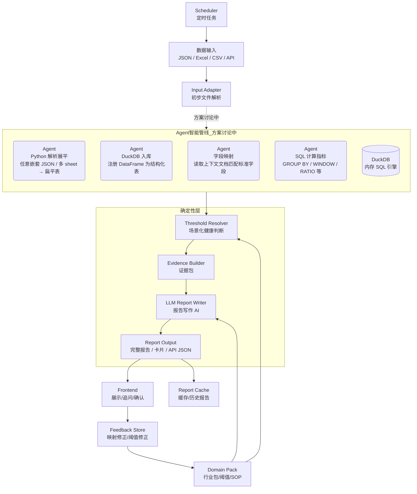
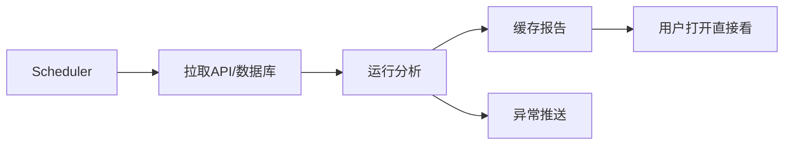

# 架构设计

## 流程图



---

## 启动

在项目根目录下执行：

```bash
npm install
npm run dev:api
```

启动后访问：`http://localhost:3000`

---

## 核心设计

### 1. Input Adapter

**用途**：统一接入 JSON / Excel / CSV / API。

输出：

```ts
type DatasetBundle = {
  sourceType: "json" | "excel" | "csv" | "api" | "database";
  files: RawTable[];
  receivedAt: string;
  tenantId?: string;
};
```

处理规则：

- JSON：保留层级路径，例如 `businessTable.rows[].retail_amount`
- Excel：每个 sheet 作为一张表
- CSV：单文件单表
- API：按接口返回结构转成表
- 多文件：合并成一个 `DatasetBundle`

---

### 2. Data Profiler

**用途**：先看数据长什么样，不做业务判断。

输出字段：

```ts
type ColumnProfile = {
  table: string;
  column: string;
  dtype: "number" | "string" | "date" | "boolean" | "unknown";
  samples: any[];
  nullRate: number;
  uniqueCount: number;
  min?: number | string;
  max?: number | string;
};
```

例：

| 原字段          | 类型   | 样本         | 可能含义 |
| --------------- | ------ | ------------ | -------- |
| `retail_amount` | number | 2467, 4214   | 营收     |
| `visitor_count` | number | 101, 98      | 来客数   |
| `source`        | string | 美团, 饿了么 | 渠道     |
| `dept_name`     | string | 销售部, HR部 | 部门     |

---

### 3. Scene Classifier

**用途**：先判断分析场景（行业/业态/目标），再决定后续的字段映射策略和行业包选择。

```ts
type SceneContext = {
  industry: "pharmacy" | "restaurant" | "retail" | "hr" | "generic";
  businessModel:
    | "offline_driven"
    | "o2o_driven"
    | "delivery_heavy"
    | "internal_department"
    | "unknown";
  dataScope: string[];
  analysisGoal: "经营诊断" | "库存诊断" | "HR效率" | "通用表格分析";
  confidence: number;
};
```

例：

```json
{
  "industry": "pharmacy",
  "businessModel": "o2o_driven",
  "dataScope": ["sales", "channel", "inventory", "member"],
  "analysisGoal": "经营诊断",
  "confidence": 0.91
}
```

---

### 4. Semantic Mapper

**用途**：根据已识别的场景，把原始字段映射成场景感知的标准语义字段。

```ts
type SemanticMapping = {
  rawField: string;
  semanticField: string;
  confidence: number;
  reason: string;
  needConfirm: boolean;
};
```

常用标准字段：

| 标准字段            | 含义                   |
| ------------------- | ---------------------- |
| `date`              | 日期 / 周期            |
| `revenue`           | 营收 / 销售额 / GMV    |
| `order_count`       | 订单数 / 小票数 / 单量 |
| `customer_count`    | 来客数 / 客流          |
| `cost`              | 成本                   |
| `gross_profit`      | 毛利                   |
| `channel`           | 渠道 / 平台 / 来源     |
| `product_name`      | 商品 / 菜品 / SKU名称  |
| `inventory_qty`     | 库存数量               |
| `member_revenue`    | 会员金额               |
| `department`        | 部门                   |
| `employee_id`       | 员工ID                 |
| `performance_score` | 绩效分                 |

字段映射示例（按场景感知映射）：

| 场景 | 原字段      | 标准字段          | 说明        |
| ---- | ----------- | ----------------- | ----------- |
| 药店 | `零售金额`  | `revenue`         | 销售额      |
| 药店 | `电商金额`  | `channel_revenue` | O2O渠道金额 |
| 餐饮 | `turnover`  | `revenue`         | 营业额      |
| 餐饮 | `dish_name` | `product_name`    | 菜品        |
| HR   | `离职人数`  | `leaver_count`    | 离职人数    |
| HR   | `部门`      | `department`      | 部门维度    |

低置信度处理：

```text
confidence < 0.75 -> 前端要求用户确认
confidence >= 0.75 -> 进入计算，但在 evidence 中保留映射记录
```

---

### 5. Metric Registry

**用途**：根据标准字段判断能算哪些指标。

```ts
type MetricDefinition = {
  metricId: string;
  name: string;
  requiredFields: string[];
  optionalFields?: string[];
  domains: string[];
  calculator: string;
  healthProfiles: string[];
};
```

示例：

```json
{
  "metricId": "avg_order_value",
  "name": "客单价",
  "requiredFields": ["revenue", "order_count"],
  "domains": ["pharmacy", "restaurant", "retail"],
  "calculator": "ratio",
  "healthProfiles": ["default"]
}
```

规则：

- 有必需字段才计算
- 缺字段返回 `uncountable`
- AI 不写计算代码
- 新指标先注册，再进入正式计算

---

### 6. Metric Engine

**用途**：用固定算法计算指标。

常用计算器：

| 计算器               | 用途                   |
| -------------------- | ---------------------- |
| `sum`                | 汇总                   |
| `ratio`              | 比率，如毛利率、客单价 |
| `period_change`      | 环比 / 同比            |
| `share_by_dimension` | 按渠道/商品/部门占比   |
| `concentration`      | 集中度                 |
| `trend_slope`        | 趋势方向               |
| `anomaly_detect`     | 异常波动               |
| `top_contribution`   | TOP贡献度              |

---

### 7. Threshold Resolver

**用途**：同一个指标，不同场景使用不同健康判断。

例：

```json
{
  "metricId": "channel_concentration",
  "value": 88,
  "scene": {
    "industry": "pharmacy",
    "businessModel": "o2o_driven"
  },
  "status": "attention",
  "reason": "O2O型药店可以接受较高线上占比，但单平台集中度偏高"
}
```

健康判断依据：

- 行业包阈值
- 业态阈值
- 历史基线
- 同类对标
- 用户目标

---

### 8. Evidence Builder

**用途**：把计算结果整理成报告证据。

```ts
type EvidenceItem = {
  metricId: string;
  title: string;
  value: any;
  status: "pass" | "attention" | "warning" | "uncountable";
  evidenceTable?: any[];
  sourceFields: string[];
  confidence: number;
};
```

证据类型：

- 指标值
- 趋势变化
- TOP列表
- 异常点
- 字段映射记录
- 缺失字段说明
- 口径说明

---

### 9. LLM Report Writer

**用途**：根据证据包生成完整报告、老板卡片和摘要。

输入：

```json
{
  "scene": {},
  "metricResults": [],
  "evidence": [],
  "dataQuality": {},
  "userOptions": {}
}
```

输出：

```ts
type ReportOutput = {
  healthStatus: string;
  overviewText: string;
  cards: ReportCard[];
  fullReport: string;
  evidenceIndex: EvidenceItem[];
};
```

---

## 行业包

### 1. 通用经营包

适用：零售、餐饮、药店、普通经营数据。

包含：

- 营收趋势
- 订单趋势
- 客单价
- 毛利率
- 渠道占比
- TOP贡献度
- 异常波动
- 数据完整度

### 2. 药店包

包含：

- O2O占比
- 平台集中度
- 会员渗透率
- 热销缺货
- 热销500覆盖
- 动销SKU
- 刚需品承接风险

### 3. 餐饮包

包含：

- 堂食/外卖占比
- 菜品销售排行
- 菜品毛利
- 时段峰谷
- 出餐/配送履约
- 翻台率（有桌台数据时）

### 4. HR包

包含：

- 离职率
- 入职率
- 招聘漏斗
- 部门人效
- 考勤异常
- 绩效分布

---

## 输入格式建议

| 来源               | 推荐格式             | 说明               |
| ------------------ | -------------------- | ------------------ |
| ERP接口            | API JSON             | 用于定时自动跑     |
| 用户上传           | Excel / CSV          | 适合非技术用户     |
| 多表数据           | Excel多sheet / 多CSV | 每张表保留表名     |
| 药店热销榜         | schema rows JSON     | 排名类数据更紧凑   |
| 商品/菜品/员工明细 | CSV / Excel          | 字段多，表格更合适 |

---

## 案例指引

### 案例1：药店 JSON

输入：

```text
概览-日.json
概览-月.json
O2O.json
店热销-周.json
热销500-缺货.json
```

识别结果：

```json
{
  "industry": "pharmacy",
  "businessModel": "o2o_driven",
  "dataScope": ["sales", "channel", "hot_products", "inventory"]
}
```

可算指标：

- 营收趋势
- 毛利率
- O2O占比
- 平台集中度
- 会员渗透率
- 热销缺货风险
- TOP商品贡献度

---

### 案例2：餐饮 Excel

输入：

```text
订单明细.xlsx
菜品销售.xlsx
外卖平台.xlsx
```

字段映射：

| 原字段     | 标准字段            |
| ---------- | ------------------- |
| `营业额`   | `revenue`           |
| `订单数`   | `order_count`       |
| `菜品名称` | `product_name`      |
| `平台`     | `channel`           |
| `出餐时长` | `delivery_duration` |

可算指标：

- 营收趋势
- 客单价
- 堂食/外卖占比
- 菜品TOP贡献
- 出餐超时风险

---

### 案例3：HR Excel

输入：

```text
员工花名册.xlsx
考勤表.xlsx
绩效表.xlsx
招聘漏斗.xlsx
```

字段映射：

| 原字段     | 标准字段            |
| ---------- | ------------------- |
| `员工编号` | `employee_id`       |
| `部门`     | `department`        |
| `入职日期` | `hire_date`         |
| `离职日期` | `leave_date`        |
| `绩效分`   | `performance_score` |

可算指标：

- 离职率
- 部门人数变化
- 考勤异常
- 绩效分布
- 招聘转化率

---

## 用户可选项

前端提供简单选项：

| 选项     | 作用                                           |
| -------- | ---------------------------------------------- |
| 分析场景 | 药店 / 餐饮 / HR / 通用                        |
| 分析目标 | 找问题 / 看增长 / 控成本 / 看库存 / 看人员效率 |
| 时间口径 | 日 / 周 / 月 / 自定义                          |
| 健康阈值 | 默认 / 保守 / 激进                             |
| 输出形式 | 老板卡片 / 完整报告 / API JSON                 |

---

## 输出接口

```ts
type AnalyzeResponse = {
  reportId: string;
  scene: SceneContext;
  mapping: SemanticMapping[];
  metrics: MetricResult[];
  cards: ReportCard[];
  fullReport: string;
  warnings: string[];
};
```

卡片结构：

```ts
type ReportCard = {
  title: string;
  explanation: string;
  suggestion: string;
  evidence: string;
  color: "green" | "yellow" | "pink" | "red";
};
```

---

## 定时任务



规则：

- 接口型客户：定时自动跑
- 上传型客户：上传后跑一次
- 报告结果落库
- 异常卡片可推送

---

## AI使用边界

AI负责：

- 字段语义映射
- 行业/业态识别
- 额外指标建议
- 报告写作
- 用户追问

系统负责：

- 数据解析
- 指标匹配
- 指标计算
- 阈值判断
- 证据留存
- API返回

---

## 实现状态 (2026-05-12)

### 新管线已实现

```
JSON/Excel/CSV → input_adapter → profiler → semantic_mapper → scene_classifier
    → canonical → metric_registry → metric_engine → threshold_resolver
    → evidence_builder → (LLM report_writer) → 输出
```

### 旧管线仍保留

```
药店JSON → cleaner → metrics (30函数) → LLM (初诊/审计/融合/精简)
```

### 入口路由

- `POST /api/run` — base64 JSON 上传（已迁至新管线）
- `POST /api/analyze` — multipart 上传（JSON / Excel / CSV，统一走新管线）

### 待完成

- 行业包: `restaurant.yaml`, `hr.yaml`
- LLM 辅助: `semantic_mapper` / `scene_classifier` 的 LLM 分支 → 详见 [AI调用文档](./AI调用文档.md)
- 前端字段确认页
- 定时任务
- 测试

### Agent 管线（讨论中）

目标：用 Agent + DuckDB 替代 `input_adapter` → `metric_engine` 这段确定性逻辑，支持任意格式输入。
详见 [Agent 方案讨论](./agent-方案讨论.md)。

---

## 相关文档

| 文档 | 说明 |
| ---- | ---- |
| [开发文档](./开发文档.md) | 模块实现细节、调试、API 路由 |
| [指标计算文档](./指标计算文档.md) | 标准字段定义、计算器、行业指标包 |
| [AI调用文档](./AI调用文档.md) | 4次 LLM 调用的提示词、参数、输入输出格式 |
| [API接口设计方案](./API接口设计方案.md) | API 鉴权、租户隔离、SSE 流 |
| [账号与隔离系统设计](./账号与隔离系统设计.md) | 账号注册、User Key 体系 |
