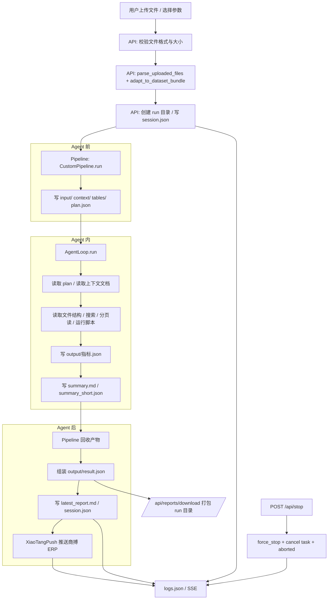

# 架构设计

## 流程图



## 核心设计

整个Agent内的流程遵循固定的步骤：

1. 解析文件
2. 写 SQL
3. 根据对应行业，阅读指标文档，执行 SQL 来计算更多数据
4. 生成完整/精简报告/或json

**最终产物输出格式**：

- 完整报告：`summary.md`（markdown 格式），包含指标计算结果、异常数据、趋势分析、关联分析、建议等
- 精简报告：`summary_short.json`，包含指标计算结果、异常数据、趋势分析、关联分析、建议等，但格式为 JSON

```json
{
  "health_status": "健康度",
  "overview_text": "总览",
  "cards": [
    {
      "title": "卡片1",
      "explanation": "卡片1解释",
      "suggestion": "卡片1建议",
      "evidence": "卡片1证据",
      "color": "red"
    },
    {
      "title": "卡片2",
      "explanation": "卡片2解释",
      "suggestion": "卡片2建议",
      "evidence": "卡片2证据",
      "color": "blue"
    }
  ]
}
```

---

## Agent 上下文文件

当前注入 Agent 的上下文主要是：

| 文件              | 注入阶段            | 内容                                   |
| ----------------- | ------------------- | -------------------------------------- |
| `指标计算文档.md` | 字段映射 + 指标计算 | 标准字段、指标口径、SQL 写法、输出约束 |
| `analysis_params` | 全程                | 用户偏好、报告风格、分析深度           |
| `plan.json`       | 全程                | 四步计划、检查点、任务边界             |

`Agent.md` 不是当前主链路中的必需文件。当前工具说明和行为边界由 `tool_converter.py`、`plan.json` 和 prompt 注入控制。

---

## 行业包

当前主分析链路不以行业包作为独立阶段。

现有代码里仍保留部分行业阈值和指标定义模块，但它们不构成当前 `custom` workflow 的主流程。当前运行时的分析重点是：

- 按实际文件结构计算可用指标
- 输出可审计的指标和报告
- 由 ERP 推送和前端事件流承接结果

---

## 输入格式建议

| 来源     | 推荐格式                                         | 说明                                          |
| -------- | ------------------------------------------------ | --------------------------------------------- |
| 用户上传 | Excel / CSV / JSON / PDF / DOCX / ZIP / RAR / 7Z | 进入 `POST /api/analyze`                      |
| 纯文本   | TXT / MD / LOG                                   | 适合 `read_file` 和 `search_files`            |
| 数据库   | SQLite / DB                                      | 适合 `query_sqlite`                           |
| 中间产物 | Parquet / JSON                                   | 适合 `duckdb_register_parquet` 或 `read_file` |

当前前端上传限制为单文件 `100MB`。

---

## 案例指引

### 案例1：药店 JSON

处理路径：

1. 上传 JSON 或 ZIP
2. API 校验并写入 workspace
3. Agent 先看文件结构，再决定是否展平
4. 指标结果写入 `output/指标.json`
5. 报告写入 `summary.md` 和 `summary_short.json`

### 案例2：餐饮 Excel

处理路径：

1. 上传多 sheet Excel
2. `read_document_structure` 看 sheet 和列
3. 必要时用 `run_python` 清洗并导出 parquet
4. DuckDB 聚合计算

### 案例3：HR Excel

处理路径：

1. 读取表结构和样例行
2. 确定人事相关字段
3. 生成指标和卡片

---

## 用户可选项

当前可配置项：

| 选项              | 作用                           |
| ----------------- | ------------------------------ |
| `analysis_params` | 控制分析深度、表达方式、关注点 |
| `reasoningEffort` | 选择模型推理强度               |
| 文件上传          | 输入本次分析的数据             |

当前不再提供分析管线切换选项。

---

## 输出接口

```ts
type AnalyzeResponse = {
  status: "started" | "completed" | "error" | "aborted";
  pipeline: "custom";
  runId: string;
};
```

更完整的结果由以下接口获取：

- `GET /api/status`
- `GET /api/logs`
- `GET /api/stream`
- `GET /api/reports/download`

`session.result` 保存精简 JSON，`session.full_result` 保存完整 Markdown。

---

## 定时任务

当前分析链路没有内置 scheduler。

如需定时执行，应由外部调度器调用 `POST /api/analyze`，然后轮询：

- `/api/status`
- `/api/logs`

---

## AI使用边界

### Agent 负责

- 读取文件结构
- 展平和清洗
- 字段映射
- 指标计算
- 报告生成

### 系统负责

- 会话隔离
- 文件落盘
- `plan.json` 写入
- `session.json` 和 `latest_report.md` 写入
- `logs.json` / SSE
- `XiaoTangPush` 推送
- 下载打包

**当前约束**：

- Agent 不能跳出 workspace 直接操作系统文件
- 大文件不能直接全文塞入上下文
- 结果必须落到约定产物文件

---

## 实现状态

当前经营分析主链路状态：

- `custom` workflow 已启用
- `traditional/pydantic/smol` 不在分析路由中
- `POST /api/analyze` 固定进入 `custom`
- `XiaoTangPush` 在分析完成后执行
- `session.json`、`logs.json`、`latest_report.md`、`output/result.json` 已按 run 目录落盘

仍保留的旧模块主要在 `packages/core`，用于共享能力或历史兼容，不作为当前主链路的章节说明对象。

---

## 相关文档

| 文档                                              | 说明                         |
| ------------------------------------------------- | ---------------------------- |
| [指标计算文档](./指标计算文档.md)                 | 指标口径、字段语义、输出约束 |
| [analysis_params 规范](./analysis-params-spec.md) | 参数存储、注入、校验         |
| [Agent Tools设计](../Agent%20Tools设计.md)        | 工具边界与工具交接说明       |
| [开发文档](./开发文档.md)                         | 代码实现和调试说明           |
| [API接口设计方案](./API接口设计方案.md)           | 接口和鉴权说明               |
