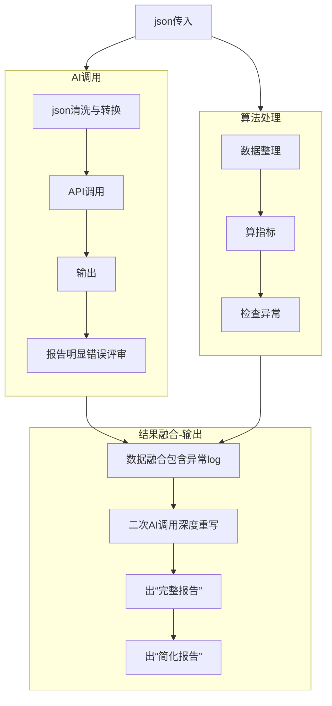

## 流程图



---

## 启动

在 `简化v1_26.5.7` 目录下执行：

```bash
npm install
node server.js
```

启动后访问：`http://localhost:3000`

## 细节设计

### json清洗-AI

分 3 类处理：

## 1. 概览类：`概览-日/月/年.json`

**用途**：经营诊断、异常解释、生成报告。
**推荐格式：紧凑 JSON + schema rows**

```json
{
  "type": "business_overview",
  "period": "2026-05",
  "granularity": "month",
  "summary_schema": ["指标", "值", "单位", "环比%", "备注"],
  "summary_rows": [
    ["营业额", 21822, "元", -78, ""],
    ["来客数", 641, "人", -78, ""],
    ["客单价", 34.04, "元", -1, ""],
    ["毛利", 5442, "元", -77, "毛利率25%"],
    ["会员营业额", 316.1, "元", -93, ""],
    ["电商业绩", 15459.95, "元", -76, ""]
  ],
  "ranking_schema": ["项目", "周期", "值", "单位"],
  "ranking_rows": [
    ["最佳营收", "2026-01", 151202.43, "元"],
    ["最佳单量", "2026-01", 4559, "单"],
    ["最佳毛利", "2026-02", 38156, "元"]
  ],
  "table_schema": [
    "周期",
    "零售金额",
    "毛利",
    "来客数",
    "会员金额",
    "会员毛利",
    "电商金额",
    "电商毛利"
  ],
  "table_rows": [],
  "source_schema": ["来源", "金额"],
  "source_rows": [
    ["普通", 6046.1],
    ["会员", 316.1],
    ["电商", 15459.95]
  ]
}
```

---

## 2. 商品资料类：`商品资料.json`

**用途**：商品维度补充、品类判断、库存/价格/会员价分析。
**推荐格式：CSV**

```csv
商品编号,批准文号,商品名称,通用名称,条码,货架,厂家,单位,规格,进价,库存,零售价,会员价
80013,卫药准字29-XK-2795,高级痱水(白美人),高级痱水,6931966600131,,广州名露医疗卫生用品有限公司,瓶,60ml,0,,18,0
30065,/,西洋参含片(鑫三扬),西洋参含片,6936784969230,常温区00238,鑫三扬药业（厦门）有限公司,盒,1.25g*12片,3.42,,12,0
```

!!目前我们先不做这部分!!读到这个json直接跳过!!

## 3. 店热销类：`店热销-今/昨/周/月.json`

**用途**：热销趋势、爆品、短期需求变化。
**推荐格式：按时间段分组合并，不分 4 个 JSON 丢。**

```json
{
  "type": "store_hot_products",
  "schema": ["排名", "商品名", "笔数", "数量"],
  "今": [[1, "[农夫山泉]饮用天然水 550ml/瓶", 2, 5]],
  "昨": [[1, "[芬必得]布洛芬缓释胶囊 0.3g*10粒*2板/盒", 3, 3]],
  "周": [[1, "[芬必得]布洛芬缓释胶囊 0.3g*10粒*2板/盒", 19, 19]],
  "月": [[1, "[芬必得]布洛芬缓释胶囊 0.3g*20粒/盒", 106, 106]]
}
```

## 4. 热销500类：`热销500-总/有货/缺货/缺种.json`

**用途**：库存机会、缺货损失、补货建议。
**推荐格式：合并成一个表，不要分 4 个 JSON 丢。**

```json
{
  "type": "hot_top500_stock_status",
  "city": "厦门",
  "schema": ["排名", "商品名"],
  "top500": [],
  "in_stock": [
    [1, "[999]感冒灵颗粒 10g*9袋/盒"],
    [2, "[金毓婷]左炔诺孕酮片 1.5mg/片/板/盒"]
  ],
  "out_of_stock": [[20, "[云南白药]创可贴(轻巧护翼型)1.5cm*2.3cm*20片/盒"]],
  "missing_category": [[25, "芒硝*5g"]]
}
```

---

# 最终推荐表

| 文件                | 推荐格式                         | 原因               |
| ------------------- | -------------------------------- | ------------------ |
| `概览-日.json`      | **紧凑 JSON + rows**             | 多块结构，适合诊断 |
| `概览-月.json`      | **紧凑 JSON + rows**             | 同上               |
| `概览-年.json`      | **紧凑 JSON + rows**             | 同上               |
| `商品资料.json`     | **CSV / schema rows**            | 纯表格，字段多     |
| `店热销-今.json`    | **schema rows**                  | 榜单型             |
| `店热销-昨.json`    | **schema rows**                  | 榜单型             |
| `店热销-周.json`    | **schema rows**                  | 榜单型             |
| `店热销.月.json`    | **schema rows**                  | 榜单型             |
| `热销500-总.json`   | **合并 rows**                    | 和库存状态一起分析 |
| `热销500-有货.json` | **合并 rows**                    | 不单独丢           |
| `热销500-缺货.json` | **合并 rows / opportunity rows** | 重点分析对象       |
| `热销500-缺种.json` | **合并 rows / opportunity rows** | 重点分析对象       |
